# __Chapter 1 Labs__

## __Technical requirements__
This book will teach you how to use software containers for improving your applications development. We will use open source tools for building, sharing and running containers as well as few commercial ones that can run without licensing for non-professional use. We included in this book some labs for helping understand the content presented. These labs are published in following URL https://github.com/PacktPublishing/Docker-For-Developers-Handbook, where you will find some extended explanations, omitted in the book’s content to make chapters easier to follow.
A common laptop or desktop computer with modern CPU (Intel Core i7, i5 or equivalent AMD CPU) with 16 GB of RAM is recommended, although you would probably be able to run labs with less resources but experience may be impacted. You could use either Microsoft Windows operating system or Linux, although Linux will be used as reference. It is expected to have some Linux/Windows operating systems knowledge at user-level and coding experience in common programming languages, although examples are not complicated and will be easy to follow.

In this lab we will install a fully functional development environment for container-based applications. We will use Docker Desktop because it includes a container runtime, its client and a minimal but fully functional Kubernetes orchestration solution.

We could use Docker Engine in Linux directly (container runtime only, following this link [https://docs.docker.com/engine/install/](https://docs.docker.com/engine/install/)) for most labs but we will need to install a new tool for Kubernetes labs which will require a Kubernetes minimal cluster installation. Thus, even for just using command-line, we will use a Docker Desktop environment.

>Important note:
>
>You can use Minikube instead for Kubernetes later if your desktop environment does not have enough CPU or memory. There are even lighter Kubernetes cluster alternatives like KinD (Kubernetes on Docker) but may require some customizations. Of course, you can use any cloud provided Kubernetes environment if you feel more comfortable.

## __Installing Docker Desktop__

This lab will guide you to install Docker Desktop on your laptop or workstation and execute a test to verify that it works correctly.
Docker Desktop can be installed on either Microsoft Windows 10, most common Linux flavors or MacOS (arm64 and amd64 architectures are both supported) operating systems. This lab shows you how to install this software on Windows 10 but I will use Windows and Linux indistinctly on other labs, they will work the same and we will review any changes required between platforms if required.
We will follow the simple steps documented in the following link https://docs.docker.com/get-docker/. Docker Desktop on windows can be deployed using Hyper-V or newer WSL2 (Windows Subsystem for Linux). This second option will use less compute and memory resources and it is nicely integrated in Microsoft Windows operating system and it is the preferred installation method; but it requires WSL2 on your host before installing Docker Desktop. Please follow Microsoft documented instructions in this link https://learn.microsoft.com/en-us/windows/wsl/install before installing Docker Desktop. You can install any Linux distribution because integration will be automatically included.
We will use “Ubuntu” WSL distribution. It is available in Microsoft Application Store and it is simple to install.
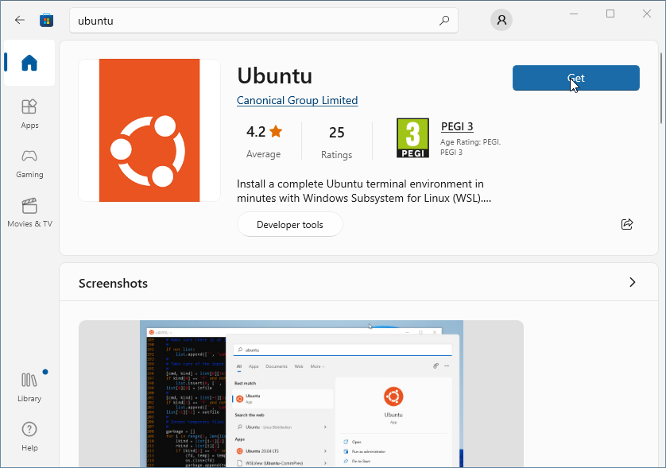

Installation is very simple and you will be prompted for a username and password for this windows subsystem installation.
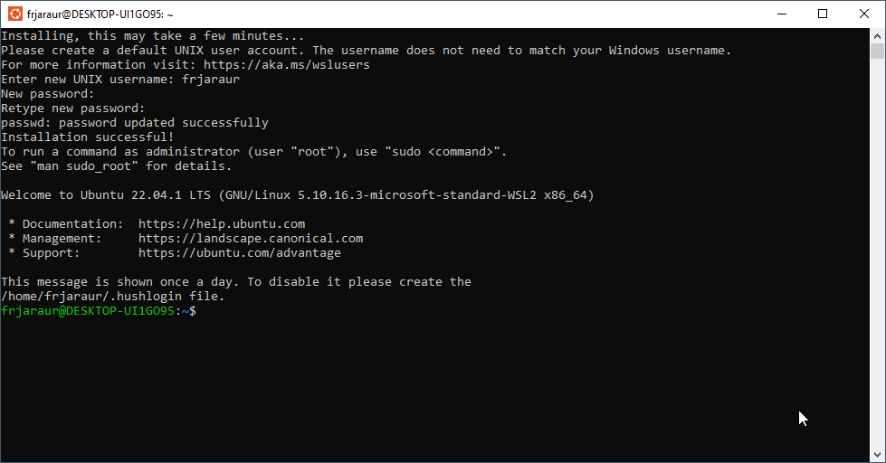

Close this “Ubuntu” terminal because Docker Desktop integration will require you to open a new one once integration is included.

>Important note
>You may need to execute some additional steps using following link https://docs.microsoft.com/windows/wsl/wsl2-kernel to update WSL2 if you don’t have your operating system updated. 

Let’s continue with Docker Desktop installation. Download the installer from the following URL https://docs.docker.com/get-docker/.
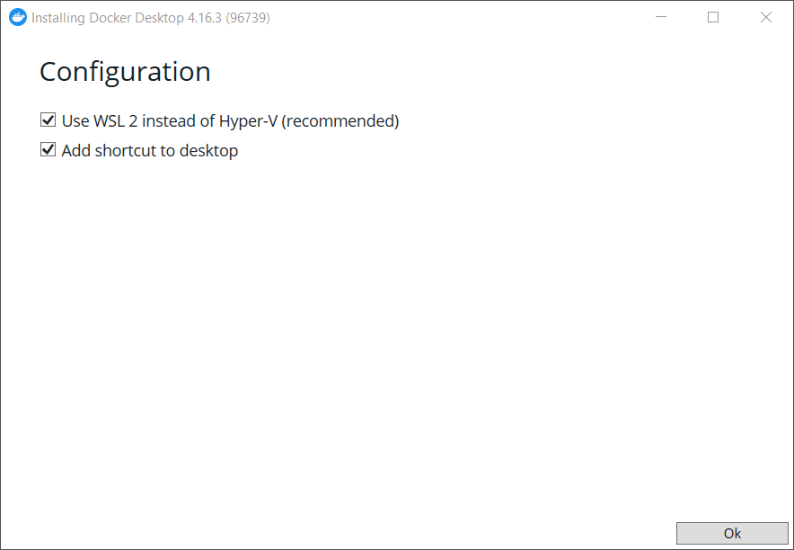 
Once downloaded, execute the “Docker Desktop Installer.exe” binary. You will be asked to choose between Hyper-V or WSL2 backend virtualization and we will choose WSL2.
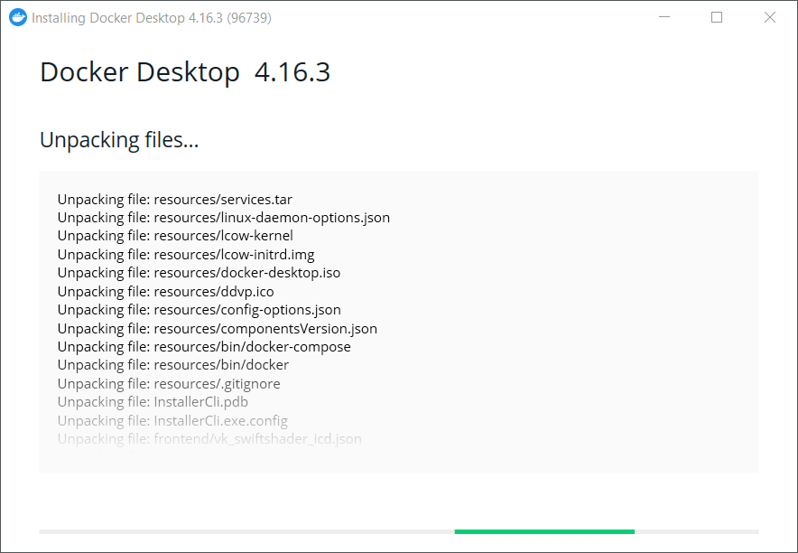

After clicking “OK” button, installation process will begin uncompressing required files (libraries, binaries, default configurations, ...etc). This could take some time (1-3 minutes) depending on your host’s disk speed and compute resources.

As final step, we will be asked to logout and login again because our user was added to new system groups (docker) to enable access to remote docker daemon via operating system pipes (similar to Unix sockets).
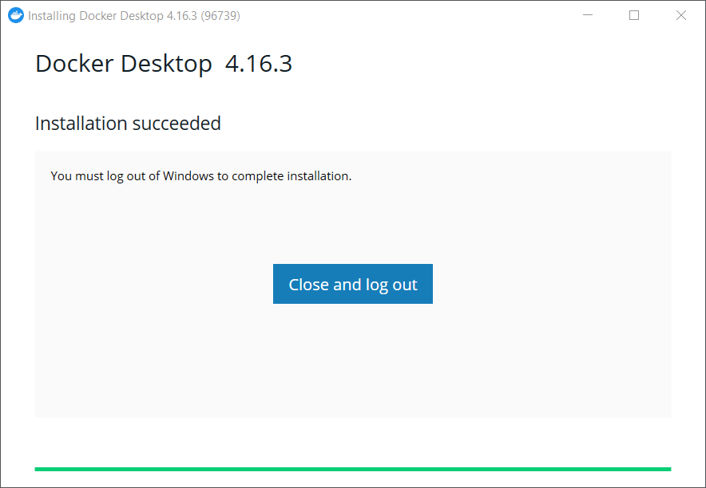

Once we login, we can execute Docker Desktop using the newly added application icon. We can enable Docker Desktop execution on start and this could be very useful for you but it may slow down your computer if you are short of resources. I recommend start Docker Desktop only when we are going to use it.
We accept redacted Docker Subscription license terms and Docker Desktop will start. This may take a minute.
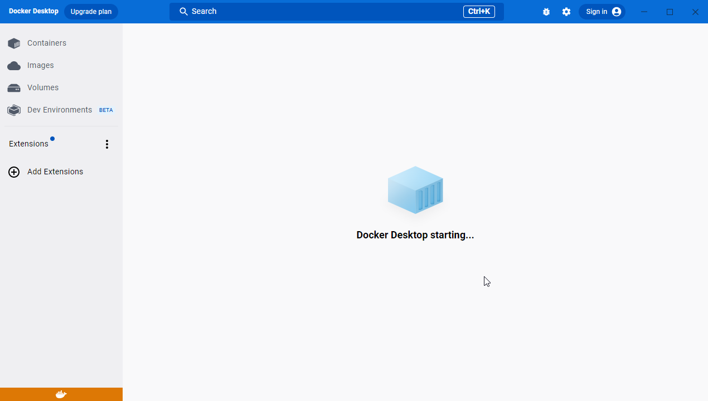

You can skip the quick guide that will appear when Docker Desktop is running, because we will learn more in next chapters, deep-diving in container images building and containers execution. 
We will get following screen, showing us that Docker Desktop is ready.
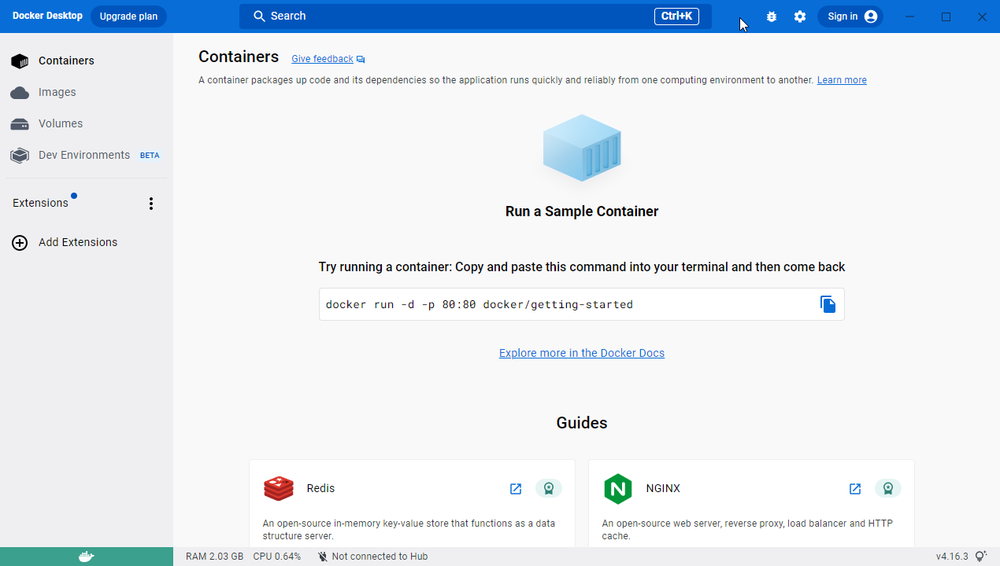

But we will need to enable WSL2 integration with our favorite Linux distribution.
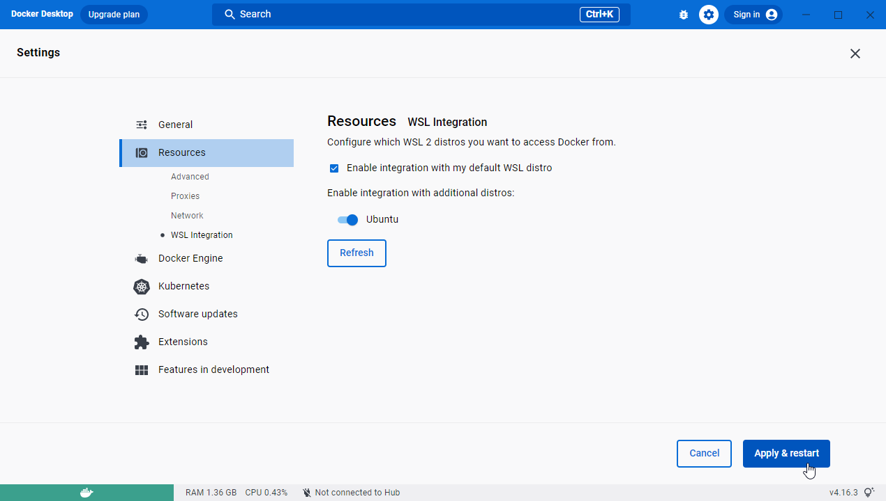

After this step, we are finally ready to work with Docker Desktop. We will open a terminal using our “Ubuntu” distribution and execute “docker” and after that, “docker info”.
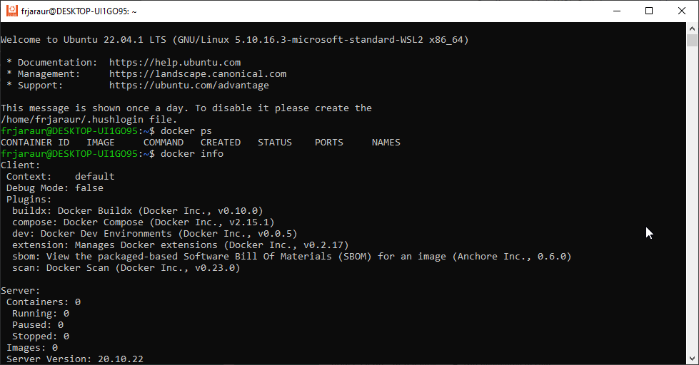

As you can see, we have a fully functional Docker client command-line associated with Docker Desktop WSL2 server.

We will end this lab executing an Alpine container (small Linux distribution), reviewing its process tree and the list of its root file system.
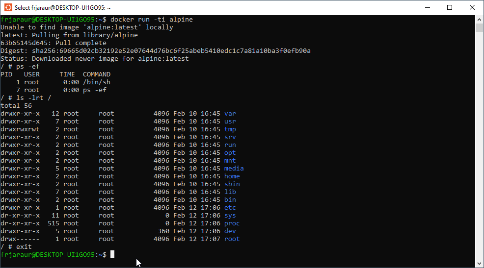

This container execution left changes in Docker Desktop; we can review the current images present in our container runtime.
 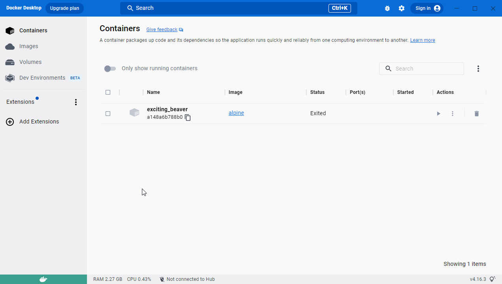

And the container, already dead because we exited by simple executing “exit” inside its shell.

Docker Desktop works and we are ready to follow next labs by using our WSL2 “Ubuntu” Linux distribution.
