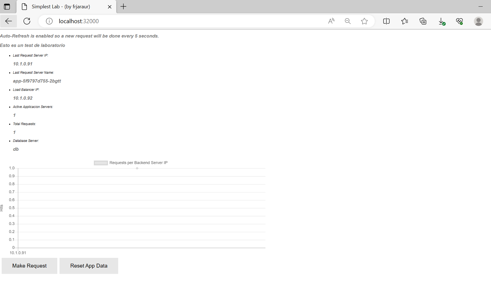
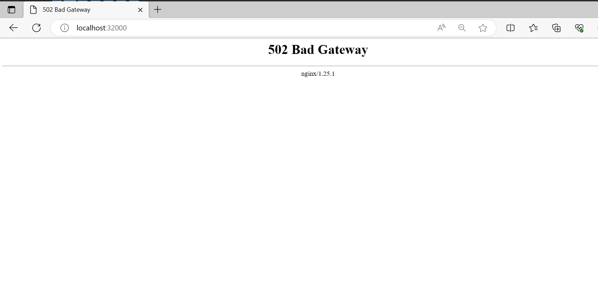

# __Chapter 10 Labs__

## __Technical requirements__

The following labs will provide examples to put into practice concepts and procedures learned in this chapter. We will use Docker Desktop as container runtime and WSL2 (or you Linux/MacOS terminal) to execute the commands described. 

Ensure you have downloaded the content of this book’s GitHub repository in https://github.com/PacktPublishing/Docker-for-Developers-Handbook.git. For this chapter’s labs we will use the content of Chapter10 directory. 

You can use one of the following Kubernetes Desktop environments:
- Docker Desktop
- Rancher Desktop
- Minikube
- KinD
The Labs will work on any of then, and of course, on any other Kubernetes environment. You may find issues with their defualt storage class, but there are some comments on the files that may be changed.

## Improving the simplelab application on Kubernetes

In this lab we will modify the simplelab, a very simplified tier-3 application (loadbalanccer could present additional static content but it is not added for the purposes of the labs), to make it more secure by adding Secret resources for defining all the required user authentications. 

The application is composed of 3 components:
- Postgres database - db component
- Application backend in NodeJS - app component
- Nginx fronted for static content - lb component

We have included in their manifests some of the storage solutions learned in this chapter.

### Database Component

As we are alredy using a StatefulSet, a PersistentVolumeClaim is configured, but the postgres user password was presented in the database container in clear text. We added a Secret resource to include this password, and we also included a complete database initialization script that will allow us to prepare the database. In the previous labs, this component was initialized with the script, included in the container image. In this case, we can manage how the database por the application will be created by modifying this sctipt and replacing the secret. You must to know that we can't use this mechanism to modify a previously initialized database. That's why we expect to deploy this component from scratch.

These are the Secret manifests created:

- dbcredentials.secret.yaml
```
apiVersion: v1
data:
  POSTGRES_PASSWORD: Y2hhbmdlbWU=
kind: Secret
metadata:
  name: dbcredentials
```

- initdb.secret.yaml
This secret is created by including the content of init-demo.sh script:
```
$ cat init-demo.sh
#!/bin/bash
set -e

psql -v ON_ERROR_STOP=1 --username "$POSTGRES_USER" <<-EOSQL
    CREATE USER demo with PASSWORD 'd3m0' ;
    CREATE DATABASE demo owner demo;
    GRANT ALL PRIVILEGES ON DATABASE demo TO demo;
    \connect demo;

    CREATE TABLE IF NOT EXISTS hits
    (
      hitid serial,
      serverip varchar(15) NOT NULL,
      clientip varchar(15) NOT NULL,
      date timestamp without time zone,
      PRIMARY KEY (hitid)
    );
    ALTER TABLE hits OWNER TO demo;
EOSQL
```

We used the following command-line for creating initdb.secret.yaml Secret manifest:
```
$ kubectl create secret generic initdb --from-file=init-demo.sh --dry-run=client -o yaml |tee initdb.secret.yaml
apiVersion: v1
data:
  init-demo.sh: IyEvYmluL2Jhc2gKc2V0IC1lCgpwc3FsIC12IE9OX0VSUk9SX1NUT1A9MSAtLXVzZXJuYW1lICIkUE9TVEdSRVNfVVNFUiIgPDwtRU9TUUwKICAgIENSRUFURSBVU0VSIGRlbW8gd2l0aCBQQVNTV09SRCAnZDNtMCcgOwogICAgQ1JFQVRFIERBVEFCQVNFIGRlbW8gb3duZXIgZGVtbzsKICAgIEdSQU5UIEFMTCBQUklWSUxFR0VTIE9OIERBVEFCQVNFIGRlbW8gVE8gZGVtbzsKICAgIFxjb25uZWN0IGRlbW87CgogICAgQ1JFQVRFIFRBQkxFIElGIE5PVCBFWElTVFMgaGl0cwogICAgKAogICAgICBoaXRpZCBzZXJpYWwsCiAgICAgIHNlcnZlcmlwIHZhcmNoYXIoMTUpIE5PVCBOVUxMLAogICAgICBjbGllbnRpcCB2YXJjaGFyKDE1KSBOT1QgTlVMTCwKICAgICAgZGF0ZSB0aW1lc3RhbXAgd2l0aG91dCB0aW1lIHpvbmUsCiAgICAgIFBSSU1BUlkgS0VZIChoaXRpZCkKICAgICk7CiAgICBBTFRFUiBUQUJMRSBoaXRzIE9XTkVSIFRPIGRlbW87CkVPU1FMCg==
kind: Secret
metadata:
  creationTimestamp: null
  name: initdb
```

In both cases, the values are encoded in base64 format. They aren't encryptedas we can verify:
```
$ kubectl get secret dbcredentials -ojsonpath="{.data.POSTGRES_PASSWORD}"|base64 -d
changeme
```

Let's see now how the StatefulSet manifest was modified:
```
apiVersion: apps/v1
kind: StatefulSet
metadata:
  name: db
  labels:
    component: db
    app: simplestlab
spec:
  replicas: 1
  selector:
    matchLabels:
      component: db
      app: simplestlab
  template:
    metadata:
      labels:
        component: db
        app: simplestlab
    spec:
      securityContext:
        runAsNonRoot: true
        runAsUser: 10000
        runAsGroup: 10000
        fsGroup: 10000
        fsGroupChangePolicy: OnRootMismatch
      volumes:
      - name: initdb-secret
        secret:
          secretName: initdb
          optional: true
      containers:
      - name: database
        image: docker.io/frjaraur/simplestdb:1.0
        ports:
        - containerPort: 5432
        # args: ["-c","sleep 1d"]
        # command: ["/bin/sh"]
        env:
        - name: POSTGRES_PASSWORD
          valueFrom:
            secretKeyRef:
              name: dbcredentials
              key: POSTGRES_PASSWORD
        - name: PGDATA
          value: /data/postgres
        volumeMounts:
        - name: postgresdata
          mountPath: /data
        - name: initdb-secret
          mountPath: "/docker-entrypoint-initdb.d/"
          readOnly: true

        readinessProbe:
          tcpSocket:
            port: 5432
          initialDelaySeconds: 5
          periodSeconds: 10
        livenessProbe:
          tcpSocket:
            port: 5432
          initialDelaySeconds: 15
          periodSeconds: 20

  volumeClaimTemplates:
  - metadata:
      name: postgresdata
    spec:
      accessModes: [ "ReadWriteOnce" ]
      #storageClassName: "csi-hostpath-sc"
      resources:
        requests:
          storage: 1Gi
```

We create all the components for the database:
```
$ kubectl create -f dbcredentials.secret.yaml -f initdb.secret.yaml
secret/dbcredentials created
secret/initdb created


$ kubectl create -f db.statefulset.yaml
statefulset.apps/db created

$ kubectl create -f db.service.yaml
service/db created
```
The service wasn't modified at all.

We check if the user was created by connecting to the database server and show its users:
```
$ kubectl exec -ti db-0 -- psql -U postgres
psql (15.3)
Type "help" for help.

postgres=# \du
                                   List of roles
 Role name |                         Attributes                         | Member of
-----------+------------------------------------------------------------+-----------
 demo      |                                                            | {}
 postgres  | Superuser, Create role, Create DB, Replication, Bypass RLS | {}

postgres=# \q
could not save history to file "//.psql_history": Permission denied
```


- Notice that we modified the content of the POSTGRES_PASSWORD variable and now it's taken from the secret created.

- We also included initdb-secret as a volume and it's mounted in /docker-entrypoint-initdb.d directory. Notice that we didn't use subPath because this directory is empty. You can change the content of the secret and it will be synced inside the containers, but this will not change the authentication values in the database because it is an initialization script. You can modify it to enforce the change of the password via SQL.

We can now review the PersistentVolumeClaim, created by using a template (because it is a StatefulSet) and the associated PersistentVolume created:
```
$ kubectl get pvc
NAME                STATUS   VOLUME                                     CAPACITY   ACCESS MODES   STORAGECLASS   AGE
postgresdata-db-0   Bound    pvc-4999f00b-deb3-4cec-97a0-3a289c4457d9   1Gi        RWO            hostpath       168m


$ kubectl get pv pvc-4999f00b-deb3-4cec-97a0-3a289c4457d9
NAME                                       CAPACITY   ACCESS MODES   RECLAIM POLICY   STATUS   CLAIM                       STORAGECLASS   REASON   AGE
pvc-4999f00b-deb3-4cec-97a0-3a289c4457d9   1Gi        RWO            Delete           Bound    default/postgresdata-db-0   hostpath                168m
```


A StorageClass is defined in Docker Desktop and we use it by default:
```
$ kubectl get sc
NAME                 PROVISIONER          RECLAIMPOLICY   VOLUMEBINDINGMODE   ALLOWVOLUMEEXPANSION   AGE
hostpath (default)   docker.io/hostpath   Delete          Immediate           false                  12d
$ kubectl get sc -o yaml hostpath
apiVersion: storage.k8s.io/v1
kind: StorageClass
metadata:
  annotations:
    kubectl.kubernetes.io/last-applied-configuration: |
      {"apiVersion":"storage.k8s.io/v1","kind":"StorageClass","metadata":{"annotations":{"storageclass.kubernetes.io/is-default-class":"true"},"name":"hostpath"},"provisioner":"docker.io/hostpath","reclaimPolicy":"Delete","volumeBindingMode":"Immediate"}
    storageclass.kubernetes.io/is-default-class: "true"
  creationTimestamp: "2023-06-20T07:46:34Z"
  name: hostpath
  resourceVersion: "407"
  uid: 27f45e89-001d-4f0c-8c64-146d44046e0a
provisioner: docker.io/hostpath
reclaimPolicy: Delete
volumeBindingMode: Immediate
```


We can now continue and review the changes in the app component.

### Application backend

For this component we used the imperative method for creating the appcredentials Secret. This method does not generate a YAML manifest which may be a problem because you will ned to store ypu passwords somewhere. In you need to store all your manifest in yor code repository, which is always recommended, you must always encrypt your Secret manifests.

```
$ kubectl create secret generic appcredentials \
--from-literal=dbhost=db \
--from-literal=dbname=demo \
--from-literal=dbuser=demo \
--from-literal=dbpasswd=d3m0

secret/appcredentials created
```
The values for these variables must be ones used in the initialization script.

Let's review the changes included to load the database authentication in the application:
```
apiVersion: apps/v1
kind: Deployment
metadata:
  name: app
  labels:
    component: app
    app: simplestlab
spec:
  replicas: 3
  selector:
    matchLabels:
      component: app
      app: simplestlab
  template:
    metadata:
      labels:
        component: app
        app: simplestlab
    spec:
      securityContext:
        runAsNonRoot: true
        runAsUser: 10001
        runAsGroup: 10001

      containers:
      - name: app
        image: docker.io/frjaraur/simplestapp:1.0
        ports:
        - containerPort: 3000
        env:
        - name: dbhost
          valueFrom:
            secretKeyRef:
              name: appcredentials
              key: dbhost
        - name: dbname
          valueFrom:
            secretKeyRef:
              name: appcredentials
              key: dbname
        - name: dbuser
          valueFrom:
            secretKeyRef:
              name: appcredentials
              key: dbuser
        - name: dbpasswd
          valueFrom:
            secretKeyRef:
              name: appcredentials
              key: dbpasswd
        securityContext:
          readOnlyRootFilesystem: true
        readinessProbe:
          httpGet:
            path: /healthz
            port: 3000
            httpHeaders:
            - name: Custom-Header
              value: HealthCheck
          initialDelaySeconds: 5
          periodSeconds: 10
        livenessProbe:
          tcpSocket:
            port: 3000
          initialDelaySeconds: 15
          periodSeconds: 20
        resources:
          requests:
            cpu: 10m
            memory: 20M
          limits:
            cpu: 20m
            memory: 30Mi
```

We have just included all the required environment variables from the secret created before.
We deploy the app menifests:
```
$ kubectl create -f app.deployment.yaml -f app.service.yaml
deployment.apps/app created
service/app created
```

We now verify the content included in the containers:
```
$ kubectl exec -ti app-5f9797d755-2bgtt -- env
PATH=/usr/local/sbin:/usr/local/bin:/usr/sbin:/usr/bin:/sbin:/bin
HOSTNAME=app-5f9797d755-2bgtt
TERM=xterm
dbhost=db
dbname=demo
dbuser=demo
dbpasswd=d3m0
KUBERNETES_PORT_443_TCP_PROTO=tcp
KUBERNETES_SERVICE_HOST=10.96.0.1
KUBERNETES_SERVICE_PORT_HTTPS=443
APP_SERVICE_HOST=10.101.227.60
KUBERNETES_SERVICE_PORT=443
KUBERNETES_PORT=tcp://10.96.0.1:443
KUBERNETES_PORT_443_TCP_PORT=443
APP_SERVICE_PORT=3000
APP_PORT=tcp://10.101.227.60:3000
KUBERNETES_PORT_443_TCP=tcp://10.96.0.1:443
KUBERNETES_PORT_443_TCP_ADDR=10.96.0.1
APP_PORT_3000_TCP=tcp://10.101.227.60:3000
APP_PORT_3000_TCP_PROTO=tcp
APP_PORT_3000_TCP_PORT=3000
APP_PORT_3000_TCP_ADDR=10.101.227.60
APPDIR=/APP
HOME=/


$ kubectl get pods
NAME                   READY   STATUS    RESTARTS   AGE
app-5f9797d755-2bgtt   1/1     Running   0          100s
app-5f9797d755-gdpw7   1/1     Running   0          100s
app-5f9797d755-rzkqz   1/1     Running   0          100s
db-0                   1/1     Running   0          179m
```

We can now continue with the frontend component.

### Frontend Component
In the previous versions of this application's deployment we were already using a configMap for configuring the Nginx load balancer.

This is the content of the configMap with these special configurations for our Nginx:
```
apiVersion: v1
kind: ConfigMap
metadata:
  name: lb-config
  labels:
    component: lb
    app: simplestlab
data: 
  nginx.conf: |
    user  nginx;
    worker_processes  auto;

    error_log  /tmp/nginx/error.log warn;
    pid        /tmp/nginx/nginx.pid;

    events { 
      worker_connections  1024; 
    }

    http { 
      server {
        listen 8080; # specify a port higher than 1024 if running as non-root user 
        location /healthz { 
            add_header Content-Type text/plain;
            return 200 'OK';
        } 
        location / {
          proxy_pass http://app:3000;
        }   
      }
    }
```

We deploy all the lb manifests:
```
$ kubectl create -f lb.daemonset.yaml -f lb.configmap.yaml -f  lb.service.yaml
daemonset.apps/lb created
configmap/lb-config created
service/lb create
```

We review the status of all the application's components and the configuration applied to the Nginx component:
```

$ kubectl get pods
NAME                   READY   STATUS    RESTARTS   AGE
app-5f9797d755-2bgtt   1/1     Running   0          5m52s
app-5f9797d755-gdpw7   1/1     Running   0          5m52s
app-5f9797d755-rzkqz   1/1     Running   0          5m52s
db-0                   1/1     Running   0          3h4m
lb-zcm6q               1/1     Running   0          2m2s

$ kubectl exec lb-zcm6q -- cat /etc/nginx/nginx.conf
user  nginx;
worker_processes  auto;

error_log  /tmp/nginx/error.log warn;
pid        /tmp/nginx/nginx.pid;

events {
  worker_connections  1024;
}

http {
  server {
    listen 8080; # specify a port higher than 1024 if running as non-root user
    location /healthz {
        add_header Content-Type text/plain;
        return 200 'OK';
    }
    location / {
      proxy_pass http://app:3000;
    }
  }
}
$
```

And now we can reach our application in any Kubernetes cluster __host's port 32000__. Your browser should access the application and show something like this (if using Docker Desktop you will need to use http://localhost:32000):



## Modifying the lb component ConfigMap

In this lab we will modify the ConfigMap to route the requests to a new app Service resource, exposing a different port and DNS name.

First we create a new Service resource by using the imperative mode:
```
$ kubectl get svc
NAME         TYPE        CLUSTER-IP      EXTERNAL-IP   PORT(S)        AGE
app          ClusterIP   10.101.227.60   <none>        3000/TCP       5m57s
db           ClusterIP   None            <none>        5432/TCP       8m8s
kubernetes   ClusterIP   10.96.0.1       <none>        443/TCP        12d
lb           NodePort    10.108.36.202   <none>        80:32000/TCP   2m7s


$ kubectl expose deployment app \
--name app2 --port 8080 \
--target-port=3000

service/app2 exposed
```

A new Service is created, associating the app endpoints, listening in port 3000, in the port 8080, in the new ___app2___ name.
```
$ kubectl get svc
NAME         TYPE        CLUSTER-IP      EXTERNAL-IP   PORT(S)        AGE
app          ClusterIP   10.101.227.60   <none>        3000/TCP       8m14s
app2         ClusterIP   10.103.70.67    <none>        8080/TCP       32s
db           ClusterIP   None            <none>        5432/TCP       10m
kubernetes   ClusterIP   10.96.0.1       <none>        443/TCP        12d
lb           NodePort    10.108.36.202   <none>        80:32000/TCP   4m24s
```

For this new service, we have already created a new ConfigMap manifest, ___lb.configmap.for-app2-service.yaml___:
```
apiVersion: v1
kind: ConfigMap
metadata:
  name: lb-config
  labels:
    component: lb
    app: simplestlab
data: 
  nginx.conf: |
    user  nginx;
    worker_processes  auto;

    error_log  /tmp/nginx/error.log warn;
    pid        /tmp/nginx/nginx.pid;

    events { 
      worker_connections  1024; 
    }

    http { 
      server {
        listen 8080; # specify a port higher than 1024 if running as non-root user 
        location /healthz { 
            add_header Content-Type text/plain;
            return 200 'OK';
        } 
        location / {
          proxy_pass http://app2:8080;
        }   
      }
    }
```

We replace the content of the ConfigMap:
```
$ kubectl replace -f lb.configmap.for-app2-service.yaml
configmap/lb-config replaced
```

We verify if the new content is applied to the ConfigMap resource in Kubernetes:
```
$ kubectl get cm lb-config -o yaml
apiVersion: v1
data:
  nginx.conf: "user  nginx;\nworker_processes  auto;\n\nerror_log  /tmp/nginx/error.log
    warn;\npid        /tmp/nginx/nginx.pid;\n\nevents { \n  worker_connections  1024;
    \n}\n\nhttp { \n  server {\n    listen 8080; # specify a port higher than 1024
    if running as non-root user \n    location /healthz { \n        add_header Content-Type
    text/plain;\n        return 200 'OK';\n    } \n    location / {\n      proxy_pass
    http://app2:8080;\n    }   \n  }\n}\n"
kind: ConfigMap
metadata:
  creationTimestamp: "2023-07-02T14:58:13Z"
  labels:
    app: simplestlab
    component: lb
  name: lb-config
  namespace: default
  resourceVersion: "56564"
  uid: 4959f7b0-a15e-49f9-96cd-2b572508e67b
```

As we can see, the ConfigMap for configuring the Nginx load balancer was updated, and we will now verify if the containers were also updated by reviewing the ___nginx.conf___ file included:
```
$ kubectl exec lb-zcm6q -- cat /etc/nginx/nginx.conf
user  nginx;
worker_processes  auto;

error_log  /tmp/nginx/error.log warn;
pid        /tmp/nginx/nginx.pid;

events {
  worker_connections  1024;
}

http {
  server {
    listen 8080; # specify a port higher than 1024 if running as non-root user
    location /healthz {
        add_header Content-Type text/plain;
        return 200 'OK';
    }
    location / {
      proxy_pass http://app:3000;
    }
  }
}
```

as you may have noticed, the file wasn't updated. This is due to the fact that we are using a subPath key to mount the ___nginx.conf___ file, hence the configMap isn't synced.

But we can now force the DaemonSet to update the values by removing the Pods: 
```
$ kubectl delete pod lb-zcm6q
pod "lb-zcm6q" deleted

$ kubectl get pods
NAME                   READY   STATUS    RESTARTS   AGE
app-5f9797d755-2bgtt   1/1     Running   0          23m
app-5f9797d755-gdpw7   1/1     Running   0          23m
app-5f9797d755-rzkqz   1/1     Running   0          23m
db-0                   1/1     Running   0          3h21m
lb-tmmnc               0/1     Running   0          4s

$ kubectl exec lb-tmmnc -- cat /etc/nginx/nginx.conf
user  nginx;
worker_processes  auto;

error_log  /tmp/nginx/error.log warn;
pid        /tmp/nginx/nginx.pid;

events {
  worker_connections  1024;
}

http {
  server {
    listen 8080; # specify a port higher than 1024 if running as non-root user
    location /healthz {
        add_header Content-Type text/plain;
        return 200 'OK';
    }
    location / {
      proxy_pass http://app2:8080;
    }
  }
}
```

As you can see, the ConfigMap's content was now updated inside the container and the application now still works, but this time using ___app2___ Service, as we can verify (if using Docker Desktop you will need to use http://localhost:32000):



