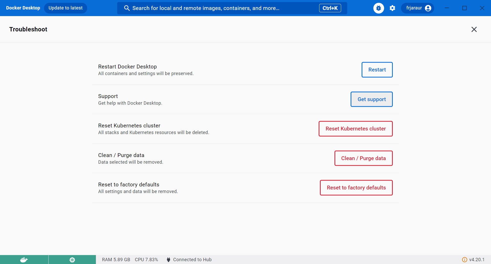
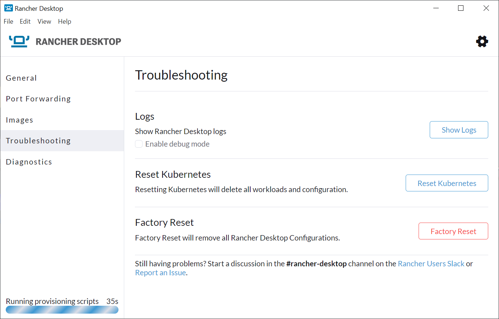
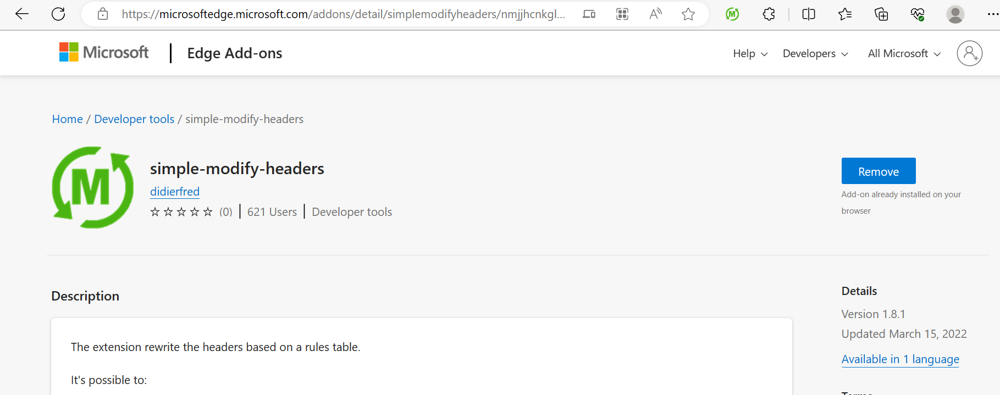
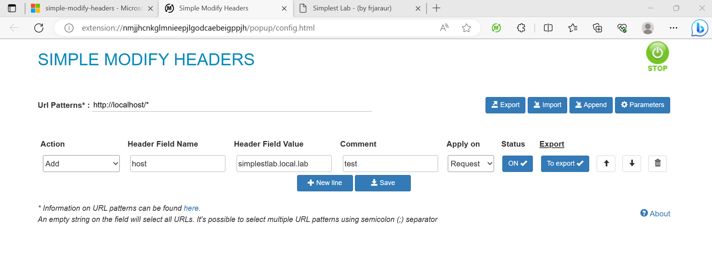
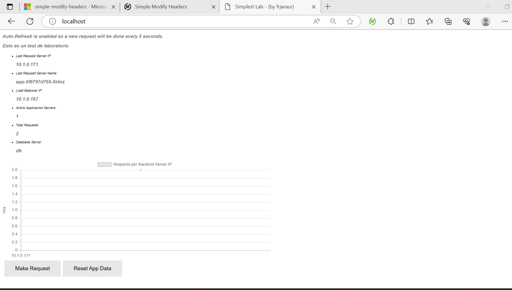

# __Chapter 11 Labs__

## __Technical requirements__

The following labs will provide examples to put into practice concepts and procedures learned in this chapter. We will use Docker Desktop as container runtime and WSL2 (or you Linux/MacOS terminal) to execute the commands described for the first part of the Labs (Ingress Controller) and then we will start a Minikube environment for the second part (NetworkPolicy resources).

>__IMPORTANT NOTE: Please stop Docker Desktop before creating your Minikube environemnt. Both can run at the same time but they will consume lot of hardware resources and you should choose the right Kubernetes context for your environment.__ 

Ensure that you have downloaded the content of this book’s GitHub repository in https://github.com/PacktPublishing/Docker-for-Developers-Handbook.git. For this chapter’s labs we will use the content of Chapter11 directory. 

You can use one of the following Kubernetes Desktop environments:
- Docker Desktop (NetworkPolicy resources are not available at the time of writting this book in this platform)
- Rancher Desktop (supports NetworkPolicy resources)
- Minikube (supports NetworkPolicy resources)
- KinD

The Ingress Controller lab will work on any of them, but for the NetworkPolicy resources part you will need to use an appropriate Kuberneted CNI, with support for such resources. Each Kubernetes desktop or platform implementation manages and presents its own networking infrastructure to the users in a different way.

These are the tasks you will find in this repository:
- We will first deploy the Kubernetes Nginx Ingress Controller (if you don’t have your own Ingress Controller in your labs platform).
- We will deploy all the manifests prepared for simplestlab application, located inside simplestlab folder. We will use kubectl create -f  simplestlab.
- Once all the components are ready, we will create an Ingress resource using the manifest prepared for this task. We will also use a more advanced Ingress manifest with a self-signed certificate and encrypt the client communications.

These labs will definitely help you understand how to improve the security of an application by isolating its components and exposing and publishing only those required for the users and other application’s components.

>NOTE: Docker Desktop and Rancher Desktop are great tools for testing Kubernetes features on your desktop computer. You can remove all your Kubernetes data with a simple click in their ___Troubleshooting___ sections. Here are a screenshot for each platform: 
>
>- Docker Desktop 
>
>
>- Rancher Desktop 
>
>
>The Reset Kubernetes button, completely removes all the workloads and resources created, which is great to start things over. I highly recommend reseting your cluster before starting this Labs section.


# Improving applications access with an Ingress Controller

## Deploying your own Ingress Controller
In this first task, we will deploy our own Ingress Controller. We are using Docker Desktop, which will provide a good LoadBalancer service implementation. These Service resources will attach the localhost IP address, which will make it easy to connect to the published services.

We will use Kubernetes Nginx Ingress Controller (https://kubernetes.github.io). We will use the cloud deployment (https://raw.githubusercontent.com/kubernetes/ingress-nginx/controller-v1.8.1/deploy/static/provider/cloud/deploy.yaml) because Docker Desktop provides LoadBalancer services. If you are using a complete bare-metal infrastructure, please use the baremetal YAML (https://raw.githubusercontent.com/kubernetes/ingress-nginx/controller-v1.8.1/deploy/static/provider/baremetal/deploy.yaml) and follow the additional instructions here https://kubernetes.github.io/ingress-nginx/deploy/baremetal/ for NodePort routing.

>NOTE: Local copies are provided in the repository as [kubernetes-nginx-ingress-controller-full-install-cloud.yaml](kubernetes-nginx-ingress-controller-full-install-cloud.yaml) and [kubernetes-nginx-ingress-controller-full-install-baremetal.yaml](kubernetes-nginx-ingress-controller-full-install-baremetal.yaml)


We will just deploy the provided YAML concatenated manifest (CLOUD VERSION FOR DOCKER DESKTOP).
```
Chapter11$ kubectl apply -f https://raw.githubusercontent.com/kubernetes/ingress-nginx/controller-v1.8.1/deploy/static/provider/cloud/deploy.yaml
namespace/ingress-nginx created
serviceaccount/ingress-nginx created
serviceaccount/ingress-nginx-admission created
role.rbac.authorization.k8s.io/ingress-nginx created
role.rbac.authorization.k8s.io/ingress-nginx-admission created
clusterrole.rbac.authorization.k8s.io/ingress-nginx created
clusterrole.rbac.authorization.k8s.io/ingress-nginx-admission created
rolebinding.rbac.authorization.k8s.io/ingress-nginx created
rolebinding.rbac.authorization.k8s.io/ingress-nginx-admission created
clusterrolebinding.rbac.authorization.k8s.io/ingress-nginx created
clusterrolebinding.rbac.authorization.k8s.io/ingress-nginx-admission created
configmap/ingress-nginx-controller created
service/ingress-nginx-controller created
service/ingress-nginx-controller-admission created
deployment.apps/ingress-nginx-controller created
job.batch/ingress-nginx-admission-create created
job.batch/ingress-nginx-admission-patch created
ingressclass.networking.k8s.io/nginx created
validatingwebhookconfiguration.admissionregistration.k8s.io/ingress-nginx-admission created
```

We can now review the workload resources created:
```
Chapter11$ kubectl get all -n ingress-nginx
NAME                                            READY   STATUS      RESTARTS   AGE
pod/ingress-nginx-admission-create-9cpnb        0/1     Completed   0          13m
pod/ingress-nginx-admission-patch-6gq2c         0/1     Completed   1          13m
pod/ingress-nginx-controller-74469fd44c-h6nlc   1/1     Running     0          13m

NAME                                         TYPE           CLUSTER-IP       EXTERNAL-IP   PORT(S)                      AGE
service/ingress-nginx-controller             LoadBalancer   10.100.162.170   localhost     80:31901/TCP,443:30080/TCP   13m
service/ingress-nginx-controller-admission   ClusterIP      10.100.197.210   <none>        443/TCP                      13m

NAME                                       READY   UP-TO-DATE   AVAILABLE   AGE
deployment.apps/ingress-nginx-controller   1/1     1            1           13m

NAME                                                  DESIRED   CURRENT   READY   AGE
replicaset.apps/ingress-nginx-controller-74469fd44c   1         1         1       13m

NAME                                       COMPLETIONS   DURATION   AGE
job.batch/ingress-nginx-admission-create   1/1           7s         13m
job.batch/ingress-nginx-admission-patch    1/1           8s         13m
```

Notice that the ingress-nginx-controller serivce is attached to localhost IP address, thus we can check its availability in http://localhost:80 and https://localhost:443 (exposed ports).
```
Chapter11$ curl http://localhost
<html>
<head><title>404 Not Found</title></head>
<body>
<center><h1>404 Not Found</h1></center>
<hr><center>nginx</center>
</body>
</html>

Chapter11$ curl https://localhost
curl: (60) SSL certificate problem: self-signed certificate
More details here: https://curl.se/docs/sslcerts.html

curl failed to verify the legitimacy of the server and therefore could not
establish a secure connection to it. To learn more about this situation and
how to fix it, please visit the web page mentioned above.

Chapter11$ curl -k https://localhost
<html>
<head><title>404 Not Found</title></head>
<body>
<center><h1>404 Not Found</h1></center>
<hr><center>nginx</center>
</body>
</html>
```

Ingress Controller is deployed and listening, the 404 error indicates that there isn't an associated ingress with localhost host (there isn't even a default one configured, but Ingress Controller responds correclty).


## Publishing the simplestlab application on Kubernetes using an Ingress Controller (No TLS)

In this lab we will deploy the simplelab, a very simplified tier-3 application, located in the ___simplestlab___ directory and publish its frontend, __lb__ component.

The manifests for the application are already written for you, we will just have to use kubectl to create an appropriate namespace for the application and then deploy all its resources:
```
Chapter11$ kubectl create ns simplestlab
namespace/simplestlab created

Chapter11$ kubectl create -n simplestlab -f simplestlab/
deployment.apps/app created
service/app created
secret/appcredentials created
service/db created
statefulset.apps/db created
secret/dbcredentials created
secret/initdb created
configmap/lb-config created
daemonset.apps/lb created
service/lb created

Chapter11$ kubectl get all -n simplestlab
NAME                       READY   STATUS    RESTARTS   AGE
pod/app-5f9797d755-5t4nz   1/1     Running   0          81s
pod/app-5f9797d755-9rzlh   1/1     Running   0          81s
pod/app-5f9797d755-nv58j   1/1     Running   0          81s
pod/db-0                   1/1     Running   0          80s
pod/lb-5wl7c               1/1     Running   0          80s

NAME          TYPE        CLUSTER-IP      EXTERNAL-IP   PORT(S)    AGE
service/app   ClusterIP   10.99.29.167    <none>        3000/TCP   81s
service/db    ClusterIP   None            <none>        5432/TCP   81s
service/lb    ClusterIP   10.105.219.69   <none>        80/TCP     80s

NAME                DESIRED   CURRENT   READY   UP-TO-DATE   AVAILABLE   NODE SELECTOR   AGE
daemonset.apps/lb   1         1         1       1            1           <none>          80s

NAME                  READY   UP-TO-DATE   AVAILABLE   AGE
deployment.apps/app   3/3     3            3           81s

NAME                             DESIRED   CURRENT   READY   AGE
replicaset.apps/app-5f9797d755   3         3         3       81s

NAME                  READY   AGE
statefulset.apps/db   1/1     80s
```

Our application is ready but innaccessible, the __lb__ component isn't exposed. It is listenning in port 80, but ClusterIP is used, hence the service is only available internally, cluster wide.

We will now create an Ingress resource. There are two manifests in the __ingress__ directory. We will use [simplestlab.ingress.yaml](./ingress/simplestlab.ingress.yaml), which will be deployed without custom TLS encryptation.  
```
Chapter11$ cat ingress/simplestlab.ingress.yaml
apiVersion: networking.k8s.io/v1
kind: Ingress
metadata:
  name: simplestlab
  annotations:
    # nginx.ingress.kubernetes.io/rewrite-target: /
spec:
  ingressClassName: nginx
  rules:
  - host: simplestlab.local.lab
    http:
      paths:
      - path: /
        pathType: Prefix
        backend:
          service:
            name: lb
            port:
              number: 80
```

We will just deploy the previously created manifest:
```
Chapter11$ kubectl create -f ingress/simplestlab.ingress.yaml -n simplestlab
ingress.networking.k8s.io/simplestlab created

Chapter11$ kubectl get ingress -n simplestlab
NAME          CLASS   HOSTS                   ADDRESS   PORTS   AGE
simplestlab   nginx   simplestlab.local.lab             80      16s
```
We can check the defined host URL with curl:
```
Chapter11$ curl -H "host: simplestlab.local.lab" http://localhost/
<!DOCTYPE html>
<html>
<head>
    <title>Simplest Lab - (by frjaraur)</title>
    <!-- <meta charset="utf-8" http-equiv="refresh" content="5"> -->
    <script src='Chart.js'></script>

    <style>

        h2 {
            color: grey;
            text-align: left;
            font-family: "Sans-serif", Arial;
            font-style: oblique;
            font-size: 14px;
        }
        li {
            color: black;
            text-align: left;
            font-family: "Sans-serif", Arial;
            font-style: oblique;
            font-size: 10px;
        }
        a {
            color: blue;
        }
        .button {
            float: left;
            background-color: #e7e7e7;
            border: none;
            color: black;
            padding: 15px 32px;
            text-align: center;
            text-decoration: none;
            /*display: inline-block;*/
            font-size: 16px;
        }
        .tweet {background-color: #008CBA;}


    </style>
</head>
<body>
<h2>Auto-Refresh is enabled so a new request will be done every 5 seconds.</h2>
    <h2>Esto es un test de laboratorio</h2>
<ul>
<li>Last Request Server IP: <h2>10.1.0.171</h2></li>
<li>Last Request Server Name: <h2>app-5f9797d755-5t4nz</h2></li>
<li>Load Balancer IP: <h2>10.1.0.167</h2></li>
<li>Active Applicacion Servers: <h2>1</h2></li>
<li>Total Requests: <h2>1</h2></li>
<li>Database Server: <h2>db</h2></li>
</ul>

    <canvas id="appChart" style="display";block;></canvas>


    <script>
        var data = {
            labels: ["10.1.0.171"],
            datasets: [
                {
                    label: "Requests per Backend Server IP",
                    fillColor: "rgba(220,220,220,0.2)",
                    strokeColor: "rgba(220,220,220,1)",
                    pointRadius: 3,
                    pointColor: "rgba(220,220,220,1)",
                    pointStrokeColor: "#fff",
                    pointHighlightFill: "#fff",
                    pointHighlightStroke: "rgba(220,220,220,1)",
                    data: [1],
                }
            ]
        };
        var options = {
            animation: {
                duration:5000
            },
            responsive:false,
            maintainAspectRatio: false,
            scales: {
                yAxes: [{
                  scaleLabel: {
                    display: true,
                    labelString: 'Hits'
                  },
                  ticks: {
                      min: 0,
                  }
                }]
            }
        };
        var ctx = document.getElementById("appChart").getContext("2d");
        ctx.canvas.width = 800;
        ctx.canvas.height = 300;
        var myNewChart = new Chart(ctx , { type: "line", data: data, options: options,});


    </script>
    <table border=0>
    <tr>
    <td><form action='/' method='post' name='request'><td>
    <button class='button' type='submit' name='action' value='app_reset'>Make Request</button>
    </form></td>
    <td><form action='/reset' method='post' name='reset'><td>
    <button class='button' type='submit' name='action' value='app_reset'>Reset App Data</button>
    </form></td>
<!--    <td>
        <a href="https://twitter.com/intent/tweet?button_hashtag=Dockerbirthday&text=Having%20Fun%20With%20@Docker,%20@Hoplasoftware%20and%20@Microsoft%20Celebrating" class="button tweet" data-related="@HoplaSoftware,user2">Tweet #Dockerbirthday</a> <script>!function(d,s,id){var js,fjs=d.getElementsByTagName(s)[0],p=/^http:/.test(d.location)?'http':'https';if(!d.getElementById(id)){js=d.createElement(s);js.id=id;js.src=p+'://platform.twitter.com/widgets.js';fjs.parentNode.insertBefore(js,fjs);}}(document, 'script', 'twitter-wjs');</script>
  </td> -->
    </tr>
    </table>
</body>
</html>
</body>
</html>
```

It is available. We can change our /etc/hosts file (or equivalent MS Windows c:\system32\drivers\etc\hosts file), add the following line and open our web browser to access the simplestlab application:
```
127.0.0.1 simplestlab.local.lab
```
This requires root or Administrator access, hence it may be more interesting to use __curl__ with __-H__ or __--header__ arguments to check the application.

>NOTE: You can better use an Extension on your web browser that allows you to modify the headers of your requests. We can simply add ___simple-modify-headers extension___ if you are using MS Edge (you will find equivalent ones for other web browsers and operating systems).
>
>We can configure a __Host__ header with the value of the published host, ___simplestlab.local.lab___:
>
>Now the application is available in __http://localhost__ (notice that we defined the URL pattern as __http://locahost/*__):
>

We will now learn how to add TLS to the Ingress resource to improve our application security.

## Publishing the simplestlab application on Kubernetes using an Ingress Controller (TLS)

>__IMPORTANT NOTE: For this lab to work it is required to either use _curl --resolve_ or change your hosts file.__

We will first create a self-signed certificate to use in our Ingress resource manifest.

1 - First we create our own CA, generating its key to self-sign our certificates:
```
Chapter11$ openssl genrsa -out ca.key 2048
```
2 - Now we create the CA certificate.
```
openssl req -new -x509 -days 365 -key ca.key -subj "/C=CN/ST=ES/L=MA/O=Labs/CN=Labs Root CA" -out ca.crt
```
3 - We create a request for our DNS name (___simplestlab.local.lab___):
```
Chapter11$ openssl req -newkey rsa:2048 -nodes -keyout tls.key -subj "/C=CN/ST=ES/L=MA/O=Labs/CN=*.local.lab" -out tls.csr
.+..+....+++++++++++++++++++++++++++++++++++++++++++++++++++++++++++++++++*......+.........+.....+......+.+..+............+.........+.+......+..+.......+......+...+..+.........+...+.......+.....+.........+....+...+.....+++++++++++++++++++++++++++++++++++++++++++++++++++++++++++++++++*...+..+....+..............+.+...+........+.......+...+............+.....+...+...+.+........+.............+..+.+..............+.+......+...+...+.........+.....+.+........+..........+..+.......+...........+.......+...+.....+....+..+.+..............+.+++++++++++++++++++++++++++++++++++++++++++++++++++++++++++++++++
.........+.........+++++++++++++++++++++++++++++++++++++++++++++++++++++++++++++++++*.+.....+...+......+....+.....+.+......+...+...+...+...........+....+.....+.+......+........+....+..+.+........+....+++++++++++++++++++++++++++++++++++++++++++++++++++++++++++++++++*....+......+......+.+.....+...+....+..+..........+...+........+..........+.....+.............+.....+.+......+.....+.........+...+.......+.....+....+...........+......+++++++++++++++++++++++++++++++++++++++++++++++++++++++++++++++++
-----
```

4 - Finally, we use the request and our CA will sign a new generated certificate associated with our ___tls.key___:
```
Chapter11$ openssl x509 -req -extfile <(printf "subjectAltName=DNS:simplestlab.local.lab") -days 365 -in tls.csr -CA ca.crt -CAkey ca.key -CAcreateserial -out tls.crt
Certificate request self-signature ok
subject=C = CN, ST = ES, L = MA, O = Labs, CN = *.local.lab

```

A key and an associated certificate were created:
``` 
Chapter11$ ls *tls*
tls.crt  tls.csr  tls.key
```
And now we will create a secret with the key and certificate created:
```
Chapter11$ kubectl create secret tls -n simplestlab simplestlab-tls \
  --cert=tls.crt \
  --key=tls.key
secret/simplestlab-tls created
```

And now we can replace the old Ingress resouce, without TLS, with the following one:
```
Chapter11$ cat ingress/simplestlab.ingress-tls.yaml
apiVersion: networking.k8s.io/v1
kind: Ingress
metadata:
  name: simplestlab
  annotations:
    # nginx.ingress.kubernetes.io/rewrite-target: /
spec:
  ingressClassName: nginx
  rules:
  - host: simplestlab.local.lab
    http:
      paths:
      - path: /
        pathType: Prefix
        backend:
          service:
            name: lb
            port:
              number: 80
  tls:
  - hosts:
      - simplestlab.local.lab
    secretName: simplestlab-tls
```

>NOTE: The Secret and Ingress resources must be included in the same namespace. It is also important to associate correctly the __host__ and the __tls__ sections. 

We can now replace the ___simplestlab___ Ingress resource:
```
Chapter11$ kubectl replace -f ingress/simplestlab.ingress-tls.yaml -n simplestlab
ingress.networking.k8s.io/simplestlab replaced
```

We check again with __curl__:
```
Chapter11$ curl -H "host: simplestlab.local.lab" http://localhost/
<html>
<head><title>308 Permanent Redirect</title></head>
<body>
<center><h1>308 Permanent Redirect</h1></center>
<hr><center>nginx</center>
</body>
</html>
```

We tested port 80, and the Ingress Controller redirects our request to HTTPS.
>NOTE: We can use __-L__ to follow the redirection. This will work if you changed yor __hosts__ file. In this case, you will not need to use --resolve, and you can use curl https://simplestlab.local.lab/ directly.

We now test the HTTPS port. Notice that we used --resove argument. This will resolve the DNS name to 127.0.0.1 before sending the request. If you still use the header, you will get the "Ingress Fake" certificate because the host name is not read correctly:
``` 
Chapter11$ curl --resolve simplestlab.local.lab:443:127.0.0.1 https://simplestlab.local.lab/ -k -vvv
* Added simplestlab.local.lab:443:127.0.0.1 to DNS cache
* Hostname simplestlab.local.lab was found in DNS cache
*   Trying 127.0.0.1:443...
* Connected to simplestlab.local.lab (127.0.0.1) port 443 (#0)
* ALPN, offering h2
* ALPN, offering http/1.1
* TLSv1.0 (OUT), TLS header, Certificate Status (22):
* TLSv1.3 (OUT), TLS handshake, Client hello (1):
* TLSv1.2 (IN), TLS header, Certificate Status (22):
* TLSv1.3 (IN), TLS handshake, Server hello (2):
* TLSv1.2 (IN), TLS header, Finished (20):
* TLSv1.2 (IN), TLS header, Supplemental data (23):
* TLSv1.3 (IN), TLS handshake, Encrypted Extensions (8):
* TLSv1.2 (IN), TLS header, Supplemental data (23):
* TLSv1.3 (IN), TLS handshake, Certificate (11):
* TLSv1.2 (IN), TLS header, Supplemental data (23):
* TLSv1.3 (IN), TLS handshake, CERT verify (15):
* TLSv1.2 (IN), TLS header, Supplemental data (23):
* TLSv1.3 (IN), TLS handshake, Finished (20):
* TLSv1.2 (OUT), TLS header, Finished (20):
* TLSv1.3 (OUT), TLS change cipher, Change cipher spec (1):
* TLSv1.2 (OUT), TLS header, Supplemental data (23):
* TLSv1.3 (OUT), TLS handshake, Finished (20):
* SSL connection using TLSv1.3 / TLS_AES_256_GCM_SHA384
* ALPN, server accepted to use h2
* Server certificate:
*  subject: C=CN; ST=ES; L=MA; O=Labs; CN=*.local.lab
*  start date: Jul 18 11:21:28 2023 GMT
*  expire date: Jul 17 11:21:28 2024 GMT
*  issuer: C=CN; ST=ES; L=MA; O=Labs; CN=Labs Root CA
*  SSL certificate verify result: unable to get local issuer certificate (20), continuing anyway.
* Using HTTP2, server supports multiplexing
* Connection state changed (HTTP/2 confirmed)
* Copying HTTP/2 data in stream buffer to connection buffer after upgrade: len=0
* TLSv1.2 (OUT), TLS header, Supplemental data (23):
* TLSv1.2 (OUT), TLS header, Supplemental data (23):
* TLSv1.2 (OUT), TLS header, Supplemental data (23):
* Using Stream ID: 1 (easy handle 0x55bd84061550)
* TLSv1.2 (OUT), TLS header, Supplemental data (23):
> GET / HTTP/2
> Host: simplestlab.local.lab
> user-agent: curl/7.81.0
> accept: */*
>
* TLSv1.2 (IN), TLS header, Supplemental data (23):
* TLSv1.3 (IN), TLS handshake, Newsession Ticket (4):
* TLSv1.2 (IN), TLS header, Supplemental data (23):
* TLSv1.3 (IN), TLS handshake, Newsession Ticket (4):
* old SSL session ID is stale, removing
* TLSv1.2 (IN), TLS header, Supplemental data (23):
* Connection state changed (MAX_CONCURRENT_STREAMS == 128)!
* TLSv1.2 (OUT), TLS header, Supplemental data (23):
* TLSv1.2 (IN), TLS header, Supplemental data (23):
< HTTP/2 200
< date: Tue, 18 Jul 2023 11:27:28 GMT
< content-type: text/html; charset=UTF-8
< strict-transport-security: max-age=15724800; includeSubDomains
<
<!DOCTYPE html>
<html>
<head>
    <title>Simplest Lab - (by frjaraur)</title>
    <!-- <meta charset="utf-8" http-equiv="refresh" content="5"> -->
    <script src='Chart.js'></script>

    <style>

        h2 {
            color: grey;
            text-align: left;
            font-family: "Sans-serif", Arial;
            font-style: oblique;
            font-size: 14px;
        }
        li {
            color: black;
            text-align: left;
            font-family: "Sans-serif", Arial;
            font-style: oblique;
            font-size: 10px;
        }
        a {
            color: blue;
        }
        .button {
            float: left;
            background-color: #e7e7e7;
            border: none;
            color: black;
            padding: 15px 32px;
            text-align: center;
            text-decoration: none;
            /*display: inline-block;*/
            font-size: 16px;
        }
        .tweet {background-color: #008CBA;}


    </style>
</head>
<body>
<h2>Auto-Refresh is enabled so a new request will be done every 5 seconds.</h2>
    <h2>Esto es un test de laboratorio</h2>
<ul>
<li>Last Request Server IP: <h2>10.1.0.170</h2></li>
<li>Last Request Server Name: <h2>app-5f9797d755-9rzlh</h2></li>
<li>Load Balancer IP: <h2>10.1.0.167</h2></li>
<li>Active Applicacion Servers: <h2>3</h2></li>
<li>Total Requests: <h2>12</h2></li>
<li>Database Server: <h2>db</h2></li>
</ul>

    <canvas id="appChart" style="display";block;></canvas>


    <script>
        var data = {
            labels: ["10.1.0.171","10.1.0.170","10.1.0.169"],
            datasets: [
                {
                    label: "Requests per Backend Server IP",
                    fillColor: "rgba(220,220,220,0.2)",
                    strokeColor: "rgba(220,220,220,1)",
                    pointRadius: 3,
                    pointColor: "rgba(220,220,220,1)",
                    pointStrokeColor: "#fff",
                    pointHighlightFill: "#fff",
                    pointHighlightStroke: "rgba(220,220,220,1)",
                    data: [7,4,1],
                }
            ]
        };
        var options = {
            animation: {
                duration:5000
            },
            responsive:false,
            maintainAspectRatio: false,
            scales: {
                yAxes: [{
                  scaleLabel: {
                    display: true,
                    labelString: 'Hits'
                  },
                  ticks: {
                      min: 0,
                  }
                }]
            }
        };
        var ctx = document.getElementById("appChart").getContext("2d");
        ctx.canvas.width = 800;
        ctx.canvas.height = 300;
        var myNewChart = new Chart(ctx , { type: "line", data: data, options: options,});


    </script>
    <table border=0>
    <tr>
    <td><form action='/' method='post' name='request'><td>
    <button class='button' type='submit' name='action' value='app_reset'>Make Request</button>
    </form></td>
    <td><form action='/reset' method='post' name='reset'><td>
    <button class='button' type='submit' name='action' value='app_reset'>Reset App Data</button>
    </form></td>
<!--    <td>
        <a href="https://twitter.com/intent/tweet?button_hashtag=Dockerbirthday&text=Having%20Fun%20With%20@Docker,%20@Hoplasoftware%20and%20@Microsoft%20Celebrating" class="button tweet" data-related="@HoplaSoftware,user2">Tweet #Dockerbirthday</a> <script>!function(d,s,id){var js,fjs=d.getElementsByTagName(s)[0],p=/^http:/.test(d.location)?'http':'https';if(!d.getElementById(id)){js=d.createElement(s);js.id=id;js.src=p+'://platform.twitter.com/widgets.js';fjs.parentNode.insertBefore(js,fjs);}}(document, 'script', 'twitter-wjs');</script>
  </td> -->
    </tr>
    </table>
</body>
</html>
</body>
</html>
* TLSv1.2 (IN), TLS header, Supplemental data (23):
* Connection #0 to host simplestlab.local.lab left intact
```

Notice that we used verbose mode with curl command to verify the certificate presented by the requested url.

Now we try directly, without the defined host,. The Ingress Controller will show us a 404 error again, but we review the certificate of the connection:
```
Chapter11 $ curl https://localhost -k -I -vvv
*   Trying 127.0.0.1:443...
* Connected to localhost (127.0.0.1) port 443 (#0)
* ALPN, offering h2
* ALPN, offering http/1.1
* TLSv1.0 (OUT), TLS header, Certificate Status (22):
* TLSv1.3 (OUT), TLS handshake, Client hello (1):
* TLSv1.2 (IN), TLS header, Certificate Status (22):
* TLSv1.3 (IN), TLS handshake, Server hello (2):
* TLSv1.2 (IN), TLS header, Finished (20):
* TLSv1.2 (IN), TLS header, Supplemental data (23):
* TLSv1.3 (IN), TLS handshake, Encrypted Extensions (8):
* TLSv1.2 (IN), TLS header, Supplemental data (23):
* TLSv1.3 (IN), TLS handshake, Certificate (11):
* TLSv1.2 (IN), TLS header, Supplemental data (23):
* TLSv1.3 (IN), TLS handshake, CERT verify (15):
* TLSv1.2 (IN), TLS header, Supplemental data (23):
* TLSv1.3 (IN), TLS handshake, Finished (20):
* TLSv1.2 (OUT), TLS header, Finished (20):
* TLSv1.3 (OUT), TLS change cipher, Change cipher spec (1):
* TLSv1.2 (OUT), TLS header, Supplemental data (23):
* TLSv1.3 (OUT), TLS handshake, Finished (20):
* SSL connection using TLSv1.3 / TLS_AES_256_GCM_SHA384
* ALPN, server accepted to use h2
* Server certificate:
*  subject: O=Acme Co; CN=Kubernetes Ingress Controller Fake Certificate
*  start date: Jul 18 15:02:34 2023 GMT
*  expire date: Jul 17 15:02:34 2024 GMT
*  issuer: O=Acme Co; CN=Kubernetes Ingress Controller Fake Certificate
*  SSL certificate verify result: self-signed certificate (18), continuing anyway.
* Using HTTP2, server supports multiplexing
* Connection state changed (HTTP/2 confirmed)
* Copying HTTP/2 data in stream buffer to connection buffer after upgrade: len=0
* TLSv1.2 (OUT), TLS header, Supplemental data (23):
* TLSv1.2 (OUT), TLS header, Supplemental data (23):
* TLSv1.2 (OUT), TLS header, Supplemental data (23):
* Using Stream ID: 1 (easy handle 0x562679acf550)
* TLSv1.2 (OUT), TLS header, Supplemental data (23):
> HEAD / HTTP/2
> Host: localhost
> user-agent: curl/7.81.0
> accept: */*
>
* TLSv1.2 (IN), TLS header, Supplemental data (23):
* TLSv1.3 (IN), TLS handshake, Newsession Ticket (4):
* TLSv1.2 (IN), TLS header, Supplemental data (23):
* TLSv1.3 (IN), TLS handshake, Newsession Ticket (4):
* old SSL session ID is stale, removing
* TLSv1.2 (IN), TLS header, Supplemental data (23):
* Connection state changed (MAX_CONCURRENT_STREAMS == 128)!
* TLSv1.2 (OUT), TLS header, Supplemental data (23):
* TLSv1.2 (IN), TLS header, Supplemental data (23):
< HTTP/2 404
HTTP/2 404
< date: Tue, 18 Jul 2023 15:03:41 GMT
date: Tue, 18 Jul 2023 15:03:41 GMT
< content-type: text/html
content-type: text/html
< content-length: 146
content-length: 146
< strict-transport-security: max-age=15724800; includeSubDomains
strict-transport-security: max-age=15724800; includeSubDomains

<
* Connection #0 to host localhost left intact
```

As you can see, we obtained the Ingress Controller common Fake Certificate, included by default in the installation. Of course, this certificate can also be changed, but it will affect all your Ingress without a specific certificate and its management will be part of the daily tasks of your Kubernetes platform administrators.


---

# Improving you application security with NetworkPolicy resources

Stop Docker Desktop because this tool doesn't provide NetworkPolicy integration. Its special CNI does not integrate NetworkPolicy resources at the time of writting this lab.

Start a Minikube environment with Calico. For this to work, open a PowerShell command line with Administrator rights and run minikube start (first ensure you have enough RAM available):
```
PS C:\Users\frjaraur> minikube start --memory 4G --kubernetes-version=stable  --driver=hyperv --cni=calico
😄  minikube v1.30.1 on Microsoft Windows 10 Pro 10.0.19045.3208 Build 19045.3208
✨  Using the hyperv driver based on user configuration
👍  Starting control plane node minikube in cluster minikube
🔥  Creating hyperv VM (CPUs=2, Memory=4096MB, Disk=20000MB) ...
🐳  Preparing Kubernetes v1.26.3 on Docker 20.10.23 ...
    ▪ Generating certificates and keys ...
    ▪ Booting up control plane ...
    ▪ Configuring RBAC rules ...
🔗  Configuring Calico (Container Networking Interface) ...
🔎  Verifying Kubernetes components...
    ▪ Using image gcr.io/k8s-minikube/storage-provisioner:v5
🌟  Enabled addons: storage-provisioner, default-storageclass
🏄  Done! kubectl is now configured to use "minikube" cluster and "default" namespace by default
```

Now we can move to our Chapter11 labs directory, localted inside our local Github repository and we change the prompt for easier reading:
```
PS C:\Users\frjaraur\Documents\...\Chapter11> function prompt {"Chapter11$ "}
Chapter11$
```

From now on, our prompt will be set to ___Chapter11$___.

We now recreate the ___simplestlab___ application:
``` 
Chapter11$ kubectl create ns simplestlab
namespace/simplestlab created

Chapter11$ kubectl create -f simplestlab -n simplestlab
deployment.apps/app created
service/app created
secret/appcredentials created
service/db created
statefulset.apps/db created
secret/dbcredentials created
secret/initdb created
configmap/lb-config created
daemonset.apps/lb created
service/lb created
```

We verify all the workload resources created status:
```
Chapter11$ kubectl get all -n simplestlab
NAME                      READY   STATUS    RESTARTS   AGE
pod/app-b6bbb5f6c-56kmx   1/1     Running   0          6m3s
pod/app-b6bbb5f6c-dq8sp   1/1     Running   0          6m3s
pod/app-b6bbb5f6c-vctmj   1/1     Running   0          6m3s
pod/db-0                  1/1     Running   0          6m2s
pod/lb-kdp89              1/1     Running   0          6m2s

NAME          TYPE        CLUSTER-IP       EXTERNAL-IP   PORT(S)    AGE
service/app   ClusterIP   10.102.249.242   <none>        3000/TCP   6m3s
service/db    ClusterIP   None             <none>        5432/TCP   6m2s
service/lb    ClusterIP   10.103.51.42     <none>        80/TCP     6m2s

NAME                DESIRED   CURRENT   READY   UP-TO-DATE   AVAILABLE   NODE SELECTOR   AGE
daemonset.apps/lb   1         1         1       1            1           <none>          6m2s

NAME                  READY   UP-TO-DATE   AVAILABLE   AGE
deployment.apps/app   3/3     3            3           6m3s

NAME                            DESIRED   CURRENT   READY   AGE
replicaset.apps/app-b6bbb5f6c   3         3         3       6m3s

NAME                  READY   AGE
statefulset.apps/db   1/1     6m2s
```


And now let's create a simple nettools container (container image with network tools ready to use for testing):
```
Chapter11$ kubectl run nettools --image=docker.io/frjaraur/nettools:small -- sleep INF
pod/nettools created
```

We will use this Pod for testing. First we verify its access without any NetworkPolicy resource:

- Access to the ___lb___ commponent:
```
Chapter11$ kubectl exec -ti nettools -- curl lb.simplestlab.svc:80 -I
HTTP/1.1 200 OK
Server: nginx/1.25.1
Date: Thu, 20 Jul 2023 09:22:41 GMT
Content-Type: text/html; charset=UTF-8
Connection: keep-alive
```

- Access to the ___app___ commponent:
```
Chapter11$ kubectl exec -ti nettools -- curl app.simplestlab.svc:3000 -I
HTTP/1.1 200 OK
Content-Type: text/html; charset=UTF-8
Date: Thu, 20 Jul 2023 09:24:13 GMT
Connection: keep-alive
Keep-Alive: timeout=5
```

- Access to the ___db___ commponent:
```
Chapter11$ kubectl exec -ti nettools -- curl db.simplestlab.svc:5432 -I
curl: (52) Empty reply from server
command terminated with exit code 52

Chapter11$ kubectl exec -ti nettools -- curl db.simplestlab.svc:5434 -I
curl: (7) Failed to connect to db.simplestlab.svc port 5434 after 1 ms: Connection refused
command terminated with exit code 7
```
>NOTE: Notice that we tested both, port ___5432___ (correct port) and ___5434___ (incorrect port), just to show you that __curl__ can be a great tool for testing communications, even if the backends doesn't presetn HTTP/HTTPS.

Now we can start playing with the NetworkPlociy manifests prepared for you.

## Disable all traffic

We will first remove all communications __to__ and __from__ the Pods in ___simplestlab___ namespace by using [disable-all-traffic.yaml](./networkpolicies/disable-all-traffic.yaml):
```
Chapter11$ gc .\networkpolicies\disable-all-traffic.yaml
apiVersion: networking.k8s.io/v1
kind: NetworkPolicy
metadata:
  name: disable-all-traffic
spec:
  podSelector: {}
  policyTypes:
    - Ingress
    - Egress


Chapter11$ kubectl create -f .\networkpolicies\disable-all-traffic.yaml -n simplestlab
networkpolicy.networking.k8s.io/disable-all-traffic created
```

And now we test again from nettools Pod:
```
Chapter11$ kubectl exec -ti nettools -- curl http://lb.simplestlab.svc:80 --connect-timeout 3 -I
curl: (28) Connection timeout after 3001 ms
command terminated with exit code 28

Chapter11$ kubectl exec -ti nettools -- curl http://app.simplestlab.svc:3000 --connect-timeout 3 -I 3
curl: (28) Connection timeout after 3001 ms
command terminated with exit code 28

Chapter11$ kubectl exec -ti nettools -- curl db.simplestlab.svc:5432 --connect-timeout 3 -I
curl: (28) Connection timeout after 3001 ms
command terminated with exit code 28
```

Connectivity from nettools Pod is lost.
Let's try from the ___lb___ component:
```
Chapter11$ kubectl get pods -n simplestlab -o wide
NAME                  READY   STATUS    RESTARTS   AGE   IP              NODE       NOMINATED NODE   READINESS GATES
app-b6bbb5f6c-56kmx   1/1     Running   0          24m   10.244.120.69   minikube   <none>           <none>
app-b6bbb5f6c-dq8sp   1/1     Running   0          24m   10.244.120.71   minikube   <none>           <none>
app-b6bbb5f6c-vctmj   1/1     Running   0          24m   10.244.120.70   minikube   <none>           <none>
db-0                  1/1     Running   0          24m   10.244.120.68   minikube   <none>           <none>
lb-kdp89              1/1     Running   0          24m   10.244.120.67   minikube   <none>           <none>

Chapter11$ kubectl exec -ti lb-kdp89 -n simplestlab -- curl db.simplestlab.svc:5432 --connect-timeout 3 -I
curl: (28) Resolving timed out after 3000 milliseconds
command terminated with exit code 28

Chapter11$ kubectl exec -ti lb-kdp89 -n simplestlab -- curl app.simplestlab.svc:3000 --connect-timeout 3 -I
curl: (28) Resolving timed out after 3000 milliseconds
command terminated with exit code 28

Chapter11$ kubectl exec -ti lb-kdp89 -n simplestlab -- curl 10.244.120.71:3000 --connect-timeout 3 -I
curl: (28) Failed to connect to 10.244.120.71 port 3000 after 3001 ms: Timeout was reached
command terminated with exit code 28
```

Notice that we are not able to even resolve the Service resources DNS names. And of course, we are not able to either access any of the ___app___ component Pods' IP addresses. Communications are completely isolated. In this example we disabled any INGRESS or EGRESS connectivity.

If we now add a NetworkPolicy allowing connectivity from nettools Pod (in fact, notice that the ipBlock 0.0.0.0/0 is also added, allowing any IP address), something changes:
```
Chapter11$ gc .\networkpolicies\allow-frontend.netpol.yaml
apiVersion: networking.k8s.io/v1
kind: NetworkPolicy
metadata:
  name: allow-frontend
spec:
  podSelector:
    matchLabels:
      component: lb
      app: simplestlab
  policyTypes:
    - Ingress
  ingress:
    - from:
        - ipBlock:
            cidr: 0.0.0.0/0
            # except:
            #   - 172.17.1.11/32 # Use the IP address of nettools pod.
        - namespaceSelector:
            matchLabels:
              kubernetes.io/metadata.name: default
          podSelector:
            matchLabels:
              app: nettools
      ports:
        - protocol: TCP
          port: 8080

Chapter11$ kubectl create -f .\networkpolicies\allow-frontend.netpol.yaml -n simplestlab
networkpolicy.networking.k8s.io/allow-frontend created

Chapter11$ kubectl exec -ti nettools -- curl http://lb.simplestlab.svc:80 --connect-timeout 3 -I

HTTP/1.1 504 Gateway Time-out
Server: nginx/1.25.1
Date: Thu, 20 Jul 2023 09:45:07 GMT
Content-Type: text/html
Content-Length: 167
Connection: keep-alive

```

We get a 504 error because our ___lb___ component doesn't have any EGRESS connectivity allowed. It wouldn't be able to reach the ___app___ backend. The execution took a lot of time because the --connect-timeout only applies to the ___lb___ component, but this required access to the DNS and then to the ___app___. In this case the DNS wasn't reached and error interrupted the application in the ____lb___ component directly.

## Enable namespaced traffic

All the traffic between Pods in the ___simplestlab___ is forbiden, hence our application doesn't work. Internal communications are required.

We should implement NetworkPolicy resources for each component, allowing only strictly required communications, but sometimes we can grant namespaced access just to ensure everything works correctly.

We will now create a NetworkPolicy allowing all the internal traffic, between components running in ___simplestlab___ namespace:
```
Chapter11$ gc .\networkpolicies\allow-namespaced.netpol.yaml
apiVersion: networking.k8s.io/v1
kind: NetworkPolicy
metadata:
  name: allow-namespaced
spec:
  podSelector: {}
  policyTypes:
    - Ingress
    - Egress
  egress:
  - to:
      - podSelector: {}
  - to:
      - namespaceSelector:
          matchLabels:
            kubernetes.io/metadata.name: kube-system
    ports:
      - protocol: UDP
        port: 53

  ingress:
  - from:
      - podSelector: {}


Chapter11$ kubectl create -f .\networkpolicies\allow-namespaced.netpol.yaml -n simplestlab
networkpolicy.networking.k8s.io/allow-namespaced created

```

Let's test again our ___lb___ frontend component from ___nettools__, running in the ___default___ namespace:
```
Chapter11$ kubectl exec -ti nettools -- curl http://lb.simplestlab.svc:80 --connect-timeout 3 -I
HTTP/1.1 200 OK
Server: nginx/1.25.1
Date: Thu, 20 Jul 2023 09:54:18 GMT
Content-Type: text/html; charset=UTF-8
Connection: keep-alive
```

It works correctly as expected because we still have a NetworkPolicy allowing access to the ___lb___ component. Notice that we added UDP EGRESS to port 53. Our application's component will be able to reach the internal DNS, which is crucial for resolving and then reaching other components. __Remember, we started with a DENY ALL policy.__

Let's try now the ___app___ component.
```
Chapter11$ kubectl exec -ti nettools -- curl http://app.simplestlab.svc:3000 --connect-timeout 3 -I
curl: (28) Connection timeout after 3001 ms
command terminated with exit code 28
```

The ___app___ component isn't reachable from ___nettools___ in ___default___ namespace (neither is the database).

We can go a bit further and fine-grain the network connectivity now.

## Allowing only specific and required traffic for the simplest lab application

We will first remove the allow-namespaced and the allow-frontend policies:
```
Chapter11$ kubectl get netpol -n simplestlab
NAME                  POD-SELECTOR                   AGE
allow-frontend        app=simplestlab,component=lb   21m
allow-namespaced      <none>                         11m
disable-all-traffic   <none>                         35m

Chapter11$ kubectl delete netpol  -n simplestlab allow-frontend allow-namespaced
networkpolicy.networking.k8s.io "allow-frontend" deleted
networkpolicy.networking.k8s.io "allow-namespaced" deleted

```

And now we create the component-specific NetworkPolicy manifests:

- For the ___db___ component we allow only INGRESS access from the ___app___ component, in the same namespace:
```
Chapter11$ gc .\networkpolicies\all-db-allowed-traffic.netpol.yaml
apiVersion: networking.k8s.io/v1
kind: NetworkPolicy
metadata:
  name: all-db-allowed-traffic
spec:
  podSelector:
    matchLabels:
      component: db
      app: simplestlab
  policyTypes:
    - Ingress
  ingress:
    - from:
        - podSelector:
            matchLabels:
              component: app
              app: simplestlab
      ports:
        - protocol: TCP
          port: 5432


Chapter11$ kubectl create -f .\networkpolicies\all-db-allowed-traffic.netpol.yaml -n simplestlab
networkpolicy.networking.k8s.io/all-db-allowed-traffic created

```
- For the ___app___ component we allow INGRESS access from the ___lb___ component, in the same namespace, and EGRESS to Kubernetes DNS and the ___db___ component (port 5432):
```
Chapter11$ gc .\networkpolicies\all-app-allowed-traffic.netpol.yaml
apiVersion: networking.k8s.io/v1
kind: NetworkPolicy
metadata:
  name: all-app-allowed-traffic
spec:
    matchLabels:
      component: app
      app: simplestlab
  policyTypes:
    - Ingress
    - Egress
  ingress:
    - from:
        - podSelector:
            matchLabels:
              component: lb
              app: simplestlab
      ports:
        - protocol: TCP
          port: 3000
  egress:
    - to:
        - podSelector:
            matchLabels:
              component: db
              app: simplestlab
      ports:
        - protocol: TCP
          port: 5432
    - to:
        - namespaceSelector:
            matchLabels:
              kubernetes.io/metadata.name: kube-system
      ports:
        - protocol: UDP
          port: 53
Chapter11$ kubectl create -f .\networkpolicies\all-app-allowed-traffic.netpol.yaml
networkpolicy.networking.k8s.io/all-app-allowed-traffic created
```

- For the ___lb___ component we allow INGRESS access from the ___nettools___ Pod (notice that we have a comment on 0.0.0.0/0 ipBlock), in the ___default___ namespace, to port 8080 (which is the port of the ___lb___ Pods, not the Service resource), and EGRESS to Kubernetes DNS and the ___app___ component (port 3000):
```
Chapter11$ gc .\networkpolicies\all-lb-allowed-traffic.netpol.yaml
apiVersion: networking.k8s.io/v1
kind: NetworkPolicy
metadata:
  name: all-lb-allowed-traffic
spec:
  podSelector:
    matchLabels:
      component: lb
      app: simplestlab
  policyTypes:
    - Ingress
  ingress:
    - from:
       #- ipBlock:
       #     cidr: 0.0.0.0/0
            # except:
            #   - 172.17.1.11/32 # Use the IP address of nettools pod.
        - namespaceSelector:
            matchLabels:
              kubernetes.io/metadata.name: default
          podSelector:
            matchLabels:
              app: nettools
      ports:
        - protocol: TCP
          port: 8080
  egress:
    - to:
        - podSelector:
            matchLabels:
              component: lb
              app: simplestlab
      ports:
        - protocol: TCP
          port: 3000
    - to:
        - namespaceSelector:
            matchLabels:
              kubernetes.io/metadata.name: kube-system
      ports:
        - protocol: UDP
          port: 53
Chapter11$ kubectl create -f .\networkpolicies\all-lb-allowed-traffic.netpol.yaml -n simplestlab
networkpolicy.networking.k8s.io/all-lb-allowed-traffic created
```

We now review the NetworkPolicy resources in simplestlab namespace:
```
Chapter11$ kubectl get netpol -n simplestlab
NAME                      POD-SELECTOR                    AGE
all-app-allowed-traffic   app=simplestlab,component=app   10m
all-db-allowed-traffic    app=simplestlab,component=db    10s
all-lb-allowed-traffic    app=simplestlab,component=lb    3m34s
disable-all-traffic       <none>                          47m
```

The POD-SELECTOR columm shows which Pods will be affected by the NetworkPolicy. 

Let's test for accesses from ___netools___ Pod:

```
Chapter11$ kubectl exec -ti nettools -- curl http://app.simplestlab.svc:3000 --connect-timeout 3 -I
curl: (28) Connection timeout after 3001 ms
command terminated with exit code 28
```

This is expected, because ___app___ component should only be reachable from ___lb___ component.

```
Chapter11$ kubectl exec -ti nettools -- curl http://lb.simplestlab.svc:80 --connect-timeout 3 -I
curl: (28) Connection timeout after 3000 ms
command terminated with exit code 28
```
This may be unexpected for you but the solution is quite simple. Let's take a look at the ___nettools___ Pod's labels:
```
Chapter11$ kubectl get pods --show-labels
NAME       READY   STATUS    RESTARTS   AGE   LABELS
nettools   1/1     Running   0          70m   run=nettools
```

Notice that the [all-lb-allowed-traffic.netpol.yaml](./networkpolicies/all-lb-allowed-traffic.netpol.yaml) NetworkPolicy allows only access from Pods with label ___app=nettools___, running in the default namespace. Hence the current ___nettools___ Pod isn't affected by this rule. 

Let's fix this by adding the appropriate label:
```
Chapter11$ kubectl label pod nettools app=nettools
pod/nettools labeled
Chapter11$ kubectl get pods --show-labels
NAME       READY   STATUS    RESTARTS   AGE   LABELS
nettools   1/1     Running   0          78m   app=nettools,run=nettools
```

Let's test again:
```
Chapter11$ kubectl exec -ti nettools -- curl http://lb.simplestlab.svc:80 --connect-timeout 3 -I
HTTP/1.1 200 OK
Server: nginx/1.25.1
Date: Thu, 20 Jul 2023 10:43:58 GMT
Content-Type: text/html; charset=UTF-8
Connection: keep-alive
```

Now everything works as expected ;)


## Remove the Minikube environment
We can end this lab session by removing the Minikube environment:
```
Chapter11$ minikube delete
✋  Stopping node "minikube"  ...
🛑  Powering off "minikube" via SSH ...
🔥  Deleting "minikube" in hyperv ...
💀  Removed all traces of the "minikube" cluster.

```

