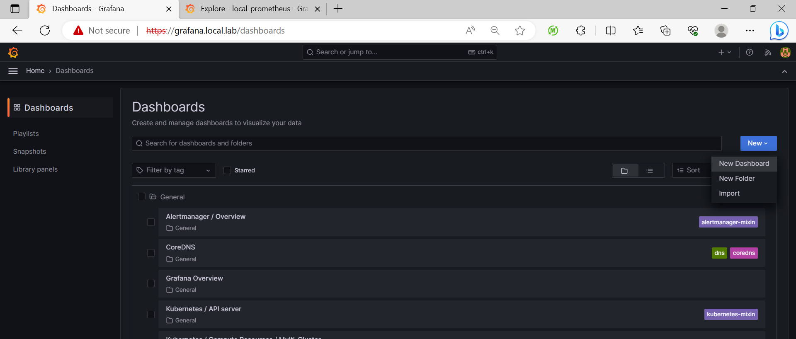
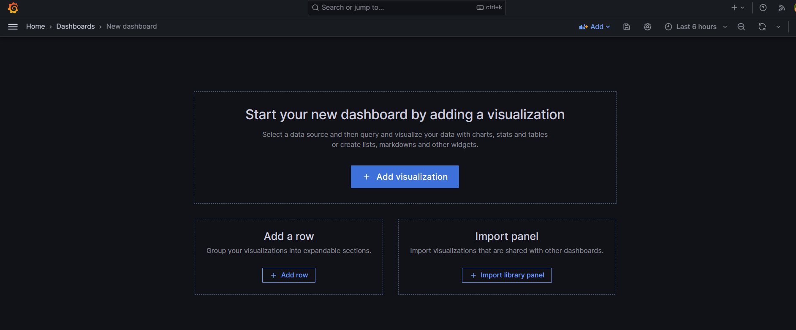
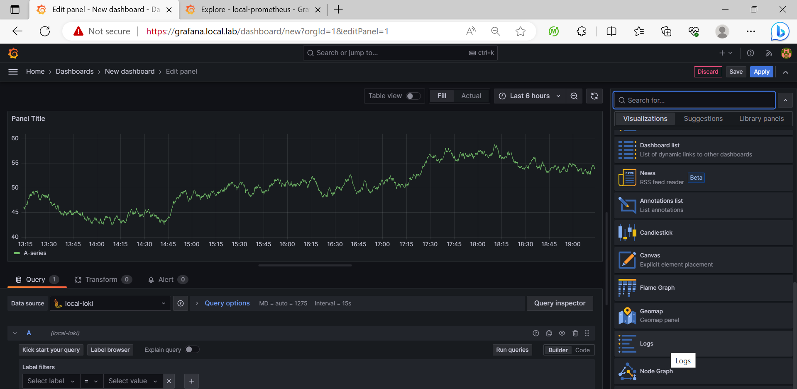
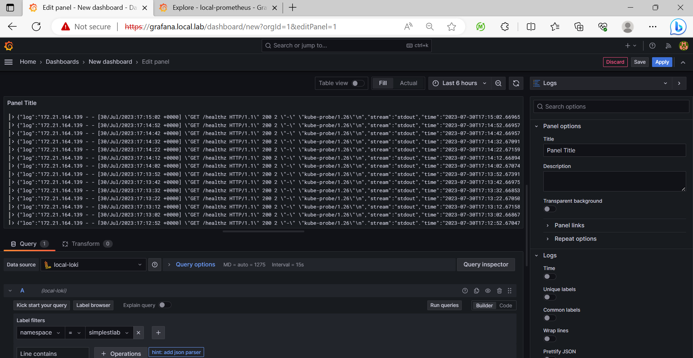
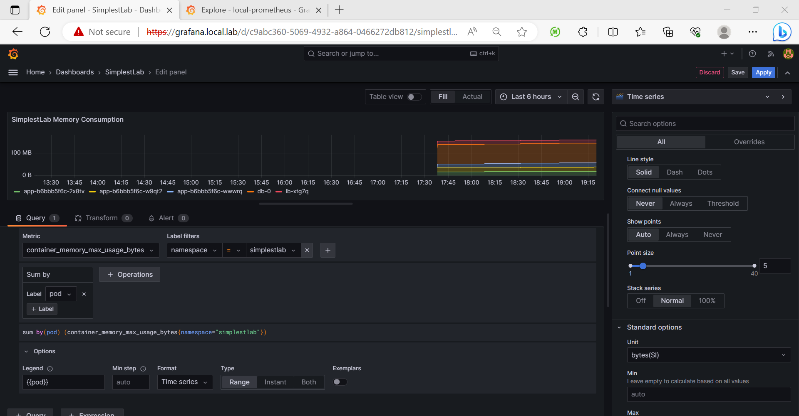
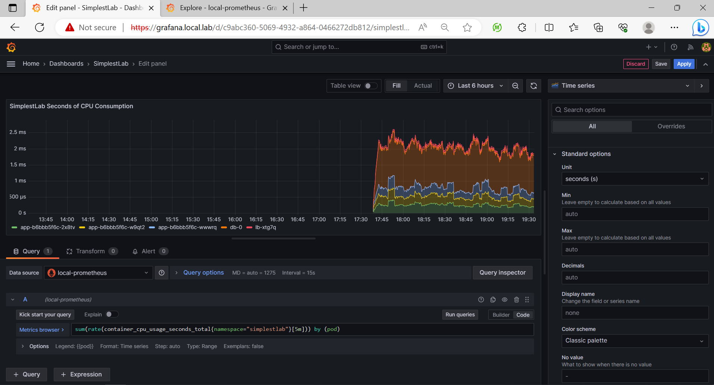
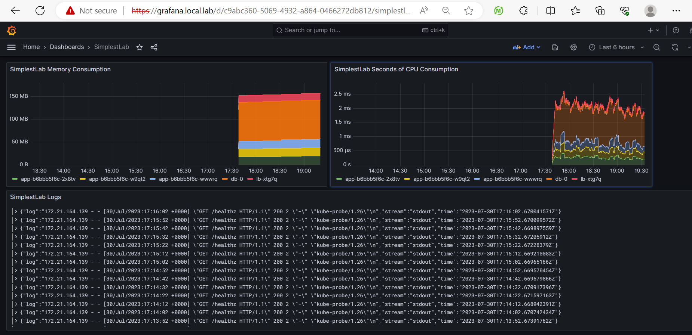
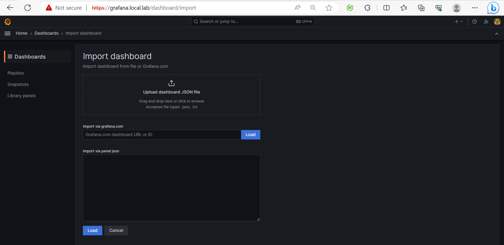
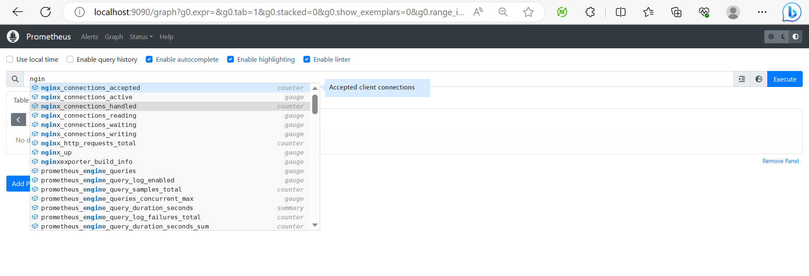

# __Chapter 12 Labs__

## __Technical requirements__

The following labs will provide examples to put into practice concepts and procedures learned in this chapter. We will use Docker Desktop as container runtime and WSL2 (or you Linux/MacOS terminal) to execute the commands described for the first part of the Labs (Ingress Controller) and then we will start a Minikube environment for the second part (NetworkPolicy resources).

>__IMPORTANT NOTE: Please stop Docker Desktop before creating your Minikube environemnt. Both can run at the same time but they will consume lot of hardware resources and you should choose the right Kubernetes context for your environment.__ 

Ensure you have downloaded the content of this book’s GitHub repository in https://github.com/PacktPublishing/Docker-for-Developers-Handbook.git. For this chapter’s labs we will use the content of Chapter12 directory. 

You can use one of the following Kubernetes Desktop environments:
- Docker Desktop (NetworkPolicy resources are not available at the time of writting this book in this platform)
- Rancher Desktop (supports NetworkPolicy resources)
- Minikube (supports NetworkPolicy resources)
- KinD


>__NOTE: Open a PowerShell console with administrator privileges to use Minikube.__


We will first move inside our Chapter12 labs directory, localted inside our local Github repository and we change the prompt for easier reading:
```
PS C:\Users\frjaraur\Documents\...\Chapter12> function prompt {"Chapter12$ "}
Chapter12$
```

We will start with a fresh Minikube environment this time. You can use any Kubernetes environment but you may need extra configurations for some lab components (for example container directories don't match on Docker Desktop Kubernetes deployment):
```
Chapter12$ minikube delete
🙄  "minikube" profile does not exist, trying anyways.
💀  Removed all traces of the "minikube" cluster.
```

We will start a Minikube environment with at least 6GB of memory and 2 CPUs. We added the ingres and metrics-server plugins. The Minikube environment will start with both preconfigured for us which really help us setting up a quick working desktop Kubernetes environment:
```
Chapter12$  minikube start --driver=hyperv --memory=6gb --cpus=2 --cni=calico --addons=ingress,metrics-server
😄  minikube v1.30.1 on Microsoft Windows 10 Pro 10.0.19045.3208 Build 19045.3208
✨  Using the hyperv driver based on user configuration
👍  Starting control plane node minikube in cluster minikube
🔥  Creating hyperv VM (CPUs=2, Memory=6144MB, Disk=20000MB) ...
🐳  Preparing Kubernetes v1.26.3 on Docker 20.10.23 ...
    ▪ Generating certificates and keys ...
    ▪ Booting up control plane ...
    ▪ Configuring RBAC rules ...
🔗  Configuring Calico (Container Networking Interface) ...
    ▪ Using image gcr.io/k8s-minikube/storage-provisioner:v5
    ▪ Using image registry.k8s.io/metrics-server/metrics-server:v0.6.3
    ▪ Using image registry.k8s.io/ingress-nginx/kube-webhook-certgen:v20230312-helm-chart-4.5.2-28-g66a760794
    ▪ Using image registry.k8s.io/ingress-nginx/controller:v1.7.0
    ▪ Using image registry.k8s.io/ingress-nginx/kube-webhook-certgen:v20230312-helm-chart-4.5.2-28-g66a760794
🔎  Verifying Kubernetes components...
🔎  Verifying ingress addon...
🌟  Enabled addons: storage-provisioner, metrics-server, default-storageclass, ingress
🏄  Done! kubectl is now configured to use "minikube" cluster and "default" namespace by default
```

We verify the current deployed Pods:
```
Chapter12$ kubectl get pods -A
NAMESPACE       NAME                                        READY   STATUS      RESTARTS   AGE
ingress-nginx   ingress-nginx-admission-create-vc2ph        0/1     Completed   0          10m
ingress-nginx   ingress-nginx-admission-patch-n7ntl         0/1     Completed   2          10m
ingress-nginx   ingress-nginx-controller-6cc5ccb977-klrb2   1/1     Running     0          10m
kube-system     calico-kube-controllers-7bdbfc669-8ptnf     1/1     Running     0          10m
kube-system     calico-node-7f8ls                           1/1     Running     0          10m
kube-system     coredns-787d4945fb-66pkm                    1/1     Running     0          10m
kube-system     etcd-minikube                               1/1     Running     0          11m
kube-system     kube-apiserver-minikube                     1/1     Running     0          11m
kube-system     kube-controller-manager-minikube            1/1     Running     0          11m
kube-system     kube-proxy-rqtp8                            1/1     Running     0          10m
kube-system     kube-scheduler-minikube                     1/1     Running     0          11m
kube-system     metrics-server-6588d95b98-wztnc             1/1     Running     0          10m
kube-system     storage-provisioner                         1/1     Running     0          10m
```


## Deploy a fully working Grafana monitoring and logging platform:

### 1 - Deploying the simplestlab application.

Once the Kubernetes cluster is up and running, we can deploy the simplestlab application:
```
Chapter12$ ls


    Directory: C:\Users\frjaraur\...\Docker-for-Developers-Handbook\Chapter12


Chapter12$ ls


    Directory: C:\Users\frjaraur\Documents\LOCAL_DockerForDevelopers\Github\Docker-for-Developers-Handbook\Chapter12


Mode                 LastWriteTime         Length Name
----                 -------------         ------ ----
d-----         7/30/2023     18:48                charts
d-----         7/31/2023     12:37                exporters
d-----         7/31/2023     12:44                images
d-----         7/31/2023     12:29                simplestlab
-a----         7/18/2023     20:55             30 .gitignore
-a----         7/30/2023     20:31            969 kube-prometheus-stack.values.yaml
-a----         7/30/2023     18:38            303 loki.values.yaml
-a----         7/31/2023     12:50          17448 Readme.md

```

We will fully deploy the simplestlab application by issuing kubectl create -f <application_directory> -n <application_namespace>. This way, all the manifests included in the directory will be deployed. Notice that we didn't included the creation of the namespace there because it may not be created before other manifests are processed. It is preferred to create the namespace for the application before:
```
Chapter12$ kubectl create ns simplestlab
namespace/simplestlab created


Chapter12$ kubectl create -f .\simplestlab\ -n simplestlab
deployment.apps/app created
service/app created
secret/appcredentials created
service/db created
statefulset.apps/db created
secret/dbcredentials created
secret/initdb created
configmap/lb-config created
daemonset.apps/lb created
service/lb created
ingress.networking.k8s.io/simplestlab created
```

We can verify the application's resources:
```
Chapter12$ kubectl get pods,svc,ingress -n simplestlab
NAME                      READY   STATUS    RESTARTS   AGE
pod/app-b6bbb5f6c-2x8tv   1/1     Running   0          3m39s
pod/app-b6bbb5f6c-w9qt2   1/1     Running   0          3m39s
pod/app-b6bbb5f6c-wwwrq   1/1     Running   0          3m39s
pod/db-0                  1/1     Running   0          3m39s
pod/lb-xtg7q              1/1     Running   0          3m39s

NAME          TYPE        CLUSTER-IP       EXTERNAL-IP   PORT(S)    AGE
service/app   ClusterIP   10.110.229.92    <none>        3000/TCP   3m39s
service/db    ClusterIP   None             <none>        5432/TCP   3m39s
service/lb    ClusterIP   10.101.139.116   <none>        80/TCP     3m39s

NAME                                    CLASS   HOSTS                   ADDRESS          PORTS   AGE
ingress.networking.k8s.io/simplestlab   nginx   simplestlab.local.lab   172.21.164.139   80      3m38s
```

### 2 - Deploying the Kubernetes Prometheus Stack.

This stack includes:
- Grafana
- Prometheus Operator - Which includes Prometheus and Alertmanager (We will disable Alertmanager because we are not going to use any alerting system in this lab).
- Exporters - Various exporters will be deployed for you (node_exporter for example for monitoring all the nodes metrics)
- kube-state-metrics - Which integrates Kubernetes statistics.


To deploy the stack we can use either the https://prometheus-community.github.io/helm-charts repository, which contains https://github.com/prometheus-community/helm-charts/tree/main/charts/kube-prometheus-stack, or the chart provided in the charts directory, which is a downloaded version at the time of writting this book.

>NOTE: In the labs described steps we will use all the charts included under the __charts__ directory although you can use them from their original repositories, but release versions may change.

Helm charts can be customized by using --set argument to declare a new value for the variables included by default. We can use --set argument multiple times to include multiple values, but it may be too long and dificult to read. You will usually use a customized YAML values file which will overwrite the variable values included in the chart as values.yaml file.

Let's take a look at the [kube-prometheus-stack.values.yaml](.kube-prometheus-stack.values.yaml) values file we will use to customize the kube-prometehus-stack environment:
```
alertmanager:
  enabled: false

grafana:
  enabled: true
  ingress:
    enabled: true
    ingressClassName: nginx
    hosts:
    - grafana.local.lab
  sidecar:
    datasources:
      enabled: true
      alertmanager:
        enabled: false
      defaultDatasourceEnabled: false
  additionalDataSources:
  - name: local-prometheus
    editable: true
    jsonData:
        tlsSkipVerify: true
    orgId: 1
    type: prometheus
    url: http://prometheus-operated:9090
    version: 1

  - name: local-loki
    editable: true
    jsonData:
        tlsSkipVerify: true
    orgId: 1
    type: loki
    url: http://loki-gateway.logging.svc:80
    version: 1
```

In this file we did the following:
- We disabled Alertmanager component.
- We enabled Ingress for publishing the Grafana component. It will be available at __grafana.local.lab__.
- We added __local-prometheus__ and __local-loki datasources__, but first we removed the default ones (Prometheus and Alertmanager). Notice that we included the URLs for both, Prometheus and Loki instances, but Loki will be deployed on logging namespace. Neither Prometheus nor Loki will be published to the users and that's why we aren't using neither SSL nor user authentication.

We will use ___helm install___ with ___--create-namespace___ to create the required namespace, __monitoring__, during the installation:
```
Chapter12$ helm install kube-prometheus-stack --namespace monitoring --create-namespace --values .\kube-prometheus-stack.values.yaml .\charts\kube-prometheus-stack\
NAME: kube-prometheus-stack
LAST DEPLOYED: Sun Jul 30 17:36:41 2023
NAMESPACE: monitoring
STATUS: deployed
REVISION: 1
NOTES:
kube-prometheus-stack has been installed. Check its status by running:
  kubectl --namespace monitoring get pods -l "release=kube-prometheus-stack"

Visit https://github.com/prometheus-operator/kube-prometheus for instructions on how to create & configure Alertmanager and Prometheus instances using the Operator.
```

After few seconds, all the Prometheus stack components are running:
```
Chapter12$ kubectl --namespace monitoring get pods -n monitoring
NAME                                                        READY   STATUS    RESTARTS   AGE
kube-prometheus-stack-grafana-8554856d99-w6dcg              2/2     Running   0          2m9s
kube-prometheus-stack-kube-state-metrics-58d9cc69bf-h5m5h   1/1     Running   0          2m9s
kube-prometheus-stack-operator-5c7499775d-jmf4s             1/1     Running   0          2m9s
kube-prometheus-stack-prometheus-node-exporter-bszkg        1/1     Running   0          2m9s
prometheus-kube-prometheus-stack-prometheus-0               2/2     Running   0          110s
```

Form the current PowerShell console, opened with administrator privileges, we can change the local __hosts__ file:
```
Chapter12$ notepad c:\windows\system32\drivers\etc\hosts
```

Get the IP address of your minikube host (__minikube ip__) and add the following lines to your __hosts__ file (in my case, the minikue' IP address is 172.21.164.139):
```
172.21.164.139 simplestlab.local.lab
172.21.164.139 grafana.local.lab
```

You can now access the Grafana UI published using our Minikue Ingress Controller at __https://grafana.local.lab__:


Use __admin__ as username and __prom-operator__ as password. These are the default values, but you can change them at installation time by adding appropriate values in the [kube-prometheus-stack.values.yaml](.kube-prometheus-stack.values.yaml) file. 


### 2 - Deploying Loki.

To deploy Loki, we can use either the https://grafana.github.io/helm-charts repository, which contains https://github.com/grafana/loki/tree/main/production/helm/loki, or the chart provided in the charts directory, which is a downloaded version at the time of writting this book.

This is the content of the customized values file we will use to deploy Loki, [loki.values.yaml](.loki.values.yaml):
```
loki:
  commonConfig:
    replication_factor: 1
  storage:
    type: filesystem
  auth_enabled: false  
singleBinary:
  replicas: 1

monitoring:
  lokiCanary:
    enabled: false
  selfMonitoring:
    enabled: false
    grafanaAgent:
      installOperator: false

test:
  enabled: false
```

We removed all the testing mechanisms for Loki and use __filesystem storage__, which of course is not suitable for Production. In such case, use a S3 solution and a microservices environment for Loki.

We will install Loki in a new namespace, __logging__, by using the chart included in the __charts__ directory:
```
Chapter12$ helm install loki --namespace logging --create-namespace --values .\loki.values.yaml .\charts\loki\
LAST DEPLOYED: Sun Jul 30 18:28:07 2023
STATUS: deployed
NOTES:
***********************************************************************
 Welcome to Grafana Loki
 Chart version: 5.9.2
 Loki version: 2.8.3
***********************************************************************

Installed components:
* loki
```

After few seconds, the Loki components will appear running.

```
Chapter12$ kubectl get all -n logging
NAME                                READY   STATUS    RESTARTS   AGE
pod/loki-0                          1/1     Running   0          13m
pod/loki-gateway-66f55cfb99-vb6gw   1/1     Running   0          13m

NAME                      TYPE        CLUSTER-IP       EXTERNAL-IP   PORT(S)             AGE
service/loki              ClusterIP   10.108.205.128   <none>        3100/TCP,9095/TCP   13m
service/loki-gateway      ClusterIP   10.110.246.3     <none>        80/TCP              13m
service/loki-headless     ClusterIP   None             <none>        3100/TCP            13m
service/loki-memberlist   ClusterIP   None             <none>        7946/TCP            13m

NAME                           READY   UP-TO-DATE   AVAILABLE   AGE
deployment.apps/loki-gateway   1/1     1            1           13m

NAME                                      DESIRED   CURRENT   READY   AGE
replicaset.apps/loki-gateway-66f55cfb99   1         1         1       13m

NAME                    READY   AGE
statefulset.apps/loki   1/1     13m
```

>NOTE: Notice that we included Loki as dataseource in the Prometheus stack. We iused the __gateway__ component internal service to reach the Loki API backend.


### 3 - Deploying Promtail to retrieve all the Kubernetes platform logs.

Loki will provide a centralized backend for managing logs from the Kubernetes platform, but we need some client agents to read and forward to Loki the generated logs.

We will deploy Promtail using the chart included in the __charts__ directory. In this case, the default values will fit correctly if we deploy Promtail in the Loki namespace. By default, the promtail chart, configures http://loki-gateway/loki/api/v1/push as the backend for pushing the log streams read.
```
Chapter12$ helm install promtail --namespace logging --create-namespace .\charts\promtail\
NAME: promtail
LAST DEPLOYED: Sun Jul 30 18:50:03 2023
NAMESPACE: logging
STATUS: deployed
REVISION: 1
TEST SUITE: None
NOTES:
***********************************************************************
 Welcome to Grafana Promtail
 Chart version: 6.11.9
 Promtail version: 2.8.3
***********************************************************************

Verify the application is working by running these commands:
* kubectl --namespace logging port-forward daemonset/promtail 3101
* curl http://127.0.0.1:3101/metrics
```
>NOTE: Promtail, by default, mounts the following hosts' directories: /run/promtail, /var/lib/docker/containers and /var/log/pods. Depending on your installation, you may need to change these paths or add new ones. If you need to include your hosts' system logs, you will need to include /var/log. This also applies to your Kubernetes components logs if they are not running as containers.

After few seconds, we can retrieve all the resources created in the __logging__ namespace:
```
Chapter12$ kubectl get all -n logging
NAME                                READY   STATUS    RESTARTS   AGE
pod/loki-0                          1/1     Running   0          22m
pod/loki-gateway-66f55cfb99-vb6gw   1/1     Running   0          22m
pod/promtail-l8dbv                  1/1     Running   0          39s

NAME                      TYPE        CLUSTER-IP       EXTERNAL-IP   PORT(S)             AGE
service/loki              ClusterIP   10.108.205.128   <none>        3100/TCP,9095/TCP   22m
service/loki-gateway      ClusterIP   10.110.246.3     <none>        80/TCP              22m
service/loki-headless     ClusterIP   None             <none>        3100/TCP            22m
service/loki-memberlist   ClusterIP   None             <none>        7946/TCP            22m

NAME                      DESIRED   CURRENT   READY   UP-TO-DATE   AVAILABLE   NODE SELECTOR   AGE
daemonset.apps/promtail   1         1         1       1            1           <none>          39s

NAME                           READY   UP-TO-DATE   AVAILABLE   AGE
deployment.apps/loki-gateway   1/1     1            1           22m

NAME                                      DESIRED   CURRENT   READY   AGE
replicaset.apps/loki-gateway-66f55cfb99   1         1         1       22m

NAME                    READY   AGE
statefulset.apps/loki   1/1     22m
```

Notice that Promtail runs as a Daemonset to monitor the logs in all your cluster nodes (you may need to verify if some Kubernetes taints are applied if some nodes doesn't run their Promtail agent).

### 4 - Review Grafana and prepare a simple dashboard for the simplestlab application.

We will now create a very simple Grafana dashboard for the simplstlab application using information from metrics and logs retrieved from the application's components.

We will first review the datasources included in the Grafana installation process (using kube-prometheus-stack).

Open your browser and navigate to the Grafana datasources section:


You can enter on each datasource and test the configuration. The integration of Prometheus and Loki was already prepared for you using the [kube-prometheus-stack.values.yaml](.kube-prometheus-stack.values.yaml) file.

Now let's check the default dashboards by navigating to the Dashboards section:


These are the dashboards already present and configured (some of them may need some tweaks) for you. We can open for example the __Prometheus/Overview__ dashboard to obtain an overall overview of the current Prometheus platform.


Some Kubernetes metrics are also shown, as we can see for example in the CoreDNS dashboard. This dashboard presents an overview of the current status of the CoreDNS internal DNS component.


Take your time and review some of the deployed dashboards. You will learn a lot from these examples.

We can use the Explore section (clicking on Explore button on the left main panel) to review the data retrieved from the configured datasources. This is usually the first point when we are trying to create a new dashboard.

on the Explore section, we will choose __local-prometheus__ as datasource to access all the data from this Prometheus-type datasource. We can include multiples datasources from the same type and select the appropriate ones on each dashboard or Explorer query.


Once the datasource is selected, we can review the metrics available by clicking in the __Metrics__ select box.

>NOTE: Choose the appropriate time range. If you have just included a datasource, or exporter with new metrics, they may not be in the Metrics selection because of the time range choosen (top right menu).

We have choosen for example the __container_cpu_usage_seconds_total__ metric  (you can write in the select box to search for metrics) and filter some specific labels such as the __namespace__, or even an specific __pod name__:


Now the presented data is filtered by the fields selected.

But we can use operations form the __Operation__ box to manipulate how the data is going to be presented. We can for example use Sum to integrate multiple samples and aggregate them by Pod:


This timeseries gives a good approach of the current CPU consumption (time active in any CPU in seconds) of your application's Pods.

Let's choose a different datasource. If we change to Loki, the Explore interface changes because we are not going to retrieve metrics. We will query log streams in this case.

We can use label filters too and create a custom query for our application's namespace for example. In the following screenshot we used the __component__  label:


In the simplestlab application, the backend component, __app__, has the __component__ label with __app__ value, hence we can retrieve all the streamed data for its containers by using this filter: 


If we close the Logs Volume section we can read all the logs of the __app__ component in the select time range ("Last 1 hour").


Let's go back to our lab and create a new dashboard. We will include metrics from CPU and memory consumption of the application's components as well as the logs from all its containers.

We wil go back to the Dashboards section and click on __New__ to create a new dashboard:



We will click on __Add Visualization__ to add a new panel to an empty dashboard:


We will choose a visualization of type Logs:



And then we choose ___local-loki___ datasource and filter by the ___simplestlab___ __namespace__ label:



And then click on __Apply__. We will then add a new panel clicking on Add button at the top-right of the dashboard page. This will add a new panel and start the process of creation again. This time we choose the ___local-prometheus___ datasource and select the ___container_memory_max_usage_bytes___ metric and filter by the ___simplestlab___ __namespace__ label again. We use bytes as Unit and represent the Sum operation by using the __pod__ label (Pod's name):



And we follow the same process for the memory, but this time we will use the following query (use __Code__ format instead of __Builder__):
```
sum(rate(container_cpu_usage_seconds_total{namespace="simplestlab"}[5m])) by (pod)
```
The results will appear grouped by the Pod's name:



And we just click Apply to add it to the application dashboard.

We changed the panel's titles and then save the dashboard as SimplestLab.



You finally have a very simple dashboard for your application, which can really help you to find any problem and allow you to have a clear idea of the limits required for your application's Pods.

>NOTE: You may find a huge number of example dashboards at https://grafana.com/grafana/dashboards. Some of them can be used as they are, but others may need some small tweaks and customization to make them work on your environment.

>NOTE: You can import a copy of the SimplestLab dashboard from the __dashboards__ directory on this Labs. For this, you just use the Add button and clieck on Import. The following page will appear and you just have to upload the [./dashboards/SimplestLab.dashboard.json](./dashboards/SimplestLab.dashboard.json) file.
>
>


## Adding Prometheus Exporters to our application


All the manifests for this part of the lab are included in the __exporters__ directory.


### 1 - Adding the Postgres Exporter


We will use the Postgres Exporter from Prometheus Community, 
https://github.com/prometheus-community/postgres_exporter.

It is packaged and prepared to use in the __quay.io/prometheuscommunity/postgres-exporter__ container image. We will include it as a sidecar container in our database component's manifest. But we need to also include few environment variables to make it work:
```
...
      - name: postgres-exporter
        image: quay.io/prometheuscommunity/postgres-exporter
        env:
        - name: DATA_SOURCE_URI
          value: "localhost:5432?sslmode=disable"
        - name: DATA_SOURCE_USER
          value: postgres
        - name: DATA_SOURCE_PASS
          valueFrom:
            secretKeyRef:
              name: dbcredentials
              key: POSTGRES_PASSWORD
        ports:
        - containerPort: 9187
        readinessProbe:
          tcpSocket:
            port: 9187
          initialDelaySeconds: 5
          periodSeconds: 10
        livenessProbe:
          tcpSocket:
            port: 9187
          initialDelaySeconds: 15
          periodSeconds: 20
... 
```

We can easily replace the current StatefulSet with the new manifest  [./exporters/db.statefulset-with-exporter.yaml](./exporters/db.statefulset-with-exporter.yaml) file.
```
Chapter12$ kubectl replace -f .\exporters\db.statefulset-with-exporter.yaml
statefulset.apps/db replaced
```
After few seconds, we can see that now we have two containers (the app components may fall down because the database's Pod was recreated)
```
Chapter12$ kubectl get pods -n simplestlab -o wide
NAME                  READY   STATUS    RESTARTS      AGE    IP               NODE       NOMINATED NODE   READINESS GATES
app-b6bbb5f6c-2x8tv   0/1     Running   2 (47s ago)   155m   10.244.120.83    minikube   <none>           <none>
app-b6bbb5f6c-w9qt2   0/1     Running   2 (47s ago)   155m   10.244.120.85    minikube   <none>           <none>
app-b6bbb5f6c-wwwrq   0/1     Running   2 (47s ago)   155m   10.244.120.84    minikube   <none>           <none>
db-0                  2/2     Running   0             46s    10.244.120.116   minikube   <none>           <none>
lb-xtg7q              1/1     Running   0             155m   10.244.120.81    minikube   <none>           <none>
```

The exporter will expose its metrics in port 9187. To verify the access to the new metrics, you can try to reach the Pod's port 9187 from the __lb__ component's Pod.
```
Chapter12$ kubectl exec -ti lb-xtg7q -n simplestlab -- /bin/sh
/ $ curl 10.244.120.115:9187
<html lang="en">
  <head>
    <meta charset="UTF-8">
    <meta name="viewport" content="width=device-width, initial-scale=1.0">
    <title>Postgres Exporter</title>
    <style>body {
  font-family: -apple-system,BlinkMacSystemFont,Segoe UI,Roboto,Helvetica Neue,Arial,Noto Sans,Liberation Sans,sans-serif,Apple Color Emoji,Segoe UI Emoji,Segoe UI Symbol,Noto Color Emoji;
  margin: 0;
}
header {
  background-color: #e6522c;
  color: #fff;
  font-size: 1rem;
  padding: 1rem;
}
main {
  padding: 1rem;
}
label {
  display: inline-block;
  width: 0.5em;
}

</style>
  </head>
  <body>
    <header>
      <h1>Postgres Exporter</h1>
    </header>
    <main>
      <h2>Prometheus PostgreSQL server Exporter</h2>
      <div>Version: (version=0.13.2, branch=HEAD, revision=8c3604b85e38ae7141e84ecdc318b6015a196c97)</div>
      <div>
        <ul>

          <li><a href="/metrics">Metrics</a></li>

        </ul>
      </div>


    </main>
  </body>
</html>
```

And directly, the metrics:
```
/ $ curl 10.244.120.115:9187/metrics
# HELP go_gc_duration_seconds A summary of the pause duration of garbage collection cycles.
# TYPE go_gc_duration_seconds summary
go_gc_duration_seconds{quantile="0"} 0
go_gc_duration_seconds{quantile="0.25"} 0
go_gc_duration_seconds{quantile="0.5"} 0
...
pg_exporter_last_scrape_duration_seconds 1.064326886
# HELP pg_exporter_last_scrape_error Whether the last scrape of metrics from PostgreSQL resulted in an error (1 for error, 0 for success).
# TYPE pg_exporter_last_scrape_error gauge
pg_exporter_last_scrape_error 1
# HELP pg_exporter_scrapes_total Total number of times PostgreSQL was scraped for metrics.
# TYPE pg_exporter_scrapes_total counter
pg_exporter_scrapes_total 1
# HELP pg_up Whether the last scrape of metrics from PostgreSQL was able to connect to the server (1 for yes, 0 for no).
# TYPE pg_up gauge
pg_up 0
# HELP postgres_exporter_build_info A metric with a constant '1' value labeled by version, revision, branch, goversion from which postgres_exporter was built, and the goos and goarch for the build.
# TYPE postgres_exporter_build_info gauge
postgres_exporter_build_info{branch="HEAD",goarch="amd64",goos="linux",goversion="go1.20.6",revision="8c3604b85e38ae7141e84ecdc318b6015a196c97",tags="netgo static_build",version="0.13.2"} 1
...
promhttp_metric_handler_requests_total{code="503"} 0
/ $ exit
command terminated with exit code 130
```

But now we need a Service resource to export correctly the data into the Kubernetes cluster (we are not using any NetworkPolicy resource on these labs).
We add the new port to the existent db Service resource [./exporters/db.service-with-exporter.yaml](./exporters/db.service-with-exporter.yaml) :
```
...
  ports:
    - protocol: TCP
      port: 5432
      targetPort: 5432
      name: db
    - protocol: TCP
      port: 9187
      targetPort: 9187
      name: exporter
...
```

And we replace the current db Service resource:
```
Chapter12$ kubectl replace -f .\exporters\db.service-with-exporter.yaml
service/db replaced
```

Now it's time to prepare a ServiceMonitor resource. But first let's verify which namespaces and labels is the Prometheus Operator lookuing for ServiceMonitor resources:
```
Chapter12$ kubectl get Prometheus -n monitoring
NAME                               VERSION   DESIRED   READY   RECONCILED   AVAILABLE   AGE
kube-prometheus-stack-prometheus   v2.45.0   1         1       True         True        25h
Chapter12$ kubectl get Prometheus -n monitoring  kube-prometheus-stack-prometheus
NAME                               VERSION   DESIRED   READY   RECONCILED   AVAILABLE   AGE
kube-prometheus-stack-prometheus   v2.45.0   1         1       True         True        25h
Chapter12$ kubectl get Prometheus -n monitoring  kube-prometheus-stack-prometheus -o yaml
apiVersion: monitoring.coreos.com/v1
kind: Prometheus
metadata:
  annotations:
    meta.helm.sh/release-name: kube-prometheus-stack
    meta.helm.sh/release-namespace: monitoring
  creationTimestamp: "2023-07-30T15:37:04Z"
  generation: 1
  labels:
    app: kube-prometheus-stack-prometheus
    app.kubernetes.io/instance: kube-prometheus-stack
    app.kubernetes.io/managed-by: Helm
    app.kubernetes.io/part-of: kube-prometheus-stack
    app.kubernetes.io/version: 48.2.2
    chart: kube-prometheus-stack-48.2.2
    heritage: Helm
    release: kube-prometheus-stack
  name: kube-prometheus-stack-prometheus
  namespace: monitoring
  resourceVersion: "18526"
  uid: c206dc6b-910e-4038-ba6a-ae78a5bf8639
spec:
  enableAdminAPI: false
  evaluationInterval: 30s
  externalUrl: http://kube-prometheus-stack-prometheus.monitoring:9090
  hostNetwork: false
  image: quay.io/prometheus/prometheus:v2.45.0
  listenLocal: false
  logFormat: logfmt
  logLevel: info
  paused: false
  podMonitorNamespaceSelector: {}
  podMonitorSelector:
    matchLabels:
      release: kube-prometheus-stack
  portName: http-web
  probeNamespaceSelector: {}
  probeSelector:
    matchLabels:
      release: kube-prometheus-stack
  replicas: 1
  retention: 10d
  routePrefix: /
  ruleNamespaceSelector: {}
  ruleSelector:
    matchLabels:
      release: kube-prometheus-stack
  scrapeConfigNamespaceSelector: {}
  scrapeConfigSelector:
    matchLabels:
      release: kube-prometheus-stack
  scrapeInterval: 30s
  securityContext:
    fsGroup: 2000
    runAsGroup: 2000
    runAsNonRoot: true
    runAsUser: 1000
    seccompProfile:
      type: RuntimeDefault
  serviceAccountName: kube-prometheus-stack-prometheus
  serviceMonitorNamespaceSelector: {}
  serviceMonitorSelector:
    matchLabels:
      release: kube-prometheus-stack
  shards: 1
  tsdb:
    outOfOrderTimeWindow: 0s
  version: v2.45.0
  walCompression: true
status:
  availableReplicas: 1
  conditions:
  - lastTransitionTime: "2023-07-31T10:38:19Z"
    observedGeneration: 1
    status: "True"
    type: Available
  - lastTransitionTime: "2023-07-31T10:38:19Z"
    observedGeneration: 1
    status: "True"
    type: Reconciled
  paused: false
  replicas: 1
  shardStatuses:
  - availableReplicas: 1
    replicas: 1
    shardID: "0"
    unavailableReplicas: 0
    updatedReplicas: 1
  unavailableReplicas: 0
  updatedReplicas: 1
Chapter12$
```

As we can see from the above Kubernetes Prometheus resource, this Prometheus instance is looking for ServiceMonitors on any namespace, but they must include release=kube-prometheus-stack label to be managed by this Prometheus server:

```
...
  serviceMonitorNamespaceSelector: {}
  serviceMonitorSelector:
    matchLabels:
      release: kube-prometheus-stack
...
```

Then, we can create our own ServiceMonitor resource for the db application's component adding the release=kube-prometheus-stack label, as we can see int the  [./exporters/db.serviceMonitor.yaml](./exporters/db.serviceMonitor.yaml) file:
```
apiVersion: monitoring.coreos.com/v1
kind: ServiceMonitor
metadata:
  labels:
    component: db
    app: simplestlab
    release: kube-prometheus-stack
  name: db
  namespace: simplestlab
spec:
  endpoints:
  - path: /metrics
    port: exporter
    interval: 30s
  # namespaceSelector:
  #   matchNames:
  #   - simplestlab
  jobLabel: jobLabel
  selector:
    matchLabels:
      component: db
      app: simplestlab
```
We defined in the ServiceMonitor which Service resources will be accessed (all the Services with ___component=db and app=simplestlab___ labels), in which port (___exporter => 9187___), which path to use to retrieve its metrics (___/metrics___). We now create this new resource:
```
Chapter12$ kubectl create -f .\exporters\db.serviceMonitor.yaml
servicemonitor.monitoring.coreos.com/db created
```

And now we can use port-forwarding to verify the metrics in Prometheus: 
```
Chapter12$ kubectl port-forward -n monitoring svc/kube-prometheus-stack-prometheus 9090:9090
Forwarding from 127.0.0.1:9090 -> 9090
Forwarding from [::1]:9090 -> 9090
```
And we can connect to the Prometheus service using http://localhost:9090:


The new Postgres metrics are avialable. You may need to wait a minute to be able to verify the Postgres metrics, because the interval for scrapping defined in the ServiceMonitor is 30s.

### 2 - Adding the Nginx exporter
In this case, will use the Nginx Exporter from Nginx Inc, the product vendor and supporter, https://github.com/nginxinc/nginx-prometheus-exporter.

It is packaged and prepared to use in the __nginx/nginx-prometheus-exporter__ container image. We will include it as a sidecar container, as we already did with the database component. But this time, we need to change the Nginx configuration because we need to expose the internal statistics feature (stub_status). For this to work, we will change our application ___lb-config___ ConfigMap, which defines the __nginx.conf__ file.

This is the content for the new ___lb-config___ ConfigMap, included in the [./exporters/lb.configmap-with-exporter.yaml](./exporters/lb.configmap-with-exporter.yaml) manifest file:

```
apiVersion: v1
kind: ConfigMap
metadata:
  name: lb-config
  labels:
    component: lb
    app: simplestlab
  namespace: simplestlab
data: 
  nginx.conf: |
    user  nginx;
    worker_processes  auto;

    error_log  /tmp/nginx/error.log warn;
    pid        /tmp/nginx/nginx.pid;

    events { 
      worker_connections  1024; 
    }

    http { 
      server {
        listen 8080; # specify a port higher than 1024 if running as non-root user 
        location /healthz { 
            add_header Content-Type text/plain;
            return 200 'OK';
        } 
        location / {
          proxy_pass http://app:3000;
        }   
      }
      server {
        listen 8081;
        location = /stub_status {
            stub_status;
        }
      }
    }

```

Notice that we added a new server on port 8081 to expose the Nginx metrics. This server will be accessed by the Nginx Exporter, which will manage the staticstics and expose the metrics in a new port. The port 8081 will only be accessible internally, we will not define a port in the Service resource to access it.

We will first replace the ___lb___ component's ConfigMap:
```
Chapter12$ kubectl replace -f .\exporters\lb.configmap-with-exporter.yaml
configmap/lb-config replaced
```
And now we have to include a sidecar container to run the Nginx Exporter. This is an extract of the [./exporters/lb.daemonset-with-exporter.yaml](./exporters/lb.daemonset-with-exporter.yaml) file:

```
...
      - name: exporter
        image: nginx/nginx-prometheus-exporter:0.10.0
        args:
        - -nginx.scrape-uri=http://localhost:8081/stub_status
        ports: 
        - containerPort: 9113
        securityContext:
          readOnlyRootFilesystem: true
...

```

The Nginx Exporter will be exposed in 9113 port. Notice that we defined ___-nginx.scrape-uri=http://localhost:8081/stub_status___ argument to specify which Nginx instance to monitor, including the path and port where the statistics will be available (___http://localhost:8081/stub_status___). 

Now, we can replace the current ___lb___ DaemonSet:
```
Chapter12$ kubectl replace -f .\exporters\lb.daemonset-with-exporter.yaml
daemonset.apps/lb replaced
```

And we can verify that our ___lb___ Pod now runs two containers:
```
Chapter12$ kubectl get pods -n simplestlab
NAME                  READY   STATUS    RESTARTS        AGE
app-b6bbb5f6c-2x8tv   1/1     Running   6 (11m ago)     19h
app-b6bbb5f6c-w9qt2   1/1     Running   7 (8m52s ago)   19h
app-b6bbb5f6c-wwwrq   1/1     Running   7 (8m48s ago)   19h
db-0                  2/2     Running   0               11m
lb-sjwrd              2/2     Running   0               8s
```

We need a Service resource which expose the Nginx Exporter metrics. We can always create a separated Service resource for the metrics, but usually it is simpler to add the new exporter port to the application's component Service resource [./exporters/lb.service-with-exporter.yaml](./exporters/lb.service-with-exporter.yaml):
```
...
  ports:
    - protocol: TCP
      port: 80
      targetPort: 8080
      name: lb
    - protocol: TCP
      port: 9113
      targetPort: 9113
      name: exporter
...
```
We replace the old Service resource with the new definition:

```
Chapter12$ kubectl replace -f .\exporters\lb.service-with-exporter.yaml
service/lb replaced
```
And now we can create the new ServiceMonitor [./exporters/lb.serviceMonitor.yaml](./exporters/lb.serviceMonitor.yaml):

```
apiVersion: monitoring.coreos.com/v1
kind: ServiceMonitor
metadata:
  labels:
    component: lb
    app: simplestlab
    release: kube-prometheus-stack
  name: lb
  namespace: simplestlab
spec:
  endpoints:
  - path: /metrics
    port: exporter
    interval: 30s
  # namespaceSelector:
  #   matchNames:
  #   - simplestlab
  jobLabel: jobLabel
  selector:
    matchLabels:
      component: lb
      app: simplestlab

```
And we create this new resource:
```
Chapter12$ kubectl create -f .\exporters\lb.serviceMonitor.yaml
servicemonitor.monitoring.coreos.com/lb created
```

We can now use again the port-forward feature to publish the Prometheus GUI at http://localhost:9090
```
Chapter12$ kubectl port-forward -n monitoring svc/kube-prometheus-stack-prometheus 9090:9090
Forwarding from 127.0.0.1:9090 -> 9090
Forwarding from [::1]:9090 -> 9090
```

If we go to the __Targets__ section we will see the new ServiceMonitors' Endpoints. They must be UP for the metrics to be available:


And now, in the __Graphs__ section, we can verify the Nginx Exporter metrics available:



In these labs we learned to prepare a fully working monitoring and Logging environment, then create an application dashboard, with information from different sources, and finally, add new metrics using application's components exporters. You are now ready to even create your own application exporter (https://prometheus.io/docs/instrumenting/writing_exporters/). 


## Remove the Minikube environment
We can end this lab session by removing the Minikube environment:
```
Chapter11$ minikube delete
✋  Stopping node "minikube"  ...
🛑  Powering off "minikube" via SSH ...
🔥  Deleting "minikube" in hyperv ...
💀  Removed all traces of the "minikube" cluster.

```

