# __Chapter 13 Labs__

## __Technical requirements__

The following labs will provide examples to put into practice concepts and procedures learned in this chapter. We will use Minikube on docker (--driver=Docker). You can use other Kubernetes implementations because we are going to use Kubernetes standar commands, available on any moder Kubernetes version (1.20+). We decided to use Minikube on Docker because this version allows us to fix the IP address used for the Minikube Host (in this case executed as a container). The lab will give you a good idea of CI/CD practices with the modern GitOps model by creating a fully functional CI/CD environment using GitLab and ArgoCD. We will separate the labs in different sections to help you follow the required steps. 

I will use my Linux desktop, but I will give you equivalent Powershell commands in case you use Microsfot Windows as your base operating system, although sometimes is even easier to open a WSL2 console on your Windows host and execute commands like __openssl__ or __base64__.

>__IMPORTANT NOTE: Please stop Docker Desktop before creating your Minikube environemnt. Both can run at the same time but they will consume lot of hardware resources and you should choose the right Kubernetes context for your environment.__ 

Ensure you have downloaded the content of this book’s GitHub repository in https://github.com/PacktPublishing/Docker-for-Developers-Handbook.git. For this chapter’s labs we will use the content of Chapter13 directory. 

You can use one of the following Kubernetes Desktop environments:
- Docker Desktop (NetworkPolicy resources are not available at the time of writting this book in this platform)
- Rancher Desktop (supports NetworkPolicy resources)
- Minikube
- KinD

>__NOTE: Open a PowerShell console with administrator privileges to use Minikube.__


We will first move inside our Chapter13 labs directory, located inside our local Github repository. You will see here the following content:

```
Chapter13  tree .
.
├── ArgoCD
│   ├── Applications
│   │   ├── minikube-simplestlab.deployed
│   │   └── minikube-simplestlab.yaml
│   ├── argo-cd-5.43.5.tgz
│   ├── create_values.sh
│   ├── minikube_install_values.template.yaml
│   └── minikube_install_values.yaml
├── GitLab
│   ├── create_values.sh
│   ├── gitlab-7.2.4.tgz
│   ├── minikube_install_values.template.yaml
│   └── minikube_install_values.yaml
├── Readme.md
└── Simplestlab
    ├── Code
    │   ├── simplestapp
    │   │   ├── dbconfig.json
    │   │   ├── Dockerfile
    │   │   ├── package.json
    │   │   ├── README.md
    │   │   ├── reset.html
    │   │   ├── simplestapp.html
    │   │   └── simplestapp.js
    │   ├── simplestdb
    │   │   ├── docker-entrypoint-initdb.d
    │   │   │   └── init-demo.sh
    │   │   ├── docker-entrypoint.sh
    │   │   ├── Dockerfile
    │   │   └── Dockerfile.scratch
    │   └── simplestlb
    │       ├── Dockerfile
    │       ├── entrypoint.sh
    │       └── nginx.conf
    ├── HelmCharts
    │   ├── simplestlab
    │   │   ├── Chart.lock
    │   │   ├── charts
    │   │   │   ├── simplestlab-app-1.0.0.tgz
    │   │   │   ├── simplestlab-db-1.0.0.tgz
    │   │   │   └── simplestlab-lb-1.0.0.tgz
    │   │   ├── Chart.yaml
    │   │   ├── templates
    │   │   │   ├── _helpers.tpl
    │   │   │   ├── ingress.yaml
    │   │   │   └── NOTES.txt
    │   │   └── values.yaml
    │   ├── simplestlab-app
    │   │   ├── Chart.yaml
    │   │   ├── templates
    │   │   │   ├── deployment.yaml
    │   │   │   ├── _helpers.tpl
    │   │   │   ├── hpa.yaml
    │   │   │   ├── NOTES.txt
    │   │   │   ├── secret.yaml
    │   │   │   ├── serviceaccount.yaml
    │   │   │   ├── service.yaml
    │   │   │   └── tests
    │   │   │       └── test-connection.yaml
    │   │   └── values.yaml
    │   ├── simplestlab-db
    │   │   ├── Chart.yaml
    │   │   ├── templates
    │   │   │   ├── dbcredentials.secret.yaml
    │   │   │   ├── _helpers.tpl
    │   │   │   ├── initdb.secret.yaml
    │   │   │   ├── NOTES.txt
    │   │   │   ├── serviceaccount.yaml
    │   │   │   ├── service.yaml
    │   │   │   ├── statefulset.yaml
    │   │   │   └── tests
    │   │   │       └── test-connection.yaml
    │   │   └── values.yaml
    │   └── simplestlab-lb
    │       ├── Chart.yaml
    │       ├── templates
    │       │   ├── configmap.yaml
    │       │   ├── daemonset.yaml
    │       │   ├── _helpers.tpl
    │       │   ├── NOTES.txt
    │       │   ├── serviceaccount.yaml
    │       │   ├── service.yaml
    │       │   └── tests
    │       │       └── test-connection.yaml
    │       └── values.yaml
    └── Values
        └── simplestlab
            └── values.yaml
```

We have prepared for you 3 main directories:

- ArgoCD - Contains the installation of ArgoCD component and the Application resource we will use to deploy our SimplesLab application.
- GitLab - Contains the installation of GitLab component.
- SimplestLab - This directory contains all the code, Helm Charts and values used for deploying a SimplestLab application instance.

We will need the following tools on our environment:

- Minikube (and Docker if you follow my steps using a fixed IP for the lab).
- Git
- ArgoCD CLI - To create and modify the integration of ArgoCD inside our Kubernetes cluster.
- OpenSSL o Certutil on MS Windows - To decode some base64 strings in case you don't have base64.
- Helm - To deploy your Helm Charts.
- Kubectl - To connect to our Kubernetes cluster.
- Base64 - For decoding some strings.

## Environemnt Setup
To help you follow the paths used we will create a simplified prompt for the lab and prepare a bin directory for the binary tools.

- Microsfot Windows PowerShell:
```
PS C:\Users\frjaraur\Documents\...\Chapter13> function prompt {"Chapter13$ "}

Chapter13$ md $HOME\bin

    Directory: C:\Users\frjaraur

Mode                 LastWriteTime         Length Name
----                 -------------         ------ ----
d-----         8/18/2023   8:07 PM                bin


Chapter13$  $env:PATH += ";$HOME\bin"

Chapter13$ $MINIKUBEIP = minikube ip


```

- Linux/MacOS:
```
export PS1="Chapter13$ "

mkdir $HOME/bin

export PATH=$PATH:$HOME/bin

Chapter13$ export MINIKUBEIP=$(minikube ip)

```
>NOTE: We can recover the Minikube cluster IP by just issuing __minikube ip__. Ensure you have the MINIKUBEIP defined before executing the installation of GitLab and ArgoCD. We will use this value for the ingress.


## Tools installations

### - Git

+ Linux:

If you are using Linux, you can use your package manager to install Git. 

+ Windows:
```
Chapter13$ winget install --id Git.Git -e --source winget
Found Git [Git.Git] Version 2.41.0.3
This application is licensed to you by its owner.
Microsoft is not responsible for, nor does it grant any licenses to, third-party packages.
Downloading https://github.com/git-for-windows/git/releases/download/v2.41.0.windows.3/Git-2.41.0.3-64-bit.exe
  ██████████████████████████████  58.3 MB / 58.3 MB
Successfully verified installer hash
Starting package install...
Successfully installed
```

### - Kubectl

+ Linux:

If you are using Linux, you can use your package manager to install Git. 

XXX


+ Windows:
```
Chapter13$ Invoke-WebRequest -URI https://dl.k8s.io/release/v1.28.0/bin/windows/amd64/kubectl.exe -OutFile $HOME\bin\kubectl.exe -UseBasicParsing
```


### - Helm

+ Linux:

If you are using Linux, you can use your package manager to install Git. 

XXX


+ Windows:
```
Chapter13$ Invoke-WebRequest -URI https://get.helm.sh/helm-v3.12.2-windows-amd64.zip -OutFile $env:TEMP\helm.zip -UseBasicParsing

Chapter13$ Expand-Archive $env:TEMP\helm.zip -DestinationPath $env:TEMP\helm_install

Chapter13$  helm version
version.BuildInfo{Version:"v3.10.2", GitCommit:"50f003e5ee8704ec937a756c646870227d7c8b58", GitTreeState:"clean", GoVersion:"go1.18.8"}

```

### - ArgoCD

+ Linux:

If you are using Linux, you can use your package manager to install Git. 
- Linux
```
curl -sSL -o argocd-linux-amd64 https://github.com/argoproj/argo-cd/releases/latest/download/argocd-linux-amd64
sudo install -m 555 argocd-linux-amd64 /usr/local/bin/argocd
rm argocd-linux-amd64
```


+ Windows:
```
XXXX
```


## Minikube installations

For a better experince, use at least 8GB of RAM and 4 vCPUs.

>__IMPORTANT NOTE: We will integrate the our GitLab Registry inside the Minikube platform as an insecure registry. This way we will not need to manage certificates in our Kubernetes cluster for pulling images for our deployed GitLab platform.__


```
Chapter13$ minikube start --driver=docker --memory=8gb --cpus=4 --addons=ingress,metrics-server --cni=calico --insecure-registry="172.16.0.0/16" --static-ip=172.31.255.254
....
....
    ▪ Generating certificates and keys ...
    ▪ Booting up control plane ...
    ▪ Configuring RBAC rules ...
   Configuring Calico (Container Networking Interface) ...
   Verifying Kubernetes components...
    ▪ Using image gcr.io/k8s-minikube/storage-provisioner:v5
    ▪ Using image registry.k8s.io/metrics-server/metrics-server:v0.6.4
....
....

   Verifying ingress addon...
   Enabled addons: storage-provisioner, default-storageclass, metrics-server, ingress
   Done! kubectl is now configured to use "minikube" cluster and "default" namespace by default

```
We can easily verify our environment:
```
Chapter13$ kubectl get nodes
NAME       STATUS   ROLES           AGE    VERSION
minikube   Ready    control-plane   3d1h   v1.27.3

```

And now we can create the namespace for the SimplestLab application:
```
Chapter13$ kubectl create namespace simplestlab
namespace/simplestlab created
```


## Prepare the SimplestLab application repositories:

Because you have cloned the Labs from Packt GitHub repositoy, your application directories already include a .git folder. Copy the content of SimplestLab folder to a new worspace location on the Chapter13 folder.
- Linux:
```
cp -R SimplestLab SimplestLab_Working
```

- Windows:
```
Copy-Item SimplestLab -Recurse  -Destination SimplestLab_Working
```

>NOTE: Remove all the hiden .git folders in SimplestLab_Working folder and subfolders if any everytime you start with the lab.


How we will use these folder:

- We will only use ___simplestapp___ code, hence ___Code\simplestapp___ will be synchronized (pushed) in GitLab.

- All the HelmCharts subfolders will be needed because we prepared an umbrella chart (___simplestlab___) and the CI/CD proces will validate and recreate its dependencies as needed.

- During the labs we will just modify the values file included inside ___Values___ folder. This way, we can manage the ___SimplestLab___ deployment parameters.


## GitLab Installation

We have prepared for you a script that generates a valid values YAML file for the installation of GitLab. Ensure you have MINIKUBEIP variable set.

>NOTE: If you prefer, you can manually create your own minikube_install_values.yaml file manually using the template minikube_install_values.template.yaml as example (change MINIKUBEIP with your value).

- Linux
```
Chapter13$ export MINIKUBEIP=$(minikube ip)
Chapter13$ echo $MINIKUBEIP
172.31.255.254

Chapter13$ cd GitLab 

Chapter13/GitLab$ ls
create_values.sh  gitlab-7.2.4.tgz  minikube_install_values.template.yaml  minikube_install_values.yaml

Chapter13/GitLab$ bash create_values.sh 

```

We can now proceed to install GitLab:
```
Chapter13/GitLab$ helm upgrade --install gitlab gitlab-7.2.4.tgz --timeout 600s --namespace gitlab --create-namespace  --values minikube_install_values.yaml

Release "gitlab" does not exist. Installing it now.
NAME: gitlab
LAST DEPLOYED: Fri Aug 18 21:03:17 2023
NAMESPACE: gitlab
STATUS: deployed
REVISION: 1
NOTES:
=== NOTICE
The minimum required version of PostgreSQL is now 13. See https://gitlab.com/gitlab-org/charts/gitlab/-/blob/master/doc/installation/upgrade.md for more details.

=== WARNING
Automatic TLS certificate generation with cert-manager is disabled.
One or more of the components does not have a TLS certificate Secret configured.
As a result, Self-signed certificates were generated for these components.

You may retrieve the CA root for these certificates from the `gitlab-wildcard-tls-ca` secret, via the following command. It can then be imported to a web browser or system store.

  kubectl get secret gitlab-wildcard-tls-ca -ojsonpath='{.data.cfssl_ca}' | base64 --decode > gitlab.172.31.255.254.nip.io.ca.pem

If you do not wish to use self-signed certificates, please set the following properties:
- global.ingress.tls.secretName
OR all of:
- global.ingress.tls.enabled (set to `true`)
- gitlab.webservice.ingress.tls.secretName
- registry.ingress.tls.secretName
- minio.ingress.tls.secretName
- gitlab.kas.ingress.tls.secretName

=== WARNING
Automatic TLS certificate generation with cert-manager is disabled and no TLS certificates were provided. Self-signed certificates were generated that do not work with gitlab-runner. Please either disable gitlab-runner by setting `gitlab-runner.install=false` or provide valid certificates.

=== NOTICE
You've installed GitLab Runner without the ability to use 'docker in docker'.
The GitLab Runner chart (gitlab/gitlab-runner) is deployed without the `privileged` flag by default for security purposes. This can be changed by setting `gitlab-runner.runners.privileged` to `true`. Before doing so, please read the GitLab Runner chart's documentation on why we
chose not to enable this by default. See https://docs.gitlab.com/runner/install/kubernetes.html#running-docker-in-docker-containers-with-gitlab-runners
Help us improve the installation experience, let us know how we did with a 1 minute survey:https://gitlab.fra1.qualtrics.com/jfe/form/SV_6kVqZANThUQ1bZb?installation=helm&release=16-2

```

>__NOTE: We will use the GitLab generated CA during the ArgoCD deployment.__
>You have to retrieve the CA root for these certificates from the `gitlab-wildcard-tls-ca` secret, via the following command. It can then be imported to a web browser or system store.
>```
>  kubectl get secret gitlab-wildcard-tls-ca -ojsonpath='{.data.cfssl_ca}' | base64 --decode > /tmp/gitlab.172.31.255.254.nip.io.ca.pem
>```

We will now retrieve the initial root password:


- Linux:
```
Chapter13$ kubectl get secret -n gitlab gitlab-gitlab-initial-root-password -ojsonpath='{.data.password}' |base64 -d
pA0jOC2GiQUxKRnN1tv5jurhvwYas0XeVs6PWXuwZ0kOCYVCqI4grn17h4J6h4iK
```

- Windows:
```
Chapter13$ $GitLabRootb64Pass=kubectl get secret -n gitlab gitlab-gitlab-initial-root-password -ojsonpath='{.data.password}'

Chapter13$ echo $GitLabRootb64Pass
eVk5ckdtb1NtZGdyMldjRk5IcVR5bHVjVktWQlpOWjM1aVUzR1pkaHVLNGNsanB1bHBmOGkxNDVHZGhKOUNuYw==

Chapter13$ echo $GitLabRootb64Pass >$env:TEMP\GitLabRootb64Pass.encoded.txt


Chapter13$ gc $env:TEMP\GitLabRootb64Pass.encoded.txt
eVk5ckdtb1NtZGdyMldjRk5IcVR5bHVjVktWQlpOWjM1aVUzR1pkaHVLNGNsanB1bHBmOGkxNDVHZGhKOUNuYw==


Chapter13$ certutil -f -decode $env:TEMP\GitLabRootb64Pass.encoded.txt $env:TEMP\GitLabRootb64Pass.decoded.txt
Input Length = 182
Output Length = 64
CertUtil: -decode command completed successfully.

Chapter13$ gc  $env:TEMP\GitLabRootb64Pass.decoded.txt
pA0jOC2GiQUxKRnN1tv5jurhvwYas0XeVs6PWXuwZ0kOCYVCqI4grn17h4J6h4iK

```

And now we can verify the Ingress resources available:

```
Chapter13$ kubectl get ingress -n gitlab
NAME                        CLASS   HOSTS                            ADDRESS          PORTS     AGE
gitlab-kas                  nginx   kas.172.31.255.254.nip.io        172.31.255.254   80, 443   19m
gitlab-minio                nginx   minio.172.31.255.254.nip.io      172.31.255.254   80, 443   19m
gitlab-registry             nginx   registry.172.31.255.254.nip.io   172.31.255.254   80, 443   19m
gitlab-webservice-default   nginx   gitlab.172.31.255.254.nip.io     172.31.255.254   80, 443   19m

```

We can now access GitLab using our browser and openning https://gitlab.172.31.255.254.nip.io using __root__ user and its associated password.

IMAGE


## Include GitLab registry CA inside Minikube
This workaround will help us to avoid certificate issues when Minikube's Kubernetes try to pull images from the GitLab registry:
```
Chapter13$ minikube ssh  
docker@minikube:~$ sudo mkdir /etc/docker/certs.d/registry.172.31.255.254.nip.io
docker@minikube:~$ openssl s_client -connect registry.172.31.255.254.nip.io:443 -showcerts </dev/null 2>/dev/null | openssl x509 -outform PEM |sudo  tee /etc/docker/certs.d/registry.172.31.255.254.nip.io/registry.172.31.255.254.nip.io.crt
docker@minikube:~$  ls /etc/docker/certs.d/registry.172.31.255.254.nip.io/
registry.172.31.255.254.nip.io.crt

docker@minikube:~$ exit
```


## ArgoCD Installation

We have prepared for you a script that generates a valid values YAML file for the installation of ArgoCD. Ensure you have MINIKUBEIP variable set.

>NOTE: If you prefer, you can manually create your own minikube_install_values.yaml file manually using the template minikube_install_values.template.yaml as example (change MINIKUBEIP with your value).

>IMPORTANT NOTE: In ArgoCD we will include the GitLab CA. You can use the create_values.sh script or change the ___GITLABCA___ with your value, obtained using __kubectl get secret -n gitlab gitlab-wildcard-tls-ca -o jsonpath='{.data.cfssl_ca}'__ (you can use the procedure shown for obtaining the GitLab root password).
>```
>kubectl get secret -n gitlab gitlab-wildcard-tls-ca -o jsonpath='{.data.cfssl_ca}' |base64 -d
>-----BEGIN CERTIFICATE-----
>MIIFTDCCAzSgAwIBAgIUWyQorye5QhY+xkqAv34NlfAOeJIwDQYJKoZIhvcNAQEN
>BQAwPjEPMA0GA1UEChMGZ2l0bGFiMQ8wDQYDVQQLEwZnaXRsYWIxGjAYBgNVBAMT
>EUdpdExhYiBIZWxtIENoYXJ0MB4XDTIzMDgyMDE1MjQwMFoXDTI4MDgxODE1MjQw
>MFowPjEPMA0GA1UEChMGZ2l0bGFiMQ8wDQYDVQQLEwZnaXRsYWIxGjAYBgNVBAMT
>. . . .
>. . . .
>7OvbJ4Ja6uDM5hkRvauGzNaMsf8VroLDnAt6a5B8WB56D4hDywv7zYmIgWwoXdlS
>9D3gyLIDSBhgD92P5e2zGq/wZLchaHWNiWS/5iYgaWCKfbQNq2anhTGtnDFl5/VQ
>X7LTPHXP84yGqwGOZIejLw==
>-----END CERTIFICATE-----
>```
>Identation in YAML files is key. If you prepare the minikube_install_values.yaml manually, be very careful with the identation once you include your GitLab CA.

- Linux
```
Chapter13$ export MINIKUBEIP=$(minikube ip)
Chapter13$ echo $MINIKUBEIP
172.31.255.254

Chapter13$ cd ArgoCD 

Chapter13/ArgoCD$ ls
create_values.sh  argo-cd-5.43.5.tgz  minikube_install_values.template.yaml  minikube_install_values.yaml

Chapter13/ArgoCD$ bash create_values.sh 

```

We can now proceed to install ArgoCD:
```
Chapter13/ArgoCD$ helm upgrade --install argocd argo-cd-5.43.5.tgz --namespace argocd --create-namespace --values minikube_install_values.yaml

Release "argocd" does not exist. Installing it now.
NAME: argocd
LAST DEPLOYED: Sun Aug 20 10:46:12 2023
NAMESPACE: argocd
STATUS: deployed
REVISION: 1
TEST SUITE: None
NOTES:
In order to access the server UI you have the following options:

1. kubectl port-forward service/argocd-server -n argocd 8080:443

    and then open the browser on http://localhost:8080 and accept the certificate

2. enable ingress in the values file `server.ingress.enabled` and either
      - Add the annotation for ssl passthrough: https://argo-cd.readthedocs.io/en/stable/operator-manual/ingress/#option-1-ssl-passthrough
      - Set the `configs.params."server.insecure"` in the values file and terminate SSL at your ingress: https://argo-cd.readthedocs.io/en/stable/operator-manual/ingress/#option-2-multiple-ingress-objects-and-hosts


After reaching the UI the first time you can login with username: admin and the random password generated during the installation. You can find the password by running:

kubectl -n argocd get secret argocd-initial-admin-secret -o jsonpath="{.data.password}" | base64 -d

(You should delete the initial secret afterwards as suggested by the Getting Started Guide: https://argo-cd.readthedocs.io/en/stable/getting_started/#4-login-using-the-cli)

```


We quiclky take a look at the Ingress generated:
```
kubectl get ingress -n argocd
NAME            CLASS   HOSTS                          ADDRESS          PORTS   AGE
argocd-server   nginx   argocd.172.31.255.254.nip.io   172.31.255.254   80      99s

```

Now retrieve the admin password from the ___argocd-initial-admin-secret___:

- Windows
```
Chapter13$ $ArdgoCDAdmin64Pass=kubectl get secret -n argocd argocd-initial-admin-secret -ojsonpath='{.data.password}'

Chapter13$ echo $ArdgoCDAdmin64Pass
Szc4NzcxSVF3bUpxcTlHdg==

Chapter13$ echo $ArdgoCDAdmin64Pass >$env:TEMP\ArdgoCDAdmin64Pass.encoded.txt


Chapter13$ gc $env:TEMP\ArdgoCDAdmin64Pass.encoded.txt
Szc4NzcxSVF3bUpxcTlHdg==


Chapter13$ certutil -f -decode $env:TEMP\ArdgoCDAdmin64Pass.encoded.txt $env:TEMP\ArdgoCDAdmin64Pass.decoded.txt
Input Length = 182
Output Length = 64
CertUtil: -decode command completed successfully.

Chapter13$ gc  $env:TEMP\ArdgoCDAdmin64Pass.decoded.txt
QDKoHBovDxdO0rt1

```

- Linux
```

Chapter13$ kubectl -n argocd get secret argocd-initial-admin-secret -o jsonpath="{.data.password}" | base64 -d
QDKoHBovDxdO0rt1

```
And now we can access the ArgoCD URL in https://argocd.172.31.255.254.nip.io/ using __admin__ user and its associated password.

Figure33 - ArgoCD Login
admin/K78771IQwmJqq9Gv


## Upload Code to GitLab

We will now move to the SimplestLab/Code directory. In this folder is located the ___simplestapp___ component code.

But first, we have to create the coder user. This is the user that will be used during the labs for pushing artifacts to the Gitlab reporitory and image registry. 


Create coder user in GitLab:

1 - Using the __root__ user, we go to the Admin settings and create the __coder__ user.
```
username: coder
password: c0der000
email: coder@labs.local
```

Fig3

2 - We now change the __coder__ user password as we are not using real emails.
    We used c0der000 (8 characters minimum an cant' be usual words)

>NOTE: The first time you login into GitLab with ___coder___ user you will be asked to change your password, but you can reuse the old one added as ___root___ user.

Fig4

We now create __SimplestLab__ group in GitLab. Code, Values, Images and HelmCharts subgroups will be included later. This will help us managea full project:

1 - Create ___SimplestLab___ group as __Public__ (this will make things simple).

Fig5

2 - We will now add the ___coder___ user as owner of the ___SimplestLab___ group. We use _Invite members_ button. Anyway, this can be executed with the __coder__ uer because it has permissions for creating groups and subgroups.

Fig6

3 - Now we sign out from ___root___ user and login into GitLab with ___coder___ user. 

Fig7


3 - With coder user we will create ___Code___, ___HelmCharts___, ___Values___ and ___Images___ subgroups inside the ___SimplestLab___ group. We have simplified the full process for a quick demo environment and used only one project for the code, we will just include the ___App___ component of the application. All other images will be used already built (Postgres Database and Nginx Loadbalancer). 

Fig8


We create ___Images___ project as __Public__ to simplify the demo environment avoiding the need of using registry authentication to pull images from Kubernetes.

Fig9 

We create ___HelmCharts___ project as __Public__ too to simplify the demo environment avoiding the need of using registry authentication to pull charts from ArgoCD.

Fig10

Final distribution is show in the following screenshot.

Fig11


4 - Now we create the ___simplestapp___ project inside the ___Code___ subgroup and push our code.

Fig12


We are now ready to upload our code.

```
Chapter13$ cd Simplestlab/Code/simplestapp

Chapter13$ tree
.
├── dbconfig.json
├── Dockerfile
├── package.json
├── README.md
├── reset.html
├── simplestapp.html
└── simplestapp.js
```
We follow the common steps for working with the previously created __https://gitlab.172.31.255.254.nip.io/simplestlab/code/simplestapp.git__ repository:
>```
>Push an existing folder
>cd existing_folder
>git init --initial-branch=main
>git remote add origin https://gitlab.172.31.255.254.nip.io/simplestlab/code/teste.git
>git add .
>git commit -m "Initial commit"
>git push --set-upstream origin main
>```

In our case:
```

Chapter13$ git init --initial-branch=main
Initialized empty Git repository in .../Chapter13/simplestlab/code/simplestapp/.git/

Chapter13$ git remote add origin https://gitlab.172.31.255.254.nip.io/simplestlab/code/simplestapp.git

Chapter13$ git add .
Chapter13$ git commit -m "Initial commit"
Author identity unknown

*** Please tell me who you are.

Run

  git config --global user.email "you@example.com"
  git config --global user.name "Your Name"

to set your account's default identity.
Omit --global to set the identity only in this repository.

Chapter13$ git config user.name "coder"

Chapter13$ git config user.email "coder@labs.local"

Chapter13$ git commit -m "Initial commit"
[main (root-commit) 9425445] Initial commit
 6 files changed, 413 insertions(+)
 create mode 100644 Dockerfile
 create mode 100644 dbconfig.json
 create mode 100644 package.json
 create mode 100644 reset.html
 create mode 100644 simplestapp.html
 create mode 100644 simplestapp.js

Chapter13$ git push --set-upstream origin main
fatal: unable to access 'https://gitlab.172.31.255.254.nip.io/simplestlab/code/simplestapp.git/': SSL certificate problem: unable to get local issuer certificate
```

When we try to push, we may get a certificate error. To avoid this, you can use __git config http.sslverify false__ on each repository or use __git config --global http.sslverify false__ to modify this setting globally during the labs.

```
Chapter13$  git config --global http.sslverify false
```
>__IMPORTANT NOTE: Don't forget to change back this setting after executing the labs.__


Now, we can proceed normally:
```

Chapter13$ git push --set-upstream origin main
warning: missing OAuth configuration for gitlab.172.31.255.254.nip.io - see https://aka.ms/gcm/gitlab for more information
Enumerating objects: 8, done.
Counting objects: 100% (8/8), done.
Delta compression using up to 24 threads
Compressing objects: 100% (8/8), done.
Writing objects: 100% (8/8), 4.70 KiB | 4.70 MiB/s, done.
Total 8 (delta 0), reused 0 (delta 0), pack-reused 0
To https://gitlab.172.31.255.254.nip.io/simplestlab/code/simplestapp.git
 * [new branch]      main -> main
branch 'main' set up to track 'origin/main'.
```

And now we can verify our code in GitLab GUI directly:

Fig13 - Code is pushed to ___simplestapp___ project.


We can test the full process changing something (create a README.md file for example) and then pulling our code.
```
Chapter13$ git pull
remote: Enumerating objects: 4, done.
remote: Counting objects: 100% (4/4), done.
remote: Compressing objects: 100% (2/2), done.
remote: Total 3 (delta 1), reused 0 (delta 0), pack-reused 0
Unpacking objects: 100% (3/3), 254 bytes | 84.00 KiB/s, done.
From https://gitlab.172.31.255.254.nip.io/simplestlab/code/simplestapp
   9425445..4430abc  main       -> origin/main
Updating 9425445..4430abc
Fast-forward
 README.md | 1 +
 1 file changed, 1 insertion(+)
 create mode 100644 README.md
```

We will just verify the build process prepared for you with a few tests for the ___SimplestApp___ component.

We are going to use __Kaniko__ to simplify and improve security in our CI pipelines.

>__[kaniko](https://github.com/GoogleContainerTools/kaniko) is a tool to build container images from a Dockerfile, inside a container or Kubernetes cluster. It doesn't depend on Docker Container Runtime and executes each command within a Dockerfile completely in userspace, which is great for security. This way we can build images inside any standard Kubernetes cluster.__

You can review the __.gitlab-ci.yml__ file included within our code:
```
stages:
 - test
 - security
 - build

.common-build:
  stage: build
  image:
    name: gcr.io/kaniko-project/executor:v1.9.1-debug
    entrypoint: [""]
  variables:
    IMAGE: "$CI_REGISTRY_IMAGE:dev"
  before_script:
    - printf '%s\n' "${LABS_LOCAL_GITLAB_CERTIFICATE}" |sed 's/- /-\n/g; s/ -/\n-/g' | sed '/CERTIFICATE/! s/ /\n/g' >> /kaniko/ssl/certs/ca-certificates.crt


.release-build:
  stage: build
  image:
    name: gcr.io/kaniko-project/executor:v1.9.1-debug
    entrypoint: [""]
  variables:
    IMAGE: "$CI_REGISTRY_IMAGE:$CI_COMMIT_TAG"
  before_script:
    - printf '%s\n' "${LABS_LOCAL_GITLAB_CERTIFICATE}" |sed 's/- /-\n/g; s/ -/\n-/g' | sed '/CERTIFICATE/! s/ /\n/g' >> /kaniko/ssl/certs/ca-certificates.crt
    - export RELEASE_REGISTRY_IMAGE="$(echo $CI_REGISTRY_IMAGE|sed -e "s|/code/|/images/|g" )"
    - export RELEASE_IMAGE="$RELEASE_REGISTRY_IMAGE:$CI_COMMIT_TAG"
    - echo "{\"auths\":{\"$CI_REGISTRY\":{\"username\":\"$PROJECTGROUP_USER\",\"password\":\"$PROJECTGROUP_PASSWORD\"}}}" > /kaniko/.docker/config.json

validate-dockerfile:
  stage: test
  image:
    name: docker.io/hadolint/hadolint:v2.12.0-alpine
  script:
    - hadolint "${CI_PROJECT_DIR}/Dockerfile"

  rules:
    - if: $CI_COMMIT_BRANCH == "dev" || $CI_COMMIT_TAG =~ /^\d+\.\d+\.\d+$/

trivy-scan:
  stage: security
  image:
    name: docker.io/aquasec/trivy:latest
    entrypoint: [""]
  script:
    - trivy fs --no-progress --scanners vuln,secret,config ${CI_PROJECT_DIR}
  rules:
    - if: $CI_COMMIT_BRANCH == "dev" || $CI_COMMIT_TAG =~ /^\d+\.\d+\.\d+$/

build:
  stage: build
  extends: .common-build
  script:
    - /kaniko/executor
     --context "${CI_PROJECT_DIR}"
     --dockerfile "${CI_PROJECT_DIR}/Dockerfile"
     --destination "${IMAGE}"
  rules:
    - if: $CI_COMMIT_BRANCH == "dev"

build-release:
  stage: build
  extends: .release-build
  script:
    - /kaniko/executor
     --context "${CI_PROJECT_DIR}"
     --dockerfile "${CI_PROJECT_DIR}/Dockerfile"
     --destination "${RELEASE_IMAGE}"
  rules:
    - if: '$CI_COMMIT_TAG =~ /^\d+\.\d+\.\d+$/'

```

This file includes the following sections:
- __stages__ - In this key we declared the stages defined in this pipeline (test, security and build)

- ___.common-build___ and ___.release-build___ - Declare some variables and scripts that will be included in real stages.

- validate-dockerfile - Using a __Hadolint__ docker image we will validate our Dockerfile.

- trivy-scan - We will use a __Trivy__ docker image to scan our code files for misconfigurations, secrets and vulnerable binaries.

- build - This stage will create __development__ images inside the code/Simplestapp repository. 

- build-release - This stage will only build __release__ images, inside the Images/Simplestapp repositoy

>IMPORTANT NOTE:
>
>Notice that we have included following variables:
>- PROJECTGROUP_USERNAME - coder
>- PROJECTGROUP_PASSWORD - C0der000
>- LABS_LOCAL_GITLAB_CERTIFICATE - Complete Gitlab TLS certificate chain base64 decoded value from 
>    ```
>    kubectl get secret -n gitlab -o yaml gitlab-wildcard-tls-chain -o jsonpath='{.data.gitlab\.172\.31\.255\.254\.nip\.io\.crt}'
>    ```
>
>They should be created at group level, in the SimplestLab main group (Settings>CI/CD>Variables). This will ensure they are used in all the contained projects. DO NOT MARK THE __'Protected'__ checkbox as we will not use any of these variables on protected repositories.
>
>Following screenshot shows the final situation, when all are created:
>
> FIGURE gitlab_global_variables.png
>
>
>Defined variables will be used to authenticate using the coder user and push release images in the SimplestLab/Images/Simplestapp repository, under __Deploy>Container Registry__ section.

In this repository different actions may be triggered:

- Whenever you __change your code__, __commit__ and __push__ using a __dev__ branch, the DEV pipeline will be triggered:
```
    validate-dockerfile ---> trivy-scan ---> build (DEVELOPMENT container image)
```
    
- Whenever you __change your code__, __commit__, tag using the common release X.Y.Z format and __push__ using any branch, the RELEASE pipeline will be triggered:
```
    validate-dockerfile ---> trivy-scan ---> build-release (RELEASE container image)
```

We have separated in two different registry repositories the different images created. This way we can provide different accesses (in this example only the __coder__ user is able to push and pull inside the Code subgroup). This is just an example, you will never allow to publicly push images to a release repository, but we showed you how to manage images in different repositories for different purposes. 


Execute some small and traceable code changes and verify how the pipelines work.

```
Chapter13$ git switch -c dev
Switched to a new branch 'dev'
Chapter13$ git merge main
Already up to date.
Chapter13$ git push --set-upstream origin dev
Total 0 (delta 0), reused 0 (delta 0), pack-reused 0
remote:
remote: To create a merge request for dev, visit:
remote:   https://gitlab.172.31.255.254.nip.io/simplestlab/code/simplestapp/-/merge_requests/new?merge_request%5Bsource_branch%5D=dev
remote:
To https://gitlab.172.31.255.254.nip.io/simplestlab/code/simplestapp.git
 * [new branch]      dev -> dev
branch 'dev' set up to track 'origin/dev'.
```

Figure15

```
Chapter13$ git switch -c prod
Switched to a new branch 'prod'
Chapter13$ git push --set-upstream origin prod
Total 0 (delta 0), reused 0 (delta 0), pack-reused 0
remote:
remote: To create a merge request for prod, visit:
remote:   https://gitlab.172.31.255.254.nip.io/simplestlab/code/simplestapp/-/merge_requests/new?merge_request%5Bsource_branch%5D=prod
remote:
To https://gitlab.172.31.255.254.nip.io/simplestlab/code/simplestapp.git
 * [new branch]      prod -> prod
branch 'prod' set up to track 'origin/prod'.
```

Figure16


```
Chapter13$ git add .gitlab-ci.yml

Chapter13> git commit -m "Added gitlab-ci"
[main 2cb374b] Added gitlab-ci
 1 file changed, 23 insertions(+)
 create mode 100644 .gitlab-ci.yml

Chapter13$ git push --set-upstream origin main
Enumerating objects: 4, done.
Counting objects: 100% (4/4), done.
Delta compression using up to 24 threads
Compressing objects: 100% (3/3), done.
Writing objects: 100% (3/3), 760 bytes | 760.00 KiB/s, done.
Total 3 (delta 1), reused 0 (delta 0), pack-reused 0
To https://gitlab.172.31.255.254.nip.io/simplestlab/code/simplestapp.git
   4430abc..2cb374b  main -> main
branch 'main' set up to track 'origin/main'.
```

Dev container images will be created in the __Deploy>Container Registry__ in the same code repository. And release images will go to SimplestLab/Images/Simplestapp repository.


```
Chapter13$ git switch -c dev
Switched to a new branch 'dev'
Chapter13$ git merge main
Already up to date.
Chapter13$ git push --set-upstream origin dev
Total 0 (delta 0), reused 0 (delta 0), pack-reused 0
remote:
remote: To create a merge request for dev, visit:
remote:   https://gitlab.172.31.255.254.nip.io/simplestlab/code/simplestapp/-/merge_requests/new?merge_request%5Bsource_branch%5D=dev
remote:
To https://gitlab.172.31.255.254.nip.io/simplestlab/code/simplestapp.git
 * [new branch]      dev -> dev
branch 'dev' set up to track 'origin/dev'.
```

Figure15


Before pushing a production release, ensure you already have configured required variables at group level:
Figure27

Now we can push a production ready code: 
```
Chapter13$ git switch -c prod
Switched to a new branch 'prod'
Chapter13$ git push --set-upstream origin prod
Total 0 (delta 0), reused 0 (delta 0), pack-reused 0
remote:
remote: To create a merge request for prod, visit:
remote:   https://gitlab.172.31.255.254.nip.io/simplestlab/code/simplestapp/-/merge_requests/new?merge_request%5Bsource_branch%5D=prod
remote:
To https://gitlab.172.31.255.254.nip.io/simplestlab/code/simplestapp.git
 * [new branch]      prod -> prod
branch 'prod' set up to track 'origin/prod'.

Chapter13$ git tag 1.0.0

Chapter13$ git push --tags
Total 0 (delta 0), reused 0 (delta 0), pack-reused 0
To https://gitlab.172.31.255.254.nip.io/simplestlab/code/simplestapp.git
 * [new tag]         1.0.0 -> 1.0.0

```

Figure16


## Mnaging Helm Chart repositories


We can now continue pushing the Helm Charts code. But first, we must create the different Helm Charts repositories under HelmCharts subgroup.
We will create the following structure
```
Simplestlab
└─ HelmCharts
   ├── simplestlab
   │   ├── Chart.lock
   │   ├── charts
   │   │   ├── simplestlab-app-1.0.0.tgz
   │   │   ├── simplestlab-db-1.0.0.tgz
   │   │   └── simplestlab-lb-1.0.0.tgz
   │   ├── Chart.yaml
   │   ├── templates
   │   │   ├── _helpers.tpl
   │   │   ├── ingress.yaml
   │   │   └── NOTES.txt
   │   └── values.yaml
   ├── simplestlab-app
   │   ├── Chart.yaml
   │   ├── templates
   │   │   ├── deployment.yaml
   │   │   ├── _helpers.tpl
   │   │   ├── hpa.yaml
   │   │   ├── NOTES.txt
   │   │   ├── secret.yaml
   │   │   ├── serviceaccount.yaml
   │   │   ├── service.yaml
   │   │   └── tests
   │   │       └── test-connection.yaml
   │   └── values.yaml
   ├── simplestlab-db
   │   ├── Chart.yaml
   │   ├── templates
   │   │   ├── dbcredentials.secret.yaml
   │   │   ├── _helpers.tpl
   │   │   ├── initdb.secret.yaml
   │   │   ├── NOTES.txt
   │   │   ├── serviceaccount.yaml
   │   │   ├── service.yaml
   │   │   ├── statefulset.yaml
   │   │   └── tests
   │   │       └── test-connection.yaml
   │   └── values.yaml
   └── simplestlab-lb
       ├── Chart.yaml
       ├── templates
       │   ├── configmap.yaml
       │   ├── daemonset.yaml
       │   ├── _helpers.tpl
       │   ├── NOTES.txt
       │   ├── serviceaccount.yaml
       │   ├── service.yaml
       │   └── tests
       │       └── test-connection.yaml
       └── values.yaml


```

Four project repositories must be created:
- simplestlab - This Chart defines the umbrella Helm Chart used to deploy all the components at once and its Ingress resource. We didn't add any Ingress on any other component.
- simplestlab-app - Describes the Application Backend component Deployment resource deployment.
- simplestlab-db - Describes the Database component StatefulSet deployment. 
- simplestlab-lb - This describes the Load Balancer DaemonSet deployment.

This projects should be Public in this demo because we will not declare any credentials in ArgoCD. You will use credentials and Private repositories in your production and development platforms, but this will definetly require more configurations for this demo environment.

>__IMPORTANT NOTE: SimplestLab umbrella Chart depends on SimplestLab-app, SimplestLab-db and SimplestLab-lb Charts. Whatever change you made into any of these projects requires a Helm Chart dependencies update on the SimplestLab umbrella Chart.__ While you use the prepared CI/CD environment, you will need to run the SimplestLab umbrella Chart project pipeline again to rebuild these dependecies. If you want do manually update them, you will use helm dependencies update in the HelmCharts/SimplestLab directory. We prepared various scenarios in the Chart.yaml file in case you want to test it locally (LOCAL comments).


We will now push the Helm Charts code into their Gitlab associated repositories. Following code snippet shows an example for simplestlab umbrella:

Figure26 - Create HelmChars/Simplestlab - umbrella chart

```
Chapter13$ pwd
Chapter13/SimplestLab

Chapter13$ cd HelmCharts/simplestlab

Chapter13$ git init --initial-branch=main
Initialized empty Git repository in ... Chapter13/simplestlab/HelmCharts/simplestlab/.git/
Chapter13$ git remote add origin https://gitlab.172.31.255.254.nip.io/simplestlab/helmcharts/simplestlab.git

Chapter13$ git add .

Chapter13$ git commit -m "Initial commit"
[main (root-commit) ce1106d] Initial commit
 10 files changed, 253 insertions(+)
 create mode 100644 .helmignore
 create mode 100644 Chart.lock
 create mode 100644 Chart.yaml
 create mode 100644 charts/simplestlab-app-1.0.0.tgz
 create mode 100644 charts/simplestlab-db-1.0.0.tgz
 create mode 100644 charts/simplestlab-lb-1.0.0.tgz
 create mode 100644 templates/NOTES.txt
 create mode 100644 templates/_helpers.tpl
 create mode 100644 templates/ingress.yaml
 create mode 100644 values.yaml

Chapter13$ git push --set-upstream origin main
Enumerating objects: 14, done.
Counting objects: 100% (14/14), done.
Delta compression using up to 24 threads
Compressing objects: 100% (13/13), done.
Writing objects: 100% (14/14), 11.99 KiB | 11.99 MiB/s, done.
Total 14 (delta 0), reused 0 (delta 0), pack-reused 0
To https://gitlab.172.31.255.254.nip.io/simplestlab/helmcharts/simplestlab.git
 * [new branch]      main -> main
branch 'main' set up to track 'origin/main'.
```

This will not trigger any pipeline. If you want to build a dev package or a release package you will need to push your changes to the dev branch (DEV) or tagged code release (PROD). Let's quickly review the associated __.gitlab-ci.yml__ automation file: 
```
stages:
  - test
  - dependencies
  - build

.common:
  before_script:
    - CHART_VERSION=$(helm inspect chart . | grep -i '^version' | awk '{ sub(/^[^:]*:[ \t]*/, ""); print }')
    - export CHART_VERSION
    - echo "Helm Login into Gitlab registry."
    - helm registry login -u $PROJECTGROUP_USER -p $PROJECTGROUP_PASSWORD $CI_REGISTRY --insecure
    - printf '%s\n' "${LABS_LOCAL_GITLAB_CERTIFICATE}" |sed 's/- /-\n/g; s/ -/\n-/g' | sed '/CERTIFICATE/! s/ /\n/g' >> /apps/ca-certificates.crt
    - export SSL_CERT_FILE=/apps/ca-certificates.crt
    # If you prefer not to load the cetificate
    #- export HELM_PUSH="helm push --insecure-skip-tls-verify"
    - export HELM_PUSH="helm push"

image:
  name: docker.io/alpine/helm:3.12.3

validate-helmfile:
  stage: test
  script:
    - helm lint .
  rules:
    - if: $CI_COMMIT_BRANCH == "dev" || $CI_COMMIT_TAG =~ /^\d+\.\d+\.\d+$/


check-dependencies:
  stage: dependencies
  extends: .common
  script:
    - echo "Updating dependencies for validation."
    - helm dependencies update
  rules:
    - if: $CI_COMMIT_BRANCH == "dev" || '$CI_COMMIT_TAG =~ /^\d+\.\d+\.\d+$/'


package-dev:
  extends: .common
  stage: build
  script:
    - helm dependencies update
    - helm package . -d package --version ${CHART_VERSION}-dev
    - echo "Pushing DEV to oci://${CI_REGISTRY_IMAGE}${CHARTREGISTRYIMAGE_SUFFIX}."
    - ${HELM_PUSH} package/* oci://${CI_REGISTRY_IMAGE}${CHARTREGISTRYIMAGE_SUFFIX}
  rules:
    - if: $CI_COMMIT_BRANCH == "dev" 

package-release:
  extends: .common
  stage: build
  script:
    - helm dependencies update
    - helm package . -d package --version $CHART_VERSION
    - echo "Pushing RELEASE to oci://${CI_REGISTRY_IMAGE}${CHARTREGISTRYIMAGE_SUFFIX}."
    - ${HELM_PUSH} package/* oci://${CI_REGISTRY_IMAGE}${CHARTREGISTRYIMAGE_SUFFIX}
    
    # Workaround for OCI certificate errors in ArgoCD. https://github.com/argoproj/argo-cd/issues/12371
    - helm registry login docker.io -u $DOCKERHUB_USERNAME -p $DOCKERHUB_PASSWORD
    - echo "Pushing RELEASE to oci://docker.io/${DOCKERHUB_USERNAME}."
    - helm push package/* oci://docker.io/${DOCKERHUB_USERNAME}

  rules:
    - if: '$CI_COMMIT_TAG =~ /^\d+\.\d+\.\d+$/'

```
We defined 3 stages:
  - test - A linter will be executed to validate our Helm Chart.
  - dependencies - Dependencies will be checked.
  - build - Package will be created (we need to update its dependencies too because we separate these steps for the demo).

In this pipeline, we will create ___-dev___ packages and ___X.Y.X___ release packages, depending on the branch you use for your Helm Chart code.

>IMPORTANT NOTE:
>
>Notice that I added two new variables here:
>
>- DOCKERHUB_USERNAME - Your DockerHub username
>- DOCKERHUB_PASSWORD - Your DockerHub password
>
>These variables are defined in the HelmChart/SimplestLab umbrella chart only. This repository is Public and anyone will read your password, but you are using your own demo environment. You can secure this password making it Private, but you will need to prepare some username authentication (new user or even coder user here) and include it in __ArgoCD OCI repository__.
>
>FIgUre - gitlab_helmcharts-simplestlab_variables.png
>
>These credentials will be used to push release Chart packages to DockerHub (docker.io). This is used as workaround to the issue you will find trying to download OCI packages from a self-signed TLS protected repository in ArgoCD (https://github.com/argoproj/argo-cd/issues/12371 issue is still open). We will push release images to docker.io and then we will configure this repository in ArgoCD. We are considering here all our OCI packages as public, hence anyone can pulled for demo purposes.


We will push all the Helm Charts code:

```
Chapter13$ cd HelmCharts/simplestlab-lb/
Chapter13$ git init --initial-branch=main

Chapter13$ git remote add origin https://gitlab.172.31.255.254.nip.io/simplestlab/helmcharts/simplestlab-lb.git
Chapter13$ git add .
Chapter13$ git commit -m "Initial commit"
Chapter13$ git push --set-upstream origin main

Chapter13$ cd ../simplestlab-app/
Chapter13$ git init --initial-branch=main
Chapter13$ git remote add origin https://gitlab.172.31.255.254.nip.io/simplestlab/helmcharts/simplestlab-app.git

Chapter13$ cd ../simplestlab-db/
Chapter13$ git init --initial-branch=main
Chapter13$ git remote add origin https://gitlab.172.31.255.254.nip.io/simplestlab/helmcharts/simplestlab-db.git
Chapter13$ git add .
Chapter13$ git commit -m "Initial commit"
Chapter13$ git push --set-upstream origin main

```


We can now create and push 1.0.0 tag to trigger the construction of a release package:
```
Chapter13$ cd ../simplestlab-db/
Chapter13$ git tag 1.0.0
Chapter13$ git push --tags 
```

Ensure you build all the dependencies before triggering the construction of the umbrella package. This will fail if any of the required packages defined in its Chart.yaml file is not availabel:
```
apiVersion: v2
name: simplestlab
description: SimplestLab FULL STACK Helm chart for Kubernetes

type: application

version: 1.0.0

appVersion: "1.0.0"

dependencies:
  - name: simplestlab-db
    version: 1.0.0
    #repository:  oci://myregistry/projectgroup/helmcharts/simplestlab-db
    #repository: "file://../simplestlab-db" # LOCAL for testing locally
    repository: oci://registry.172.31.255.254.nip.io/simplestlab/helmcharts/simplestlab-db
  - name: simplestlab-app
    version: 1.0.0
    #repository:  oci://myregistry/projectgroup/helmcharts/simplestlab-app
    #repository: "file://../simplestlab-app" # LOCAL for testing locally
    repository: oci://registry.172.31.255.254.nip.io/simplestlab/helmcharts/simplestlab-app

  - name: simplestlab-lb
    version: 1.0.0
    #repository:  oci://myregistry/projectgroup/helmcharts/simplestlab-lb
    #repository: "file://../simplestlab-lb" # LOCAL for testing locally
    repository: oci://registry.172.31.255.254.nip.io/simplestlab/helmcharts/simplestlab-lb

```

You can use the local __file__ key for local testing of the constructions. In such case, you will just need to ensure appropriate version numbers are defined on each Helm Chart.

Following simple and common git procedure will trigger the construction of a __-dev__ package. All the Helm Chart packages will be included in the GitLab repository in the __Deploy>Container Registry__ section: 
```
Chapter13$ git switch -c dev
Switched to a new branch 'dev'

Chapter13$ git merge main
Already up to date.

Chapter13> git commit -a -m "Testing"
[dev f4f97e2] Testing
 1 file changed, 53 insertions(+)
 create mode 100644 .gitlab-ci.yml
Chapter13$ git merge main^C

Chapter13$   git push --set-upstream origin dev
Enumerating objects: 4, done.
Counting objects: 100% (4/4), done.
Delta compression using up to 24 threads
Compressing objects: 100% (3/3), done.
Writing objects: 100% (3/3), 875 bytes | 875.00 KiB/s, done.
Total 3 (delta 1), reused 0 (delta 0), pack-reused 0
remote:
remote: To create a merge request for dev, visit:
remote:   https://gitlab.172.31.255.254.nip.io/simplestlab/helmcharts/simplestlab/-/merge_requests/new?merge_request%5Bsource_branch%5D=dev
remote:
To https://gitlab.172.31.255.254.nip.io/simplestlab/helmcharts/simplestlab.git
 * [new branch]      dev -> dev
branch 'dev' set up to track 'origin/dev'.
```

If every thing worked as expected, you will have a __-dev__ package inside __Deploy>Container__ Registry section. And now we can build a release package creating a tag, using 1.0.0 dependencies (This is just a quick example).
```
Chapter13$ git push --tags
Enumerating objects: 5, done.
Counting objects: 100% (5/5), done.
Delta compression using up to 24 threads
Compressing objects: 100% (3/3), done.
Writing objects: 100% (3/3), 296 bytes | 296.00 KiB/s, done.
Total 3 (delta 2), reused 0 (delta 0), pack-reused 0
To https://gitlab.172.18.158.255.nip.io/simplestlab/helmcharts/simplestlab.git
 * [new tag]         1.0.0 -> 1.0.0
```

Figure32 - Package 1.0.0 was created.


## Adding the Values repository

We will create Simplestlab/values/simplestlab respository to manage a simple values file that will be used to deploy the SimplestLab application using the SimplestLab umbrella Helm Chart.

Here is the values file:
```
ingress:
  enabled: true
  className: "nginx"
  annotations: {}
    # kubernetes.io/ingress.class: nginx
    # kubernetes.io/tls-acme: "true"
  hosts:
    - host: simplestlab.172.31.255.254.nip.io
      paths:
        - path: /
          pathType: ImplementationSpecific
  tls: []
  #  - secretName: chart-example-tls
  #    hosts:
  #      - chart-example.local

service:
  port: 8080
  name: simplestlab-simplestlab-lb

simplestlab-db:
  image:
    repository: docker.io/frjaraur/simplestdb
    pullPolicy: IfNotPresent
    tag: "1.0"
  envVariables:
  # Never use clear values. This file is stored in GitLab. Use Sealed Secrets to encrypt and use here the encrypted values.
    POSTGRES_PASSWORD: changeme

  # Never use clear values, even on this script because it includes passwords. This file is stored in GitLab. Use Sealed Secrets to encrypt and use here the encrypted values, files can also be encrypted using this mechanism.
  initdbScript: |
    #!/bin/bash
    set -e

    psql -v ON_ERROR_STOP=1 --username "$POSTGRES_USER" <<-EOSQL
        CREATE USER demo with PASSWORD 'd3m0' ;
        CREATE DATABASE demo owner demo;
        GRANT ALL PRIVILEGES ON DATABASE demo TO demo;
        \connect demo;

        CREATE TABLE IF NOT EXISTS hits
        (
          hitid serial,
          serverip varchar(15) NOT NULL,
          clientip varchar(15) NOT NULL,
          date timestamp without time zone,
          PRIMARY KEY (hitid)
        );
        ALTER TABLE hits OWNER TO demo;
    EOSQL


simplestlab-app:
  image:
    repository: registry.172.31.255.254.nip.io/simplestlab/images/simplestapp
    pullPolicy: Always
    tag: "1.0.0"
  replicaCount: 1
  envVariables:
  # Never use clear values. This file is stored in GitLab. Use Sealed Secrets to encrypt and use here the encrypted values.
    dbhost: db
    ###################################
    ## First Test Update -- Change the value of this key
    #dbhost: simplestlab-simplestlab-db
    ####################################
    dbname: demo
    dbpasswd: d3m0
    dbuser: demo
  autoscaling:
    enabled: false
    minReplicas: 1
    maxReplicas: 100
    targetCPUUtilizationPercentage: 80
    # targetMemoryUtilizationPercentage: 80

simplestlab-lb:
  image:
    repository: docker.io/nginx
    pullPolicy: IfNotPresent
    tag: "alpine"
  service:
    port: 8080
  ##################################
  # Second Test Update -- Uncomment whti section
  # nginxConfig: |
  #   user  nginx;
  #   worker_processes  auto;
  #   error_log  /tmp/nginx/error.log warn;
  #   pid        /tmp/nginx/nginx.pid;

  #   events { 
  #     worker_connections  1024; 
  #   }

  #   http { 
  #     server {
  #       listen 8080;
  #       location /healthz { 
  #         add_header Content-Type text/plain;
  #         return 200 'OK';
  #       } 
  #       location / {
  #         proxy_pass http://simplestlab-simplestlab-app:3000;
  #       }   
  #     }
  #   }

  ###################################
```

We can observe in this file four different sections (starting from the end):

- __simplestlab-lb__ - Defines the values to overwrite when deploying simplestlab-lb Helm Chart, added as dependency in the umbrella Chart.
- __simplestlab-app__ - Defines the values to overwrite when deploying simplestlab-app Helm Chart, added as dependency in the umbrella Chart.
- __simplestlab-db__ - Defines the values to overwrite when deploying simplestlab-db Helm Chart, added as dependency in the umbrella Chart.
- __All the rest__ - The rest of the definitions included will manage the behavior of the umbrella Chart. We included parameters for deploying the Ingress resource here.


>IMPORTANT NOTE:
>
>We have defined two Labs in the values file.
>
>- First test will deploy a configuration with wrong database service name for the Application component (__dbhost: db__). The correct data is commented,__dbhost: simplestlab-simplestlab-db__. Thus, when you create the ArgoCD application for the first time, the application component, and the load balancer components will fail. Until you change the correct the mentioned value in the values YAML file, but this will not fix the problem in the load balancer component.
>
>- Second test will deploy a new configuration that will fix the load balancer component by deploying a completely new nginx.conf ConfigMap. To make this happen, uncomment the nginxConfig key in simplestlab-lb. Identation is key, uncomment all the lines (you can leave the "###################################" line).

When the Application resource is created in ArgoCD, the synchronization with the different reports starts and everytime you change either the Helm Chart package or the values file, the misconfigurations will be reflected in the ArgoCD environment.

At this very momment we will just push the current values.yaml file to the main branch in the SimplestLab/Values/SimplestLab repository:
```
Chapter13$ cd Values/simplestlab/

Chapter13$ git init --initial-branch=main

Chapter13$ git remote add origin https://gitlab.172.31.255.254.nip.io/simplestlab/values/simplestlab.git

Chapter13$ git add . 

Chapter13$ git commit -m "Initial Commit"
[main 6531c8b] Initial Commit
 1 file changed, 22 insertions(+), 22 deletions(-)

Chapter13$ git push 
Username for 'https://gitlab.172.31.255.254.nip.io': coder
Password for 'https://coder@gitlab.172.31.255.254.nip.io': 
Enumerating objects: 5, done.
Counting objects: 100% (5/5), done.
Delta compression using up to 24 threads
Compressing objects: 100% (2/2), done.
Writing objects: 100% (3/3), 435 bytes | 435.00 KiB/s, done.
Total 3 (delta 1), reused 0 (delta 0), pack-reused 0
To https://gitlab.172.31.255.254.nip.io/simplestlab/values/simplestlab.git
   69c8c1a..6531c8b  main -> main
```

We can now integrate our application into ArgoCD.


## Integrating our SimplestLab application into ArgoCD

We will use ArgoCD CLI to manage the integration of our Kubernetes cluster with ArgoCD. To connect Kubernetes with ArgoCD, this will create a ServiceAccount resource with cluster privileges to manage applications cluster wide.


We will use the password of the ArgoCD admin user and the current Kubernetes context (Minikube in this example):
```
Chapter13$ kubectl get secret -n argocd argocd-initial-admin-secret -o jsonpath='{.data.password}'|base64 -d
QDKoHBovDxdO0rt1 

Chapter13$ argocd login --insecure --username admin --password QDKoHBovDxdO0rt1 --grpc-web argocd.$MINIKUBEIP.nip.io

'admin:login' logged in successfully
Context 'argocd.172.31.255.254.nip.io' updated
```

We have just connected the cluster, but we need to really integrate the cluster. I prefer to add a new cluster to ensure all integration requirements are automatically create by ArgoCD, hence we add minikube cluster using --in-cluster to make ArgoCD integrate the its own cluster (where it is running) using internal Kubernetes API service (__kubernetes.defaul.svc__):
```
Chapter13$ argocd cluster add  minikube --name minikube --in-cluster 

WARNING: This will create a service account `argocd-manager` on the cluster referenced by context `minikube` with full cluster level privileges. Do you want to continue [y/N]? y
INFO[0005] ServiceAccount "argocd-manager" created in namespace "kube-system" 
INFO[0005] ClusterRole "argocd-manager-role" created    
INFO[0005] ClusterRoleBinding "argocd-manager-role-binding" created 
INFO[0010] Created bearer token secret for ServiceAccount "argocd-manager" 
Cluster 'https://kubernetes.default.svc' added

```

As you may have noticed, "argocd-manager" ServiceAccount is created with all its required privileges.

We can now login as admin user into ArgoCD and create the SimplestLab Project.

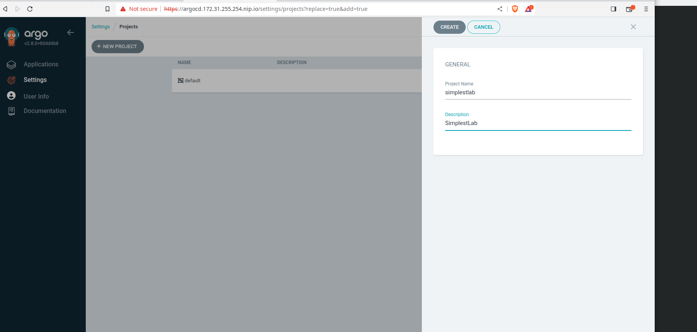


And now we can create the different repositories used for our project:

- Code Repo type - https://gitlab.172.31.255.254.nip.io/simplestlab/values/simplestlab.git - This repository will be used to integrate our values YAML file, used to run the umbrella Helm Chart and deploy the full application. This repository requires authentication, we will use coder as username and c0der000 as password.

- OCI type - registry.172.31.255.254.nip.io/simplestlab/helmcharts/simplestlab.git - Which includes the simplestlab-chart package.

- OCI type - docker.io - Which includes the simplestlab-chart package uploaded at DockerHub as a WORKAROUND to the issue in ArgoCD with self-signed certificates.

>NOTE: Code repositories doesn't require a name while OCI repositories do.

Now, we go back to the project settings and verify the right code and artifacts repositories are available. We will also configure here the clusters in which the project is allowed to be deployed. We will configure the following settings:
```
- SOURCE REPOSITORIES: *
- DESTINATIONS:
    Server: https://kubernetes.default.svc

```

Following screenshot shows the final configuration:

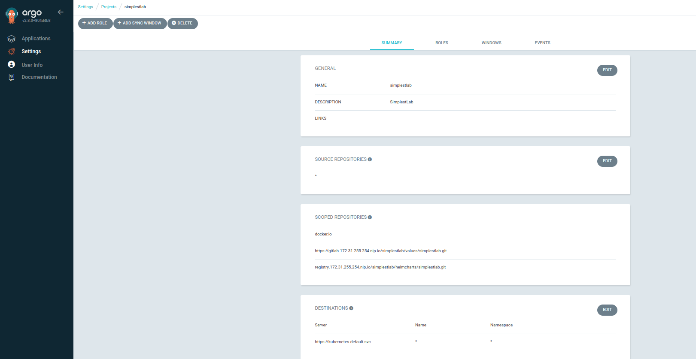


In such situation, we are able to use any repository and kubernetes.default.svc cluster.


We will now prepare the Application resource for ArgoCD.

## ArgoCD Application resource

The ArgoCD GUI does not allow us to use multiple repositories, hence we will not be able to use a code repository for the values file and another one for the Helm Chart package artifact. Under this circunstances, we need to prepare the Application resource using a YAML file:
```
apiVersion: argoproj.io/v1alpha1
kind: Application
metadata:
  name: minikube-simplestlab
  namespace: argocd
spec:
  destination:
    name: minikube
    namespace: simplestlab
  project: simplestlab
  sources:
  - chart: simplestlab
    helm:
      releaseName: simplestlab
      valueFiles:
      - $values/values.yaml
    repoURL: docker.io/frjaraur
    #repoURL: docker.io/YOURUSERNAME
    #repoURL: registry.172.31.255.254.nip.io/simplestlab/helmcharts/simplestlab
    targetRevision: 1.0.0
  - ref: values
    repoURL: https://gitlab.172.31.255.254.nip.io/simplestlab/values/simplestlab.git
    targetRevision: main
```

A copy of this faile is included in the Chapter13/ArgoCD/Applications directory, [minikube-simplestlab.yaml](ArgoCD/Applications/minikube-simplestlab.yam).

In this YAML file we declare:
- __destination__:
    - __minikube__ cluster
    - __simplestlab__ namespace
- __sources__:
    - chart --> docker.io/frjaraur/simplestlab:1.0.0 package (notice the values of __repoURL__, __chart__ and __targetRevision__ keys)
    - values --> __values.yaml__ file included in the __main__ branch of the __https://gitlab.172.31.255.254.nip.io/simplestlab/values/simplestlab.git__ repository.

>NOTE: I included other options for your __repoURL__ you can test. As mentioned before, at the time of writting this lab there's an issue with self-signed certificates in ArgoCD. There isn't any parameter to include our GitLab certificate and pulling the Helm Charts will not work. You can use your DockerHub repository to test the complete CI/CD workflow.

We now create the Application resource (must be always included into __argocd__ namespace):
```
Chapter13$ kubectl create -f ArgoCD/Applications/minikube-simplestlab.yaml
application.argoproj.io/minikube-simplestlab created
```

>NOTE: Ensure that your __simplestlab__ namespace exists.

As soon it is created, we will see the application in the ArgoCD GUI:


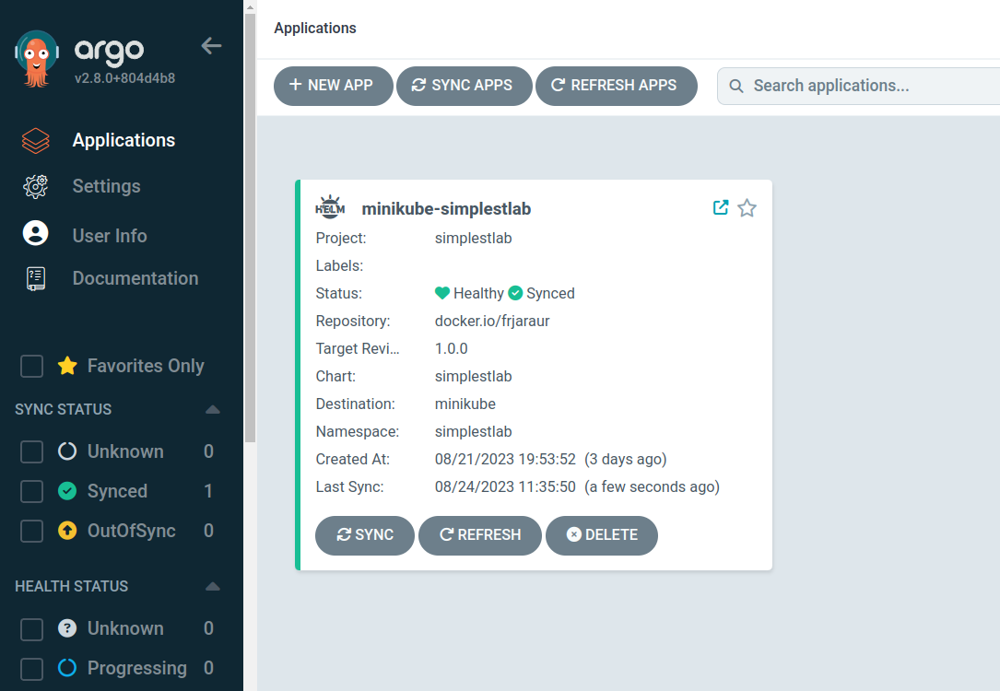

At this point, the application doesn't work:

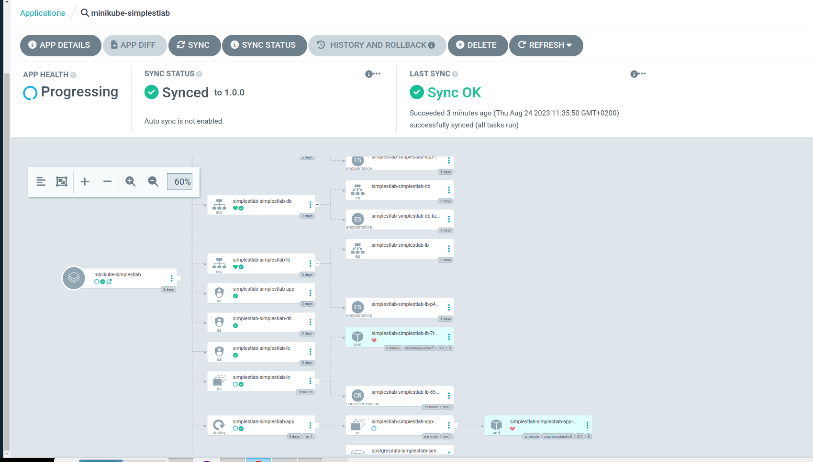

Two components are in error state. We can easily locate them by using the filters available on the left panel:

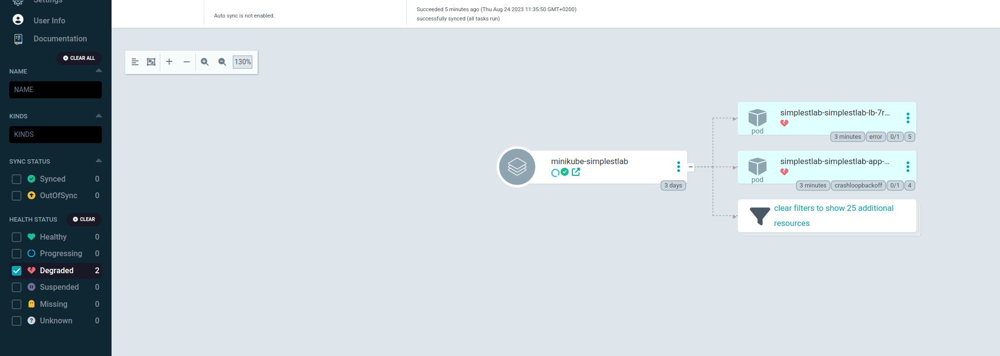

The __App__ component does not work because it can't connect to ___db___ database service. This makes also fail the ___Lb___ component, because it connects and serves the ___App___ component.

We will fix the application changing the values YAML file located in SimplestLab/Values/SimplestLab repository.

## Changing and Syncing the SimplestLab Application 

In this part of the Lab we will make some changes to our SimplestLab values file to fix the configuration errors. At this stage we are assume all the Helm Charts and Application Component code is working properly.

### First Fix - Changing the Database Host

We will just modify locally our values.yaml file and change the database server (___dbhost___ key):

1 - First verify the new name, automatically created by the Helm Chart template (These names could have been fixed but this is a usual error and we can see how to solve it in this example) 
```
Chapter13$ kubectl get svc -n simplestlab
NAME                          TYPE        CLUSTER-IP      EXTERNAL-IP   PORT(S)    AGE
simplestlab-simplestlab-app   ClusterIP   10.96.6.93      <none>        3000/TCP   2d14h
simplestlab-simplestlab-db    ClusterIP   10.98.159.97    <none>        5432/TCP   2d14h
simplestlab-simplestlab-lb    ClusterIP   10.103.79.186   <none>        8080/TCP   2d14h

```

2 - Now we know the new name for the Database server and we can change the ___dbhost___ value in the __values.yaml__ file:
```
....
....
  envVariables:
  # Never use clear values. This file is stored in GitLab. Use Sealed Secrets to encrypt and use here the encrypted values.
    dbhost: simplestlab-simplestlab-db
....
....
```

3 - Commit the new changes and push the file to our repository:
```
Chapter13$ git status
On branch main
Your branch is up to date with 'origin/main'.

Changes not staged for commit:
  (use "git add <file>..." to update what will be committed)
  (use "git restore <file>..." to discard changes in working directory)
        modified:   values.yaml

no changes added to commit (use "git add" and/or "git commit -a")

Chapter13$ git commit -a -m "Fixed database dbhost key"
[main 7995db3] Fixed database dbhost key
 1 file changed, 2 insertions(+), 2 deletions(-)

Chapter13$ git push
Username for 'https://gitlab.172.31.255.254.nip.io': coder
Password for 'https://coder@gitlab.172.31.255.254.nip.io': 
Enumerating objects: 5, done.
Counting objects: 100% (5/5), done.
Delta compression using up to 24 threads
Compressing objects: 100% (2/2), done.
Writing objects: 100% (3/3), 287 bytes | 287.00 KiB/s, done.
Total 3 (delta 1), reused 0 (delta 0), pack-reused 0
To https://gitlab.172.31.255.254.nip.io/simplestlab/values/simplestlab.git
   6531c8b..7995db3  main -> main
```

And now the changes are shown in our ArgoCD GUI. We haven't configured auto-sync, hence we will see a misconfiguration of the values (out-of-sync). Current values in the cluster are different from those expected by the configuration:

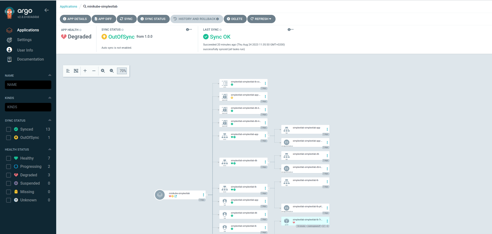


4 - We can now proceed to sync the creation of the secret with the right values. We gill push sync in the Secret resource.

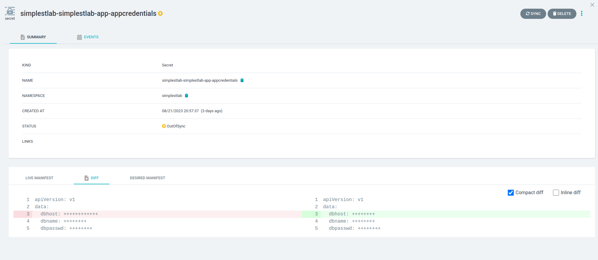

5 - Once the Secret reource is replaced, we need to delete the old Pod, which uses the old Secret resource. Kubernetes ReplicaSet Controller will create anew Pod for us.

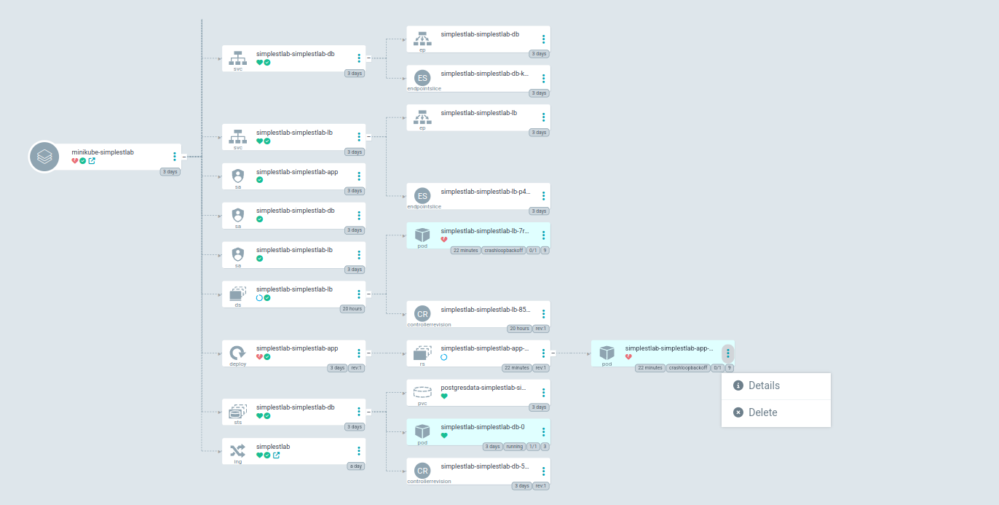

6 - ___App___ component works, but we need to fix the ___Lb___ component. We can review the new Pod's log and see it is working now:

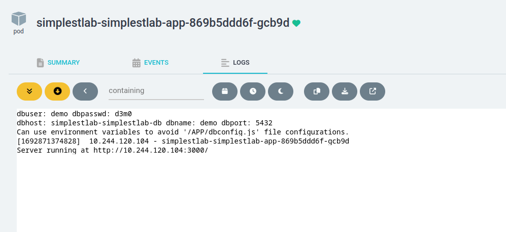

But ___Lb___ component doesn't work.


### Second Fix - Changing the Nginx nginx.conf configuration file 

In this case we will change the __nginx.conf__ file required by the Nginx ___Lb___. It is included as a ConfigMap resource and managed by the ___nginxConfig___ key in the values file. We need to change the name of the application backend service (___App___ component). By default it uses ___app___ as you can see in the default values file included in the ___simplest-lb___ Helm Chart (SimplestLab/HelmCharts/simplestlab/values.yaml)  

1 - We first verify the name of the ___App___ component service:
```
Chapter13$ kubectl get svc -n simplestlab
NAME                          TYPE        CLUSTER-IP      EXTERNAL-IP   PORT(S)    AGE
simplestlab-simplestlab-app   ClusterIP   10.96.6.93      <none>        3000/TCP   2d14h
simplestlab-simplestlab-db    ClusterIP   10.98.159.97    <none>        5432/TCP   2d14h
simplestlab-simplestlab-lb    ClusterIP   10.103.79.186   <none>        8080/TCP   2d14h
Chapter13$ pwd

```

2 - Now we uncomment the ___nginxConfig___  key value prepared for you. After uncommenting the value, you should hae something like this:
```
....
....
simplestlab-lb:
  image:
    repository: docker.io/nginx
    pullPolicy: IfNotPresent
    tag: "alpine"
  service:
    port: 8080
  ##################################
  # Second Test Update -- Uncomment whti section
  nginxConfig: |
    user  nginx;
    worker_processes  auto;
    error_log  /tmp/nginx/error.log warn;
    pid        /tmp/nginx/nginx.pid;

    events { 
      worker_connections  1024; 
    }

    http { 
      server {
        listen 8080;
        location /healthz { 
          add_header Content-Type text/plain;
          return 200 'OK';
        } 
        location / {
          proxy_pass http://simplestlab-simplestlab-app:3000;
        }   
      }
    }

  ###################################
```

3 - We commit and push the new changes.

```
Chapter13$ git status          
On branch main
Your branch is up to date with 'origin/main'.

Changes not staged for commit:
  (use "git add <file>..." to update what will be committed)
  (use "git restore <file>..." to discard changes in working directory)
        modified:   values.yaml

no changes added to commit (use "git add" and/or "git commit -a")

Chapter13$ git add values.yaml 

Chapter13$ git commit -m "Second fix"
[main fd40ee7] Second fix
 1 file changed, 20 insertions(+), 20 deletions(-)
Chapter13$ git push
Username for 'https://gitlab.172.31.255.254.nip.io': coder
Password for 'https://coder@gitlab.172.31.255.254.nip.io': 
Enumerating objects: 5, done.
Counting objects: 100% (5/5), done.
Delta compression using up to 24 threads
Compressing objects: 100% (2/2), done.
Writing objects: 100% (3/3), 434 bytes | 434.00 KiB/s, done.
Total 3 (delta 1), reused 0 (delta 0), pack-reused 0
To https://gitlab.172.31.255.254.nip.io/simplestlab/values/simplestlab.git
   7995db3..fd40ee7  main -> main
```

4 - New changes are not synced in ArgoCD:

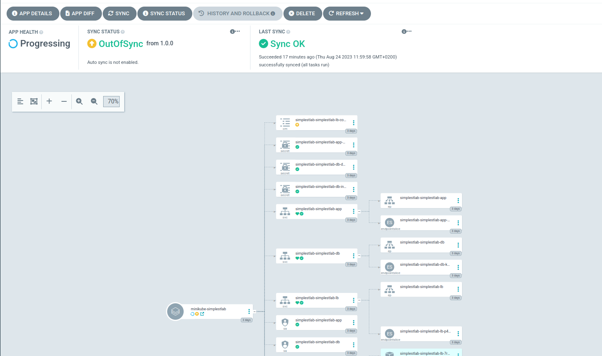


5 - We sync the change and delete the ___Lb___ Pod, associated with the DaemonSet to fix the Nginx configuration issue. After the syncronization and the removal of the Pod, the new Pod works fine.
The ArgoCD shows the application __Healthy__ and __Synced__.

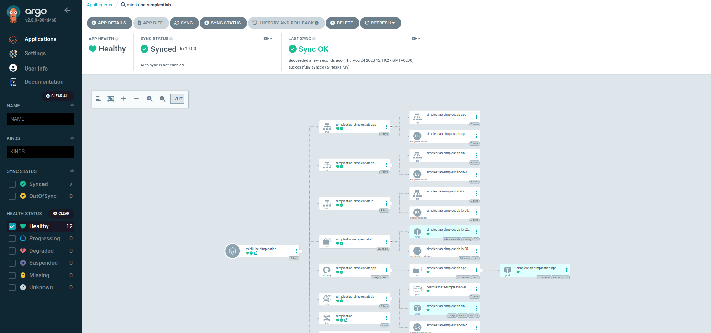


This ws the last step on this long lab. You can make changes to either your configurations, code or Helm Charts and trigger the pipelines or GitOps integration to manage your application status and behavior.

We can't explain you in a lab all the configurations we have done to make all the workflow work, we gave you the tips and you can deep dive by your self exploring the already prepared configuration and script steps done.

It would be nice to follow the lab by including now the NetworkPolicy resources created in Chapter 11 and the Nginx and Postgres exporters prepared in Chapter 12.


