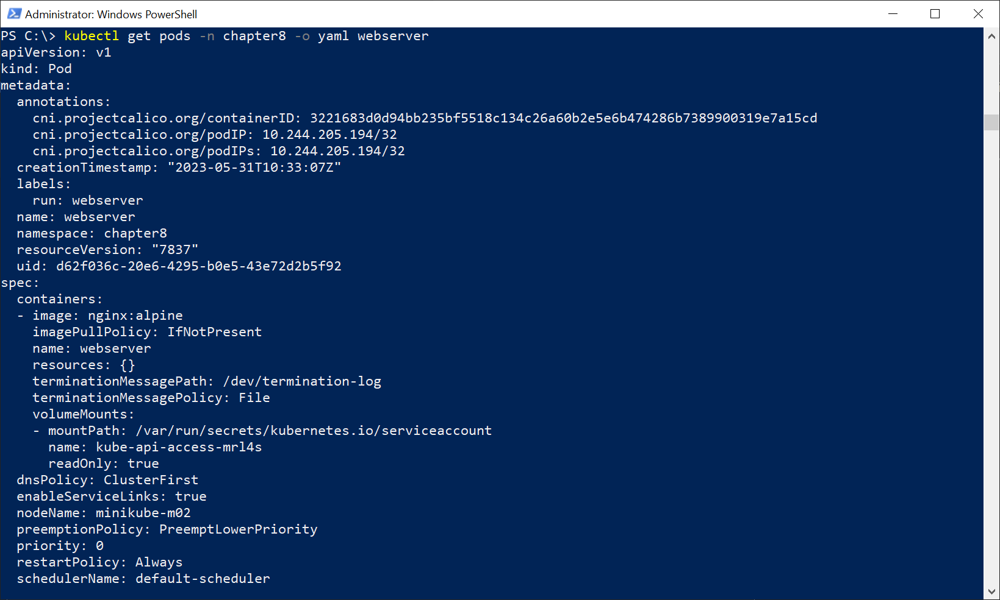

# Chapter 8 Labs 

In this chapter we are going to have a short lab section that will help us to learn and understand the basics of deploying a local Kubernetes environment with Minikube and test some of its resource types to validate the cluster. 

The code for the labs is available in this book’s GitHub repository in https://github.com/PacktPublishing/Docker-for-Developers-Handbook.git. Ensure you have the latest revision available by simply executing git clone https://github.com/PacktPublishing/Docker-for-Developers-Handbook.git to download all its content or git pull if you already downloaded the repository before. All commands and content used in these labs will be located inside Docker-for-Developers-Handbook/Chapter8 directory. 

We will start by deploying a Minikube cluster with 2 nodes ( 1 master + 1 worker). We will deploy them with 3GB of RAM each, which will be more than enough for testing applications behavior when some of the cluster node dies, but you will probably don’t need 2 nodes for your daily usage. 

## Deploying a Minikube cluster with 2 nodes 

In this lab we will deploy a fully functional Kubernetes cluster, for testing purposes, locally. We will continue working on a Windows 10 laptop with 16GB of RAM, which is enough for the labs in this book. 

1. Install Minikube; Firstly, download from https://minikube.sigs.k8s.io/docs/start/, choose the appropriate installation method and follow the simple steps for your operating system. We will use Hyper-V, hence it must be enabled and running on your desktop computer or laptop. 

2. Once Minikube is installed, we will open an administrator Powershell. Minikube deployments using Hyper-V require the execution with administrator privileges. This is due to the Hyper-V layer, hence admin provileges won’t be required if you VirtualBox as hypervisor or Linux as base operating system (other hypervisors may be used, such as KVM, which works very nice with Minikube). Admin rights will also be required to remove the minikube cluster. Once the Powershell terminal is ready, we execute minikube start --nodes 2 --memory 3G --cpus 2 --kubernetes-version=stable --driver=hyperv --cni=calico --addons=ingress,metrics-server,csi-hostpath-driver. This will create a cluster with 2 nodes (3GB of memory each) with current stable Kubernetes release (1.26.3 at the time of writting this book), using Calico as CNI, and the host's storage for volumes. It also delivers automatically an Ingress Controller for us.  
``` 
PS C:\Windows\system32> cd c:\

PS C:\>  minikube start --nodes 2 --memory 3G --cpus 2 --kubernetes-version=stable --driver=hyperv --cni=calico --addons=ingress,metrics-server,csi-hostpath-driver
* minikube v1.30.1 on Microsoft Windows 10 Pro 10.0.19045.2965 Build 19045.2965                                       * Using the hyperv driver based on user configuration                                                                 * Starting control plane node minikube in cluster minikube                                                            * Creating hyperv VM (CPUs=2, Memory=3072MB, Disk=20000MB) ...
* Preparing Kubernetes v1.26.3 on Docker 20.10.23 ...
  - Generating certificates and keys ...
  - Booting up control plane ...                                                                                        - Configuring RBAC rules ...                                                                                        * Configuring Calico (Container Networking Interface) ...                                                             ! [WARNING] For full functionality, the 'csi-hostpath-driver' addon requires the 'volumesnapshots' addon to be enabled.                                                                                                                     
You can enable 'volumesnapshots' addon by running: 'minikube addons enable volumesnapshots'

* Verifying Kubernetes components...
  - Using image registry.k8s.io/sig-storage/hostpathplugin:v1.9.0
  - Using image registry.k8s.io/sig-storage/livenessprobe:v2.8.0
  - Using image gcr.io/k8s-minikube/storage-provisioner:v5
  - Using image registry.k8s.io/sig-storage/csi-resizer:v1.6.0
  - Using image registry.k8s.io/sig-storage/csi-snapshotter:v6.1.0
  - Using image registry.k8s.io/sig-storage/csi-provisioner:v3.3.0
  - Using image registry.k8s.io/sig-storage/csi-attacher:v4.0.0
  - Using image registry.k8s.io/ingress-nginx/kube-webhook-certgen:v20230312-helm-chart-4.5.2-28-g66a760794
  - Using image registry.k8s.io/sig-storage/csi-external-health-monitor-controller:v0.7.0
  - Using image registry.k8s.io/ingress-nginx/controller:v1.7.0
  - Using image registry.k8s.io/sig-storage/csi-node-driver-registrar:v2.6.0
  - Using image registry.k8s.io/ingress-nginx/kube-webhook-certgen:v20230312-helm-chart-4.5.2-28-g66a760794
  - Using image registry.k8s.io/metrics-server/metrics-server:v0.6.3
* Verifying ingress addon...
* Verifying csi-hostpath-driver addon...
* Enabled addons: storage-provisioner, default-storageclass, metrics-server, csi-hostpath-driver, ingress

* Starting worker node minikube-m02 in cluster minikube
* Creating hyperv VM (CPUs=2, Memory=3072MB, Disk=20000MB) ...
* Found network options:
  - NO_PROXY=172.19.156.51
  - no_proxy=172.19.156.51
* Preparing Kubernetes v1.26.3 on Docker 20.10.23 ...
  - env NO_PROXY=172.19.156.51
* Verifying Kubernetes components...
* Done! kubectl is now configured to use "minikube" cluster and "default" namespace by default

PS C:\> 
```

3. We can now verify the cluster status by executing kubectl get nodes: 
```
PS C:\> kubectl get nodes 

NAME           STATUS   ROLES           AGE   VERSION 
minikube       Ready    control-plane   23m   v1.26.3 
minikube-m02   Ready    <none>          18m   v1.26.3 
```

As you may noticed, minikube-m02 node does not show any role. This is due to the fact that everything in Kubernetes is managed by labels. Remember that we have seen how selectors are used to identify which pods belong to an specific replicaSet.  We can review the node labels and create a new one for the worker node. This will show us how we can modify the resources behavior by using labels. 
```
PS C:\> kubectl get nodes --show-labels 

NAME           STATUS   ROLES           AGE   VERSION   LABELS 

minikube       Ready    control-plane   27m   v1.26.3   beta.kubernetes.io/arch=amd64,beta.kubernetes.io/os=linux,kubernetes.io/arch=amd64,kubernetes.io/hostname=minikube,kubernetes.io/os=linux,minikube.k8s.io/commit=08896fd1dc362c097c925146c4a0d0dac715ace0,minikube.k8s.io/name=minikube,minikube.k8s.io/primary=true,minikube.k8s.io/updated_at=2023_05_31T10_59_55_0700,minikube.k8s.io/version=v1.30.1,node-role.kubernetes.io/control-plane=,node.kubernetes.io/exclude-from-external-load-balancers=,topology.hostpath.csi/node=minikube 

minikube-m02   Ready    <none>          22m   v1.26.3   beta.kubernetes.io/arch=amd64,beta.kubernetes.io/os=linux,kubernetes.io/arch=amd64,kubernetes.io/hostname=minikube-m02,kubernetes.io/os=linux,topology.hostpath.csi/node=minikube-m02 
```

Lots of labels are assigned to both nodes but we miss node-role.kubernetes.io/worker on the worker node. 


4. We can now add a new label to the worker node by using kubectl label <RESOURCE> <LABEL_TO_ADD>: 
```
PS C:\> kubectl label node minikube-m02  node-role.kubernetes.io/worker= 

node/minikube-m02 labeled 

PS C:\> kubectl get nodes 

NAME           STATUS   ROLES           AGE   VERSION 

minikube       Ready    control-plane   33m   v1.26.3 

minikube-m02   Ready    worker          28m   v1.26.3 
```

We can use kubectl label to add any lable to any resource. In the specific case of node-role.kubernetes.io, it is used by kubernetes to show the roles column, but we can use any other label to identify a set of nodes. This will help you in a production cluster to run your applications in the nodes that best-fit your purposes, for example by selecting the nodes with fast solid state disks, or those with special hardware devices. You may need to ask your Kubernetes administrators about these nodes special characteristics. 

## Interact with the Minikube’s deployed cluster 

In this lab we will interact with the current cluster, reviewing and creating some new resources. 

1. We will start by listing all the pods deployed in the cluster using kubectl get pods --A. This will list all the pods in the cluster. We are able to list them after the Minikube installation because we are connecting as administrators. Following screenshot shows the output of kubectl get pods -A followed with the list of current namespaces, using kubectl get namespaces. 


Figure 1: Output of kubectl get –A and kubectl get namespaces commands.  

2. Let’s create a new namespace, chapter8, by using kubectl create ns chapter8.  
```
PS C:\> kubectl create ns chapter8 

namespace/chapter8 created 
```

We can list the pods in chapter8 namespace by adding --namespace or just --n to kubectl get pods: 
```
PS C:\> kubectl get pods -n chapter8 

No resources found in chapter8 namespace. 
```

We can try now on ingress-nginx namespace. We are going to list all the resources deployed in this namespace using kubectl get all, as we see on the following screenshot: 

 


Figure 2: Output of kubectl get all –n ingress-nginx. 

Now we know how we can filter the resources associated with a specific namespace. 

3. Let’s create now a simple pod in the chapter8 namespace by using the imperative format. We will execute kubectl run webserver --image=nginx:alpine to run a pod with one container using the docker.io/nginx:alpine image: 
```
PS C:\> kubectl run webserver --image=nginx:alpine -n chapter8 

pod/webserver created 

PS C:\> kubectl get pods -n chapter8 

NAME        READY   STATUS    RESTARTS   AGE 

webserver   1/1     Running   0          11s 
```

Notice that we used an external registry for storing the images. Kubernetes does not use local stores for pulling images. As we expect to have on any other container orchestrator environment, a registry is needed and host’s kubelet component will pull images from this. You will never synchronize images manually between nodes in a cluster.  

4. Let’s review the resource manifest now. It is important to understand that kubectl command talks with the Kubernetes API using the credentials from our local kubeconfig (this file is located in your home under .kube directory, you can use $env:USERPROFILE\.kube in Microsoft Windows) and the Kube-APIserver gets this information from the Etcd before it is presentedin our terminal. Following screenshot shows part of the output we get using kubectl get pod <PODNAME> -o yaml. The –o yaml modifier shows the output from a current resource in yaml format. This will really help us understand how objects are created and manage by Kubernetes. 


 

Figure 3: Output of kubectl get pod --namespace chapter8 -o yaml webserver 

```
PS C:\> kubectl get pods -n chapter8 -o yaml webserver
apiVersion: v1
kind: Pod
metadata:
  annotations:
    cni.projectcalico.org/containerID: 3221683d0d94bb235bf5518c134c26a60b2e5e6b474286b7389900319e7a15cd
    cni.projectcalico.org/podIP: 10.244.205.194/32
    cni.projectcalico.org/podIPs: 10.244.205.194/32
  creationTimestamp: "2023-05-31T10:33:07Z"
  labels:
    run: webserver
  name: webserver
  namespace: chapter8
  resourceVersion: "7837"
  uid: d62f036c-20e6-4295-b0e5-43e72d2b5f92
spec:
  containers:
  - image: nginx:alpine
    imagePullPolicy: IfNotPresent
    name: webserver
    resources: {}
    terminationMessagePath: /dev/termination-log
    terminationMessagePolicy: File
    volumeMounts:
    - mountPath: /var/run/secrets/kubernetes.io/serviceaccount
      name: kube-api-access-mrl4s
      readOnly: true
  dnsPolicy: ClusterFirst
  enableServiceLinks: true
  nodeName: minikube-m02
  preemptionPolicy: PreemptLowerPriority
  priority: 0
  restartPolicy: Always
  schedulerName: default-scheduler
  securityContext: {}
  serviceAccount: default
  serviceAccountName: default
  terminationGracePeriodSeconds: 30
  tolerations:
  - effect: NoExecute
    key: node.kubernetes.io/not-ready
    operator: Exists
    tolerationSeconds: 300
  - effect: NoExecute
    key: node.kubernetes.io/unreachable
    operator: Exists
    tolerationSeconds: 300
  volumes:
  - name: kube-api-access-mrl4s
    projected:
      defaultMode: 420
      sources:
      - serviceAccountToken:
          expirationSeconds: 3607
          path: token
      - configMap:
          items:
          - key: ca.crt
            path: ca.crt
          name: kube-root-ca.crt
      - downwardAPI:
          items:
          - fieldRef:
              apiVersion: v1
              fieldPath: metadata.namespace
            path: namespace
status:
  conditions:
  - lastProbeTime: null
    lastTransitionTime: "2023-05-31T10:33:07Z"
    status: "True"
    type: Initialized
  - lastProbeTime: null
    lastTransitionTime: "2023-05-31T10:33:15Z"
    status: "True"
    type: Ready
  - lastProbeTime: null
    lastTransitionTime: "2023-05-31T10:33:15Z"
    status: "True"
    type: ContainersReady
  - lastProbeTime: null
    lastTransitionTime: "2023-05-31T10:33:07Z"
    status: "True"
    type: PodScheduled
  containerStatuses:
  - containerID: docker://2a335da6e26ae6a4a3056f78f8e5a7af728c5e1232b446f04000fb4140b8a7f3
    image: nginx:alpine
    imageID: docker-pullable://nginx@sha256:2e776a66a3556f001aba13431b26e448fe8acba277bf93d2ab1a785571a46d90
    lastState: {}
    name: webserver
    ready: true
    restartCount: 0
    started: true
    state:
      running:
        startedAt: "2023-05-31T10:33:15Z"
  hostIP: 172.19.146.184
  phase: Running
  podIP: 10.244.205.194
  podIPs:
  - ip: 10.244.205.194
  qosClass: BestEffort
  startTime: "2023-05-31T10:33:07Z"
PS C:\>
```

5. Let’s see which node is executing our pod by using either kubectl get pods -o wide, which shows extended information, or by filtering the hostIP key from the YAML output: 
```
PS C:\> kubectl get pods -n chapter8 -o wide 

NAME        READY   STATUS    RESTARTS   AGE   IP               NODE           NOMINATED NODE   READINESS GATES 

webserver   1/1     Running   0          27m   10.244.205.194   minikube-m02   <none>           <none> 
```

Or using Jsonpath (https://kubernetes.io/docs/reference/kubectl/jsonpath/): 
```
PS C:\> kubectl get pods -n chapter8 -o jsonpath='{ .status.hostIP }' webserver 
172.19.146.184 
```
>Important Note 
>
>You may notice that the node name is also available in the spec section (spec.nodeName), but this section is where pod specifications are presented. We will learn in next chapter how we can change the workloads behavior by changing the specifications from the online manifests, directly in Kubernetes. The status section is read-only because it shows the actual state of the resource, while some of the sections in either the metadata and spec sections can be modified, for example by adding new labels or annotations. 

Before ending the labs from this chapter, we will expose the pod deployed by adding a NodePort service which will guide our requests to the running webserver pod. 

## Exposing a pod with a NodePort service 

In this quick lab we are going to use the imperative model to deploy a NodePort service to expose the already deployed webserver pod. 

1. Because we haven’t defined the container port in the webserver pod, Kubernetes will not know which port must be associated in the service, hence we will need to pass --target-port 80 argument to specify that the service should link the Nginx container port listening. We will use port 8080 for the service and we will let Kubernetes choose one NodePort for us. 
```
PS C:\> kubectl expose pod webserver -n chapter8 --target-port 80 --port 8080 --type=NodePort 

service/webserver exposed 
```

2. We can now review the resources in chapter8 namespace: 
```
PS C:\> kubectl get all -n chapter8 

NAME            READY   STATUS    RESTARTS   AGE 

pod/webserver   1/1     Running   0          50m 


NAME                TYPE       CLUSTER-IP      EXTERNAL-IP   PORT(S)          AGE 

service/webserver   NodePort   10.103.82.252   <none>        8080:32317/TCP   72s 
```

Notice that hosts’ port 32317 is associated to service’s port 8080, which is associated with webserver pod’s port 80 (the Nginx container is listening on that port).  

3. We can now access the published NodePort port on any host, even if it does not run any service-related pod. We can use the IP address of any of the Minikube cluster nodes or use minikube service -n chapter8 webserver to automatically open our default web browser in the associated URL. 

Following screenshot shows the output in both cases. First, we obtained the host’s IP addresses by using kubectl get nodes –o wide. We used Powershell’s command Invoke-WebRequest to access the combination of IP addresses of the nodes and the NodePort published port. Then, we used the Minikube’s built-in for resolving the service’s URL by using minikube service: 

  

 

 

 

Figure 4: Output of kubectl get nodes, different tests using the cluster nodes and minikube service URL resolution.  

As you may noticed, we used the IP addresses of both, master and worker node for the tests and they worked; even though the pod was only running on the worker node. This output also shows how easy it is test services by using the Minikube’s integrated services resolution. It automatically opened our default web browser and we can access our service directly as we can see in the following capture: 

 

Figure 5: Default web browser accessing the webserver service’s NodePort port. 

4. We can now remove all the resources created in this chapter. It is important to first remove the pod and the service and then the namespace. Removing the namespace first trigger the removal of all the associated resources in cascade and it may get some issues if Kubernetes isn’t able to remove some resources. It will never happen in this simple lab, but it is a good practice to remove resources inside a namespace before deleting the namespace itself. 
```
PS C:\> kubectl delete service/webserver pod/webserver -n chapter8 

service "webserver" deleted 

pod "webserver" deleted 

PS C:\> kubectl delete ns chapter8 

namespace "chapter8" deleted 
```

You are now prepared to learn more advanced Kubernetes topics in the next chapter. 
