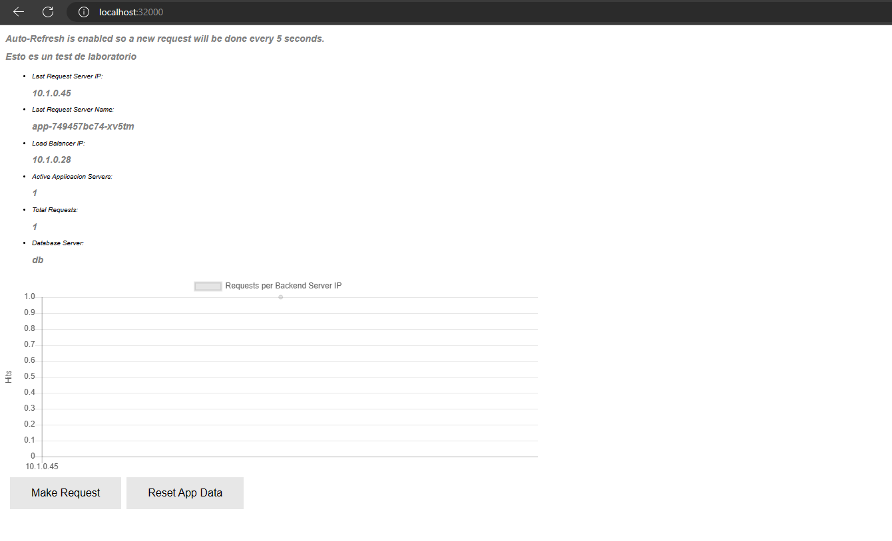
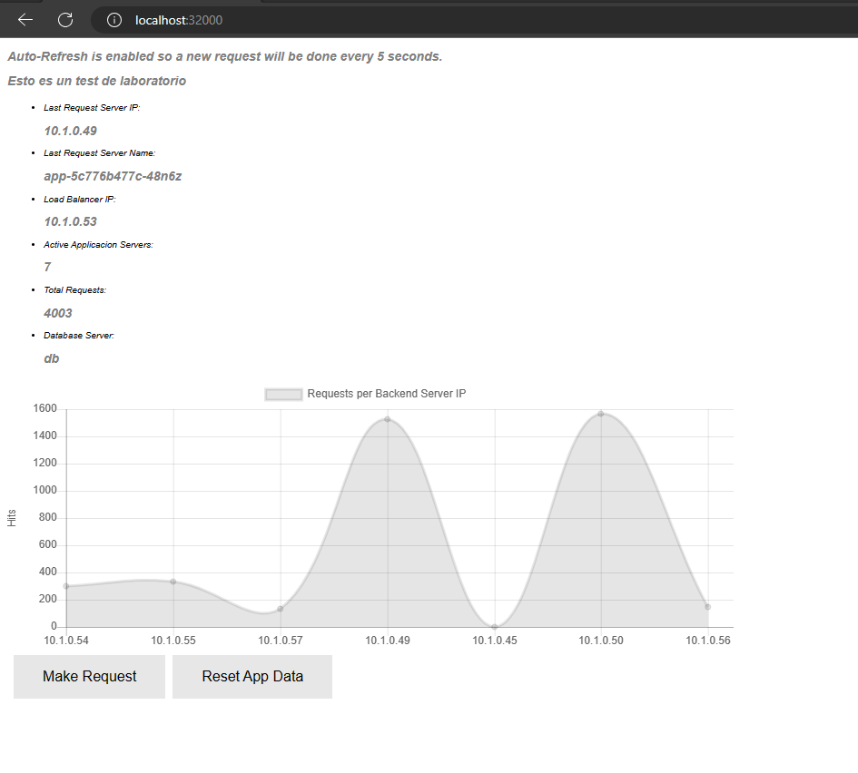

# __Chapter 9 Labs__

## __Technical requirements__

The following labs will provide examples to put into practice concepts and procedures learned in this chapter. We will use Docker Desktop as container runtime and WSL2 (or you Linux/MacOS terminal) to execute the commands described. 

Ensure that you have downloaded the content of this book’s GitHub repository in https://github.com/PacktPublishing/Docker-for-Developers-Handbook.git. For this chapter’s labs we will use the content of Chapter9 directory. 

You can use one of the following Kubernetes Desktop environments:
- Docker Desktop
- Rancher Desktop
- Minikube
- KinD
The Labs will work on any of then, and of course, on any other Kubernetes environment. You may find issues with their default storage class, but there are some comments on the files that may be changed.

## Deploying the simplelab on Kubernetes

In this lab we will deploy the simplelab, a very simplified tier-3 application (load balancer could present additional static content but it is not added for the purposes of the labs).

The application is composed of 3 components:
- Postgres database - db component
- Application backend in NodeJS - app component
- Nginx fronted for static content - lb component

We have included in their manifests some of the mechanisms we learned in this chapter for checking the components health, replicating their processes and improve their security by disallowing their execution as root user, among other features.

Let's start by reviewing and deploying the database component.

### Database Component

We will use a StatefulSet to ensure that replicating its processes (scaling up) will never represent a problem to our data. It is important to understand that a new replica starts empty, without data, and joins the pool of available endpoints for the service, which could probably become a problem. This means that in this condition, the Postgres database isn't scalable, this component is deployed as StatefulSet to preserve its data even in the case of a manual replication. This example does only provide resilience, do not scale this component. If you need to deploy a database with high availability, you will need a distributed database like MongoDB.

This is its main manifest:
```
apiVersion: apps/v1
kind: StatefulSet
metadata:
  name: db
  labels:
    component: db
    app: simplestlab
spec:
  replicas: 1
  selector:
    matchLabels:
      component: db
      app: simplestlab
  template:
    metadata:
      labels:
        component: db
        app: simplestlab
    spec:
      securityContext:
        runAsNonRoot: true
        runAsUser: 10000
        runAsGroup: 10000
        fsGroup: 10000
        fsGroupChangePolicy: OnRootMismatch
      containers:
      - name: database
        image: docker.io/frjaraur/simplestdb:1.0
        ports:
        - containerPort: 5432
        env:
        - name: POSTGRES_PASSWORD
          value: changeme
        - name: PGDATA
          value: /data/postgres
        volumeMounts:
        - name: postgresdata
          mountPath: /data
        readinessProbe:
          tcpSocket:
            port: 5432
          initialDelaySeconds: 5
          periodSeconds: 10
        livenessProbe:
          tcpSocket:
            port: 5432
          initialDelaySeconds: 15
          periodSeconds: 20

  volumeClaimTemplates:
  - metadata:
      name: postgresdata
    spec:
      accessModes: [ "ReadWriteOnce" ]
      #storageClassName: "csi-hostpath-sc"
      resources:
        requests:
          storage: 1Gi
```

We have defined a template for the Pods to create and a separated template for the VolumeClaims (we will talk about them in chapter 10). This ensures that each Pod will get its own volume. The volume created, will be mounted in the database container as /data filesystem and its size will be 1000MB (1Gi). No other container is created.
POSTGRES_PASSWORD and PGDATA environment variables are set and pased to the container. They will be used to create the password for the postgres user and the patch for the database data.
The image used for the container is docker.io/frjaraur/simplestdb:1.0 and port 5432 will be used to expose its service. Pods only expose their services internally, in the Kubernetes network, hence you will never be able to reach these services from remote clients. 
We have specified 1 replica and the controller will associate the pods to this StatefulSet by searching Pods wih  component=db and app=simplestlab labels.
We have simplified the database's probes by just checking a TCP connection to port 5432. 

We have defined a security context at Pod's level, which will be applied to all the containers by default:
```
      securityContext:
        runAsNonRoot: true
        runAsUser: 10000
        runAsGroup: 10000
        fsGroup: 10000
        fsGroupChangePolicy: OnRootMismatch
```
The database processes will run as 10000:10000 user:group, hence they are secure (no root is required). We could have gone further if we set the container as read-only but in this case we didn't, as the Docker's official Postgres image; although it would have been better using a full read-only filesystem.

The pod will get an IP address and this may change if Pod is recreated by any reason, which makes Pods' IP addresses imposible to use in such dynamic environments. We will use a Service to associate a "fixed IP address" with a service and then with the endpoints of the Pods related to the Service.

This is the definition for the service:
```
apiVersion: v1
kind: Service
metadata:
  name: db
spec:
  clusterIP: None
  selector:
    component: db
    app: simplestlab
  ports:
    - protocol: TCP
      port: 5432
      targetPort: 5432
```

This service is associated with the Pods by using a selector (components=db and app=simplestlab labels) and Kubernetes will route the traffic to appropriate Pods. When a TCP packet reaches Service's port 5432, it is load balanced to all the available Pod's endpoints (in this case we will just have one replica) in port 5432. We used in both cases port 5432, but you must understand that targetPort refers to the Container port, while port key refers to the Service's port, and they can be completely different.
We are using a headless Service because it works very well with StatefulSets and its resolution in round-robin mode

With the StatefulSet definition and the Service we can deploy the databse component.
```
PS Chapter9> kubectl create -f .\db.statefulset.yaml
statefulset.apps/db created

PS Chapter9> kubectl create -f .\db.service.yaml
service/db created

PS Chapter9> kubectl get pods
NAME   READY   STATUS    RESTARTS   AGE
db-0   1/1     Running   0          17s

```

We can now continue and review tha app component.

### Application backend

The application (backend component) is deployed as a Deployment workload. Let's review its manifest:
```
apiVersion: apps/v1
kind: Deployment
metadata:
  name: app
  labels:
    component: app
    app: simplestlab
spec:
  replicas: 3
  selector:
    matchLabels:
      component: app
      app: simplestlab
  template:
    metadata:
      labels:
        component: app
        app: simplestlab
    spec:
      securityContext:
        runAsNonRoot: true
        runAsUser: 10001
        runAsGroup: 10001
      containers:
      - name: app
        image: docker.io/frjaraur/simplestapp:1.0
        ports:
        - containerPort: 3000
        env:
        - name: dbhost 
          value: db
        - name: dbname
          value: demo
        - name: dbuser
          value: demo
        - name: dbpasswd
          value: d3m0
        securityContext:
          readOnlyRootFilesystem: true
        readinessProbe:
          httpGet:
            path: /healthz
            port: 3000
            httpHeaders:
            - name: Custom-Header
              value: HealthCheck
          initialDelaySeconds: 5
          periodSeconds: 10
        livenessProbe:
          tcpSocket:
            port: 3000
          initialDelaySeconds: 15
          periodSeconds: 20
        resources:
          requests:
            cpu: 10m
            memory: 20M
          limits:
            cpu: 20m
            memory: 30Mi
```

For this component, we defined 3 replicas, hence 3 Pods will be deployed cluster wide. In this component we are using the docker.io/frjaraur/simplestapp:1.0 image. 
We configured two security contexts, one at Pod's level:
```
      securityContext:
        runAsNonRoot: true
        runAsUser: 10001
        runAsGroup: 10001
```
And another one for enforcing the use of read-only filesystem for the Container.
```
        securityContext:
          readOnlyRootFilesystem: true
```

We prepared a readinessProbe using httpGet but we still keep tcpSocket for the livenessProbe. We coded /healthz as application's health endpoint for checking its healthiness.

In this component we added a resource section for the app container:
```
        resources:
          requests:
            cpu: 10m
            memory: 20M
          limits:
            cpu: 20m
            memory: 30Mi
```

In this case, we ask Kubernetes for at least 10 millicores of CPU and 20M of memory. The limits section, describes the maximum CPU (20 millicores) and memory (30Mi). If the memory limit is reached, Kubelet will trigger the OOMKiller procedure and it will kill the Container. When CPU limit is reached, kernel does not provide more CPU cycles to the Container which may lead the probes to fail and hence the container will die.

This component is stateless and it is running completely in read-only mode.

>Important Note:
>
>Notice that we are using the envrionemtn variables for passing sensitive data. Never do that. We will learn how to include sensitive data in Chapter 10: Managing Application Data.

We also add a Service for accessing the app Deployment:
```
apiVersion: v1
kind: Service
metadata:
  name: app
spec:
  selector:
    app: simplestlab
    component: app
  ports:
    - protocol: TCP
      port: 3000
      targetPort: 3000

```

We create both Kubernetes resources:
```
PS Chapter9> kubectl create -f .\app.deployment.yaml -f .\app.service.yaml
deployment.apps/app created
service/app created

PS Chapter9> kubectl get pods
NAME                  READY   STATUS    RESTARTS   AGE
db-0                  1/1     Running   0          96s
app-585f8bb87-r8dqh   1/1     Running   0          41s
app-585f8bb87-wsfm7   1/1     Running   0          41s
app-585f8bb87-t5gpx   1/1     Running   0          41s

```

We can now continue with the frontend component.

### Frontend Component
We will deploy an Nginx on each Kubernetes cluster node. In this case we use a DaemonSet for running the component cluster wide, one replica will be deployed on each node.
We will prepare this component to also run as non-root user hence some special configurations are needed. We prepare a configMap with these special configurations for our Nginx:
```
apiVersion: v1
kind: ConfigMap
metadata:
  name: lb-config
  labels:
    component: lb
    app: simplestlab
data: 
  nginx.conf: |
    user  nginx;
    worker_processes  auto;

    error_log  /tmp/nginx/error.log warn;
    pid        /tmp/nginx/nginx.pid;

    events { 
      worker_connections  1024; 
    }

    http { 
      server {
        listen 8080; # specify a port higher than 1024 if running as non-root user 
        location /healthz { 
            add_header Content-Type text/plain;
            return 200 'OK';
        } 
        location / {
          proxy_pass http://app:3000;
        }   
      }
    }
```
This configuration will allow us to run as user 101 (nginx). We create this configMap before the actual DaemonSet; although it is possible to do the opposite, it is important to understand the requirements and prepare them before the workload deployment. This configuration allows us to run Nginx as non-root on a port greater than 1024 (system ports). We will use 8080.

Notice that we added a proxy_pass sentence for reouting the requests for / to http://app:3000, where app is the Service's name, resolved via internal DNS.
We will use /healthz for checking the container health.

Let's review the DaemonSet manifest:
```
apiVersion: apps/v1
kind: DaemonSet
metadata:
  name: lb
  labels:
    component: lb
    app: simplestlab
spec:
  selector:
    matchLabels:
      component: lb
      app: simplestlab
  template:
    metadata:
      labels:
        component: lb
        app: simplestlab
    spec:
      securityContext:
        runAsNonRoot: true
        runAsUser: 101
        runAsGroup: 101
      containers:
      - name: loadbalancer
        securityContext:
          readOnlyRootFilesystem: true
        image: docker.io/nginx:alpine
        ports: 
        - containerPort: 8080
        securityContext:
          readOnlyRootFilesystem: true
        volumeMounts: 
        - name: cache
          mountPath: /var/cache/nginx
        - name: tmp
          mountPath: /tmp/nginx
        - name: conf 
          mountPath: /etc/nginx/nginx.conf
          subPath: nginx.conf
        readinessProbe:
          httpGet:
            path: /healthz
            port: 8080
          initialDelaySeconds: 5
          periodSeconds: 10
        livenessProbe:
          tcpSocket:
            port: 8080
          initialDelaySeconds: 15
          periodSeconds: 20
      volumes: 
      - name: cache
        emptyDir: {}
      - name: tmp
        emptyDir: {} 
      - name: conf
        configMap: 
          name: lb-config
```
Noticed that we added /var/cache/nginx, and /tmp as emptyDir volumes as mentioned before.

This component will be also stateless and run in read-only mode, but some temporal directories must be created as emptyDir volumes for allowing writing in them without allowing the full Container's filesystem.

Following security contexts are created:
- Pod level
```
      securityContext:
        runAsNonRoot: true
        runAsUser: 101
        runAsGroup: 101
```
- Container level
```
        securityContext:
          readOnlyRootFilesystem: true
```

Finally we have the Service definition, where we will use a NodePort type to quickly expose our application:
```
apiVersion: v1
kind: Service
metadata:
  name: lb
spec:
  type: NodePort
  selector:
    app: simplestlab
    component: lb
  ports:
    - protocol: TCP
      port: 80
      targetPort: 8080
      nodePort: 32000
```

We deploy all the lb component (frontend) manifests:
```
PS Chapter9> kubectl create -f .\lb.configmap.yaml
configmap/lb-config created
PS Chapter9> kubectl create -f .\lb.daemonset.yaml
daemonset.apps/lb created
PS Chapter9> kubectl create -f .\lb.service.yaml
service/lb created
````

And now we can reach our application in any Kubernetes cluster host's port 32000. Your browser should access the application and show something like this (if using Docker Desktop you will need to use http://localhost:32000):



## Autoscaling the app component

In this lab we will scale up and down automatically. For this to work, first we need to deploy the Kubernetes metrics server component.
```
PS Chapter9> kubectl create -f .\metrics-server\components.yaml
serviceaccount/metrics-server created
clusterrole.rbac.authorization.k8s.io/system:aggregated-metrics-reader created
clusterrole.rbac.authorization.k8s.io/system:metrics-server created
rolebinding.rbac.authorization.k8s.io/metrics-server-auth-reader created
clusterrolebinding.rbac.authorization.k8s.io/metrics-server:system:auth-delegator created
clusterrolebinding.rbac.authorization.k8s.io/system:metrics-server created
service/metrics-server created
deployment.apps/metrics-server created
apiservice.apiregistration.k8s.io/v1beta1.metrics.k8s.io created
```

We will first test how the application works without autoscaling. We will use one of the lb pods and execute a ephemeral debug container with docker.io/frjaraur/nettools:small-1.0 to execute Apache Benchmark :
```
PS Chapter9> kubectl get pods -l component=lb
NAME       READY   STATUS    RESTARTS   AGE
lb-hbsrj   1/1     Running   0          19s


kubectl debug --image=docker.io/frjaraur/nettools:small-1.0 -c nettools lb-hbsrj -- ab -n 2000 -c 20 http://app:3000/
```

We can now check the containers log, running inside the lb Pod.
```
PS Chapter9> kubectl logs lb-hbsrj -c nettools
This is ApacheBench, Version 2.3 <$Revision: 1879490 $>
Copyright 1996 Adam Twiss, Zeus Technology Ltd, http://www.zeustech.net/
Licensed to The Apache Software Foundation, http://www.apache.org/

Benchmarking app (be patient)
Completed 200 requests
PS C:\Chapter9> kubectl logs lb-hbsrj -c nettools
This is ApacheBench, Version 2.3 <$Revision: 1879490 $>
Copyright 1996 Adam Twiss, Zeus Technology Ltd, http://www.zeustech.net/
Licensed to The Apache Software Foundation, http://www.apache.org/

Benchmarking app (be patient)
Completed 200 requests
```

We an verify the app Pods behavior thanks to the metrics-server:
```
PS Chapter9> kubectl top pods
NAME                   CPU(cores)   MEMORY(bytes)
app-5c776b477c-44cg8   20m          18Mi
app-5c776b477c-48n6z   20m          22Mi
db-0                   17m          103Mi
lb-hbsrj               3m           5Mi
```
Notice that the CPU is limited and the Pods can't increase their resources.

Let's create a HorizontalPodAutoscaler resource:
```
apiVersion: autoscaling/v2
kind: HorizontalPodAutoscaler
metadata:
  name: app
spec:
  maxReplicas: 6
  metrics:
  - resource:
      name: cpu
      target:
        averageUtilization: 80
        type: Utilization
    type: Resource
  minReplicas: 2
  scaleTargetRef:
    apiVersion: apps/v1
    kind: Deployment
    name: app
```
We configured a maximum of 6 replicas and new replicas will be created whenever the CPU usage is greater than 80%.
Let's create the hpa resource and compare the results:
```
PS Chapter9> kubectl create -f .\app.horizontalpodautoscaler.yaml
horizontalpodautoscaler.autoscaling/app created
```

To reuse the same debug Pod name, we simple remove the lb Pod to recreate a new one.
```
PS Chapter9> kubectl delete pod lb-hbsrj
pod "lb-hbsrj" deleted
```

Now we can execute a new debug Pod:
```
PS Chapter9> kubectl debug --image=docker.io/frjaraur/nettools:small-1.0 -c nettools lb-2chqt -- ab -n 2000 -c 20 http://app:3000/


PS Chapter9> kubectl logs lb-2chqt -c nettools --follow
This is ApacheBench, Version 2.3 <$Revision: 1879490 $>
....
CTRL+C
```
We can check the hpa resource again:
```
PS Chapter9> kubectl get hpa -w
NAME   REFERENCE        TARGETS         MINPODS   MAXPODS   REPLICAS   AGE
app    Deployment/app   <unknown>/80%   2         6         0          39s
app    Deployment/app   10%/80%   2         6         2          69s
app    Deployment/app   170%/80%   2         6         2          4m1s
app    Deployment/app   185%/80%   2         6         4          5m1s
app    Deployment/app   190%/80%   2         6         6          6m1s
app    Deployment/app   10%/80%    2         6         6          7m1s
app    Deployment/app   10%/80%    2         6         4          11m
app    Deployment/app   10%/80%   2         6         2          12m
````
Notice that the number of replicas was continuosly modified from 2 to 6 and back to 2. thi is how autoscaling works.


After scaling up and down the numbe rof replicas, your applications requests will probably look like this (if using Docker Desktop you will need to use http://localhost:32000):

